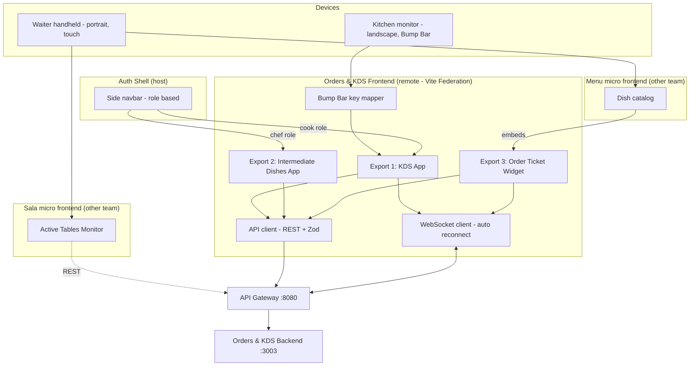
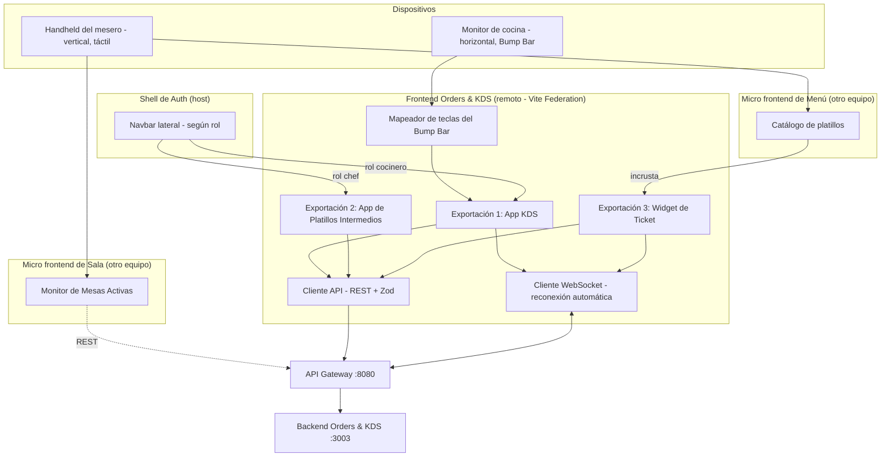

# Orders & KDS — Frontend

[](https://react.dev)
[](https://www.typescriptlang.org)
[](https://tailwindcss.com)
[](https://vitejs.dev)
[](https://github.com/originjs/vite-plugin-federation)
[](https://vitest.dev)
[](https://playwright.dev)
[](https://github.com/features/actions)
[](https://sonarcloud.io)

---

**Orders & KDS** is the *Orders and Kitchen* microservice (Microservice 4) of a distributed restaurant management system. This repository contains its **frontend**, built as a **remote micro frontend** (Module Federation) so that this team keeps full control over the deployment of what it owns: the kitchen screen, the chef screen and the order ticket widget. It does **not** build the waiter's full screens — those belong to the Sala and Menú micro frontends, which reuse the pieces exposed here. It talks to the backend (`ordenes-kds-backend`) through REST and a WebSocket channel, always behind the API Gateway (`:8080`), which routes to the backend container (`:3003`).

The exposed modules serve two very different physical devices, and the UI is designed around them:

| Users | Device | Orientation | Interaction |
|---|---|---|---|
| **Waiters** *(through the Ticket widget embedded in the Menu micro frontend)* | Android handheld POS or rugged 8" tablet | Portrait | One-handed touch, large buttons, vertical scrolling |
| **Kitchen staff (KDS)** | Wall-mounted industrial monitor | Landscape | **Bump Bar only** (sealed physical keyboard): numeric shortcuts, arrows and `Enter`. No touch, no mouse |

### Views / Exposed Modules

Under the Module Federation model this repository **does not build the complete waiter screen**. Instead, it exposes three modules through Vite Federation:

| # | Exposed module | Kind | Loaded by | Users | Purpose |
|---|---|---|---|---|---|
| 1 | **KDS App** | Full view (landscape) | **Auth Shell** — when a user with the kitchen (cook) role clicks "Órdenes y Cocina" in the side menu | Kitchen | Kanban board sorted by priority, per-station filter, live timers, Bump Bar control |
| 2 | **Intermediate Dishes App** *(optional)* | Full view | **Auth Shell** (chef role) | Chef | Register batches of pre-prepared dishes outside any customer order |
| 3 | **Order Ticket Widget** | Isolated React component — *not* a view | **Menu micro frontend**, embedded next to its dish catalog | Waiter (and admin for late voids) | Order ticket with its **Confirm**, **Cancel** and **Modify** buttons |

Screens of the original four-view scope that this repository **does not** build:

| Original view | Now owned by | Relation with this repository |
|---|---|---|
| Active Tables Monitor | **Sala micro frontend** | Consumes the backend endpoints of this microservice (`GET /orders`, `POST /orders`) |
| Order Manager (catalog tabs + sliding ticket) | **Menu micro frontend** (catalog) | Menú renders the catalog and embeds the **Order Ticket Widget** exported here; the menu availability data shown there is Menú's, while this repo only keeps a local copy of it in the backend |

### Table of Contents

- [Team Members](#team-members)
- [Technology Stack](#technology-stack)
- [Architecture Overview](#architecture-overview)
- [Quick Start](#quick-start)
- [Project Structure](#project-structure)
- [Running Tests](#running-tests)
- [Documentation](#documentation)
- [Contributing](#contributing)

---

### Team Members

| # | Name | Role | GitHub | Contact |
|---|---|---|---|---|
| 1 | Suarez Balam Brandon Emanuel| Networking, Security & Concurrency Lead | [@BS435](https://github.com/BS435) | |
| 2 | Contreras Gamboa Emiliano | Backend Architect | [@EmiCG](https://github.com/EmiCG) | |
| 3 | Dzib Pech Luis Gilberto| V&V/QA Lead | [@LuisGilDzib](https://github.com/LuisGilDzib) | |
| 4 | Martínez Martínez José Pablo | Scrum Master | [@Jose-Pablo-Martinez](https://github.com/Jose-Pablo-Martinez) | |
| 5 | Matu Aguayo Leonardo Daniel | Frontend Architect | [@leonardodanielmaguayo-hub](https://github.com/leonardodanielmaguayo-hub) | |
| 6 | Vega Nolasco Erick Ricardo| Database Lead | [@eriveingsoft](https://github.com/eriveingsoft) | |

---

### Technology Stack

#### Application
| Technology | Version | Purpose |
|---|---|---|
|  | 18+ | Component-based UI; exposed views and widgets for the micro frontend architecture |
|  | 5.x (`strict`) | Strict typing aligned with the backend API and event contracts |
|  | 3.x | Utility-first styling scoped to the exported modules (no global resets); landscape KDS layout and portrait-friendly ticket widget |
|  | 5.x | Dev server and build tool |
| **@originjs/vite-plugin-federation** | latest compatible with Vite 5 | Module Federation: exposes the KDS App, the Intermediate Dishes App and the Order Ticket Widget as a remote of the Auth Shell |
| **TanStack Query** | 5.x | Server-state fetching, caching and mutation handling (including optimistic-concurrency conflicts) |
| **Zod** | 3.x | Runtime validation of API responses and WebSocket messages |

#### Infrastructure & DevOps
| Technology | Purpose |
|---|---|
|  | CI/CD pipeline: lint, type-check, unit tests, E2E, SonarCloud |
|  | Static analysis, Quality Gate and coverage tracking |
|  | Containerized static build (including the federation `remoteEntry.js`) served behind the API Gateway |

#### Testing
| Technology | Purpose |
|---|---|
|  + **React Testing Library** | Unit and component tests |
| **MSW** (Mock Service Worker) | Mocks REST and WebSocket traffic for integration tests |
|  | End-to-end tests (Chromium + WebKit) with the Page Object Model |
| **Cucumber.js** (Gherkin) | Acceptance scenarios readable by non-programmers, executed with Playwright |
| **axe-core** | Automated accessibility checks (integrated in Playwright) |
| **Postman + Newman** / **Pact** | Consumer-side verification of the backend REST contract |
| **k6** *(browser/API scenarios)* | Performance checks of the flows consumed by the UI (WebSocket fan-out) |

---

### Architecture Overview



**Micro Frontend Integration (Module Federation):** This repository acts as a **remote module** and uses `@originjs/vite-plugin-federation` to integrate with the Auth Shell. It exposes entire views to the Shell (e.g., the KDS Board) and isolated React components (e.g., the Order Ticket Widget) to be consumed by the Menu micro frontend. Visual consistency is guaranteed by strictly following the `FMAT-RESTAURANT Guía visual de componentes` (primary color `#C2410C`, specific border radii and spacing) **without implementing global styles** that could clash with the Shell.

| Exposed module | Federation key *(proposed — to be agreed with the Shell and Menu teams)* | Consumer |
|---|---|---|
| KDS App | `./KdsApp` | Auth Shell |
| Intermediate Dishes App *(optional)* | `./IntermediateDishesApp` | Auth Shell |
| Order Ticket Widget | `./OrderTicketWidget` | Menu micro frontend |

Every HTTP request — including the ones fired by the Confirm / Cancel / Modify buttons while the Ticket widget lives inside the Menu micro frontend — goes through the API Gateway (`:8080`) to this microservice's backend container (`:3003`). The backend contract (`POST /orders`, `PATCH /orders/{orderId}/items`, …) is exactly the same no matter which repository renders the button.

Design rules:

- **The UI never decides business rules.** Which transitions are allowed, who can void, and whether a dish is available are enforced by the backend; the UI hides or disables actions for usability only.
- **The identity of the logged-in user is never a form field.** The authenticated user travels in the JWT (issued by Auth, held by the Shell session) and is resolved by the backend. This repository never implements login.
- **Server state comes from the server.** When the backend pushes a state change through the WebSocket, screens redraw by themselves. No polling.
- **Asynchronous by nature.** Confirming an order from the Ticket widget returns immediately; the order only changes to "in kitchen" or "rejected" when the WebSocket message arrives (Choreographed Saga).
- **Kitchen screens are keyboard-only.** Every KDS action must be reachable with the Bump Bar; no interaction may depend on a pointer.
- **No global styles.** No CSS reset, no `body` / `:root` rules and no unscoped selectors: every exported module styles only its own root container, using the FMAT-RESTAURANT tokens, so it can live next to other micro frontends without clashes.
- **The widget is not a screen.** The Order Ticket Widget owns no routing and no page layout; its host decides where it is placed and passes it what it needs.

---

### Quick Start

#### Prerequisites

- **Node.js** 20 LTS — [nodejs.org](https://nodejs.org)
- **pnpm** 9+ — Windows: `iwr https://get.pnpm.io/install.ps1 -useb | iex` / macOS: `brew install pnpm`
- **Git** 2.40+
- The **backend** running locally (see `ordenes-kds-backend/README.md`), or the mock server described in `docs/CONTRIBUTING_Frontend.md`

> Step-by-step installation, verification commands, ports, troubleshooting and daily routine: [QUICKSTART.md §5–§6](QUICKSTART.md).
>
> New to Docker? Read the basic team guide (in Spanish) on how Docker works locally and the cloud scope (TASK-38): [docs/GUIA_DOCKER.md](docs/GUIA_DOCKER.md).

#### Installation

**Option A — automated bootstrap (recommended for a clean machine):**

```powershell
# Windows PowerShell
git clone https://github.com/your-org/ordenes-kds-frontend.git
cd ordenes-kds-frontend
.\scripts\bootstrap.ps1
```

```bash
# macOS / Linux
git clone https://github.com/your-org/ordenes-kds-frontend.git
cd ordenes-kds-frontend
bash scripts/bootstrap.sh
```

The script verifies Node.js and pnpm, installs dependencies with a frozen
lockfile, installs the Playwright browsers, and creates `.env.local` from
`.env.example`.  It prints the remaining steps when it finishes.

**Option B — manual steps:**

```bash
# 1. Clone the repository
git clone https://github.com/your-org/ordenes-kds-frontend.git
cd ordenes-kds-frontend

# 2. Install dependencies
pnpm install --frozen-lockfile

# 3. Set up environment variables
cp .env.example .env.local
# Edit .env.local — set VITE_API_BASE_URL and VITE_WS_URL

# 4. Install Playwright browsers (first time only)
pnpm exec playwright install --with-deps chromium webkit

# 5. Start the development server
pnpm dev
```

The stand-alone dev harness will be available at `http://localhost:5173`. It mounts each exported module by itself so you can work without the Auth Shell.

> **Daily routine:** `git pull --rebase origin develop && pnpm install --frozen-lockfile && pnpm dev`. No virtual environment activation needed.

> **Tip:** to try the KDS App exactly as the kitchen uses it, open `http://localhost:5173/kds` in a landscape window and operate it only with the keyboard.

> **Testing inside the Shell or the Menu micro frontend:** with `@originjs/vite-plugin-federation` the `remoteEntry.js` file is generated at build time, so to consume this remote from another repository run `pnpm build && pnpm preview` and point the host at the URL and port printed by `preview`. The port assigned to each micro frontend will be agreed as they are built.

---

### Project Structure

```
ordenes-kds-frontend/
├── .github/
│   ├── ISSUE_TEMPLATE/
│   ├── PULL_REQUEST_TEMPLATE.md
│   └── workflows/
│       └── ci.yml                     # Lint + types + tests + E2E + Sonar
│
├── src/
│   ├── app/                           # Stand-alone dev harness: mounts each export locally (not shipped to the Shell)
│   ├── exposes/                       # Federation entry points (what the Shell / Menu import)
│   │   ├── KdsApp.tsx                 # Export 1: full KDS view
│   │   ├── IntermediateDishesApp.tsx  # Export 2 (optional): full chef view
│   │   └── OrderTicketWidget.tsx      # Export 3: ticket component for the Menu micro frontend
│   ├── features/
│   │   ├── kds-board/                 # Kanban board, station filter, Bump Bar
│   │   ├── intermediate-dishes/       # (optional) chef batch registration
│   │   └── order-ticket/              # Ticket with Confirm / Cancel / Modify actions
│   ├── shared/
│   │   ├── api/                       # REST client, Zod schemas, error codes
│   │   ├── realtime/                  # WebSocket client and message handlers
│   │   ├── components/                # Reusable UI components
│   │   ├── hooks/                     # Reusable hooks
│   │   └── types/                     # Domain types (OrderStatus, roles, DTOs)
│   └── assets/                        # Design tokens (FMAT-RESTAURANT visual guide), static files
│
├── tests/
│   ├── e2e/                           # Playwright specs
│   │   └── pages/                     # Page Objects (POM)
│   ├── bdd/                           # Gherkin .feature files + step definitions
│   ├── contract/                      # REST contract checks against the backend
│   └── mocks/                         # MSW handlers and fixtures
│
├── e2e/                           # Playwright specs at the repo root (app-level)
├── docs/                              # Full project documentation
├── scripts/
│   ├── bootstrap.ps1              # One-shot setup for Windows PowerShell
│   └── bootstrap.sh               # One-shot setup for macOS / Linux
├── QUICKSTART.md                      # CI prerequisites, branch protection, machine setup and daily routine
├── playwright.config.ts
├── vitest.config.ts
├── vite.config.ts                     # Vite + @originjs/vite-plugin-federation (remote)
├── tailwind.config.ts                 # Design tokens; Preflight (global reset) disabled
├── sonar-project.properties
├── Dockerfile
├── .dockerignore
└── .env.example
```

> Unit and component tests live next to the code they test (`Component.test.tsx`).

---

### Running Tests

```bash
# Unit and component tests
pnpm test

# With coverage report
pnpm test --coverage

# Lint, formatting and type checking
pnpm lint && pnpm typecheck

# End-to-end tests (Chromium + WebKit, headless)
pnpm test:e2e

# End-to-end with the Playwright UI (debugging)
pnpm test:e2e --ui

# BDD acceptance scenarios (Cucumber.js + Playwright)
pnpm test:bdd

# Accessibility checks (axe-core)
pnpm test:a11y
```

The complete strategy (levels, tools, thresholds and traceability) is described in [`docs/VyV_OrdenesKDS.md`](docs/VyV_OrdenesKDS.md).

---

### Documentation

Full documentation is in the [`docs/`](docs/) folder:

| Document | Description |
|---|---|
| [`ERS_ordeneskds.md`](docs/ERS_ordeneskds.md) | Software Requirements Specification (v4) |
| [`Arquitectura_ordeneskds.md`](docs/Arquitectura_ordeneskds.md) | Complete architecture: internal API and published events |
| [`API_COMUNICACIONES.md`](docs/API_COMUNICACIONES.md) | REST, WebSocket and broker communication |
| [`FMAT_RESTAURANT_Guia_Visual_Componentes.md`](docs/FMAT_RESTAURANT_Guia_Visual_Componentes.md) | Shared visual guide for every micro frontend (colors such as `#C2410C`, radii, spacing) |
| [`DEVELOPMENT_GUIDELINES.md`](docs/DEVELOPMENT_GUIDELINES.md) | Coding standards and rules for humans and AI agents |
| [`VyV_OrdenesKDS.md`](docs/VyV_OrdenesKDS.md) | Verification & Validation plan |
| [`CONTRIBUTING_Frontend.md`](docs/CONTRIBUTING_Frontend.md) | Contribution guidelines and workflow (frontend-specific) |
| [`QUICKSTART.md`](QUICKSTART.md) | CI/CD prerequisites, branch protection, machine setup and daily development routine |
| [`docs/GUIA_DOCKER.md`](docs/GUIA_DOCKER.md) | How Docker works locally and what moves to the cloud in TASK-38 (Spanish) |

---

### Contributing

1. Read [`docs/DEVELOPMENT_GUIDELINES.md`](docs/DEVELOPMENT_GUIDELINES.md) and [`CONTRIBUTING.md`](CONTRIBUTING.md) before contributing.
2. Create a branch from `develop`:
   ```bash
   git checkout -b feat/your-feature-name
   ```
3. Make sure everything passes locally before opening a PR:
   ```bash
   pnpm lint && pnpm typecheck
   pnpm test
   pnpm test:e2e
   ```
4. Open a Pull Request against `develop` using the provided template.
5. The CI pipeline and the SonarCloud Quality Gate must pass before any PR can be merged.

---
---

## Español

**Orders & KDS** es el microservicio de *Órdenes y Cocina* (Microservicio 4) de un sistema distribuido de gestión de restaurantes. Este repositorio contiene su **frontend**, construido como **micro frontend remoto** (Module Federation) para que este equipo conserve el control total del despliegue de lo que le pertenece: la pantalla de cocina, la pantalla del chef y el widget de ticket de comanda. **No** construye las pantallas completas del mesero: esas pertenecen a los micro frontends de Sala y Menú, que reutilizan las piezas expuestas aquí. Se comunica con el backend (`ordenes-kds-backend`) mediante REST y un canal WebSocket, siempre a través del API Gateway (`:8080`), que enruta al contenedor del backend (`:3003`).

Los módulos expuestos atienden dos dispositivos físicos muy distintos, y la interfaz está diseñada alrededor de ellos:

| Usuarios | Dispositivo | Orientación | Interacción |
|---|---|---|---|
| **Meseros** *(mediante el widget de Ticket incrustado en el micro frontend de Menú)* | Handheld POS Android o tablet de 8" de uso rudo | Vertical (Portrait) | Táctil con una sola mano, botones amplios, desplazamiento vertical |
| **Personal de cocina (KDS)** | Monitor industrial montado en pared | Horizontal (Landscape) | **Solo Bump Bar** (teclado físico sellado): atajos numéricos, flechas y `Enter`. Sin táctil ni mouse |

### Vistas / Módulos Expuestos

Bajo el modelo de Module Federation este repositorio **no construye la pantalla completa del mesero**. En su lugar, expone tres módulos a través de Vite Federation:

| # | Módulo expuesto | Tipo | Cargado por | Usuarios | Propósito |
|---|---|---|---|---|---|
| 1 | **App KDS** | Vista completa (horizontal) | **Shell de Auth** — cuando un usuario con rol de cocina (cocinero) hace clic en "Órdenes y Cocina" en el menú lateral | Cocina | Tablero Kanban ordenado por prioridad, filtro por estación, cronómetros en vivo, control por Bump Bar |
| 2 | **App de Platillos Intermedios** *(opcional)* | Vista completa | **Shell de Auth** (rol chef) | Chef | Registrar lotes de platillos pre-elaborados fuera de cualquier comanda de cliente |
| 3 | **Widget de Ticket/Comanda** | Componente React aislado — *no* es una vista | **Micro frontend de Menú**, incrustado junto a su catálogo de platillos | Mesero (y admin para anulaciones tardías) | Ticket de la comanda con sus botones de **Confirmar**, **Cancelar** y **Modificar** |

Pantallas del alcance original de cuatro vistas que este repositorio **no** construye:

| Vista original | Ahora pertenece a | Relación con este repositorio |
|---|---|---|
| Monitor de Mesas Activas | **Micro frontend de Sala** | Consume los endpoints del backend de este microservicio (`GET /orders`, `POST /orders`) |
| Gestor de Comanda (pestañas de catálogo + ticket deslizable) | **Micro frontend de Menú** (catálogo) | Menú renderiza el catálogo e incrusta el **Widget de Ticket** exportado aquí; los datos de disponibilidad del menú son de Menú, y este repositorio solo conserva una copia local en el backend |

### Tabla de Contenidos

- [Miembros del Equipo](#miembros-del-equipo)
- [Stack Tecnológico](#stack-tecnológico-1)
- [Visión General de la Arquitectura](#visión-general-de-la-arquitectura)
- [Instalación Rápida](#instalación-rápida)
- [Estructura del Proyecto](#estructura-del-proyecto-1)
- [Ejecución de Tests](#ejecución-de-tests)
- [Documentación](#documentación-1)
- [Contribución](#contribución-1)

---

### Miembros del Equipo

| # | Nombre | Rol | GitHub | Contacto |
|---|---|---|---|---|
| 1 | Suarez Balam Brandon Emanuel| Líder de redes, seguridad y concurrencia | [@BS435](https://github.com/BS435) | |
| 2 | Contreras Gamboa Emiliano | Arquitecto backend | [@EmiCG](https://github.com/EmiCG) | |
| 3 | Dzib Pech Luis Gilberto| Responsable VyV-QA| [@LuisGilDzib](https://github.com/LuisGilDzib) | |
| 4 | Martínez Martínez José Pablo | Scrum master | [@Jose-Pablo-Martinez](https://github.com/Jose-Pablo-Martinez) | |
| 5 | Matu Aguayo Leonardo Daniel | Arquitecto Frontend | [@leonardodanielmaguayo-hub](https://github.com/leonardodanielmaguayo-hub) | |
| 6 | Vega Nolasco Erick Ricardo| Líder de base de datos | [@eriveingsoft](https://github.com/eriveingsoft) | |

---

### Stack Tecnológico

#### Aplicación
| Tecnología | Versión | Propósito |
|---|---|---|
|  | 18+ | Interfaz basada en componentes; vistas y widgets expuestos para la arquitectura de micro frontends |
|  | 5.x (`strict`) | Tipado estricto alineado con la API del backend y los contratos de eventos |
|  | 3.x | Estilos utilitarios acotados a los módulos exportados (sin resets globales); diseño horizontal del KDS y widget de ticket apto para vertical |
|  | 5.x | Servidor de desarrollo y herramienta de build |
| **@originjs/vite-plugin-federation** | última compatible con Vite 5 | Module Federation: expone la App KDS, la App de Platillos Intermedios y el Widget de Ticket como remoto del Shell de Auth |
| **TanStack Query** | 5.x | Consulta, caché y mutaciones del estado del servidor (incluye conflictos de concurrencia optimista) |
| **Zod** | 3.x | Validación en runtime de respuestas de la API y mensajes WebSocket |

#### Infraestructura y DevOps
| Tecnología | Propósito |
|---|---|
|  | Pipeline CI/CD: lint, type-check, tests unitarios, E2E, SonarCloud |
|  | Análisis estático, Quality Gate y seguimiento de cobertura |
|  | Build estático contenerizado (incluye el `remoteEntry.js` de federation), servido detrás del API Gateway |

#### Testing
| Tecnología | Propósito |
|---|---|
|  + **React Testing Library** | Tests unitarios y de componentes |
| **MSW** (Mock Service Worker) | Simula tráfico REST y WebSocket para pruebas de integración |
|  | Pruebas end-to-end (Chromium + WebKit) con Page Object Model |
| **Cucumber.js** (Gherkin) | Escenarios de aceptación legibles por no programadores, ejecutados con Playwright |
| **axe-core** | Verificaciones automáticas de accesibilidad (integrado en Playwright) |
| **Postman + Newman** / **Pact** | Verificación del lado consumidor del contrato REST del backend |
| **k6** *(escenarios de navegador/API)* | Verificaciones de rendimiento de los flujos que consume la UI (distribución por WebSocket) |

---

### Visión General de la Arquitectura



**Integración de Micro Frontends (Module Federation):** Este repositorio actúa como un **módulo remoto** y usa `@originjs/vite-plugin-federation` para integrarse al Shell de Auth. Expone vistas completas al Shell (p. ej., el Tablero KDS) y componentes React aislados (p. ej., el Widget de Ticket de Comanda) para que los consuma el micro frontend de Menú. La consistencia visual se garantiza siguiendo estrictamente la `FMAT-RESTAURANT Guía visual de componentes` (color primario `#C2410C`, radios de borde y espaciado específicos) **sin implementar estilos globales** que puedan chocar con el Shell.

| Módulo expuesto | Clave de federation *(propuesta — por acordar con los equipos del Shell y de Menú)* | Consumidor |
|---|---|---|
| App KDS | `./KdsApp` | Shell de Auth |
| App de Platillos Intermedios *(opcional)* | `./IntermediateDishesApp` | Shell de Auth |
| Widget de Ticket/Comanda | `./OrderTicketWidget` | Micro frontend de Menú |

Toda petición HTTP —incluidas las que disparan los botones Confirmar / Cancelar / Modificar mientras el widget de Ticket vive dentro del micro frontend de Menú— pasa por el API Gateway (`:8080`) hasta el contenedor backend de este microservicio (`:3003`). El contrato del backend (`POST /orders`, `PATCH /orders/{orderId}/items`, …) es exactamente el mismo sin importar qué repositorio dibuje el botón.

Reglas de diseño:

- **La UI nunca decide reglas de negocio.** Qué transiciones están permitidas, quién puede anular y si un platillo está disponible lo imponen el backend; la UI oculta o deshabilita acciones solo por usabilidad.
- **La identidad del usuario autenticado nunca es un campo de formulario.** El usuario viaja en el JWT (emitido por Auth y mantenido por la sesión del Shell) y el backend lo resuelve. Este repositorio nunca implementa el login.
- **El estado del servidor viene del servidor.** Cuando el backend empuja un cambio de estado por WebSocket, las pantallas se redibujan solas. Sin polling.
- **Asíncrono por naturaleza.** Confirmar una orden desde el widget de Ticket responde de inmediato; la orden solo cambia a "en cocina" o "rechazada" cuando llega el mensaje WebSocket (Saga coreografiada).
- **Las pantallas de cocina son solo teclado.** Toda acción del KDS debe poder ejecutarse con el Bump Bar; ninguna interacción puede depender de un puntero.
- **Sin estilos globales.** Nada de CSS reset, reglas sobre `body` / `:root` ni selectores sin acotar: cada módulo exportado estiliza únicamente su propio contenedor raíz, usando los tokens de FMAT-RESTAURANT, para convivir con otros micro frontends sin choques.
- **El widget no es una pantalla.** El Widget de Ticket no maneja rutas ni layout de página; su anfitrión decide dónde colocarlo y qué datos pasarle.

---

### Instalación Rápida

#### Prerrequisitos

- **Node.js** 20 LTS — [nodejs.org](https://nodejs.org)
- **pnpm** 9+ — Windows: `iwr https://get.pnpm.io/install.ps1 -useb | iex` / macOS: `brew install pnpm`
- **Git** 2.40+
- El **backend** corriendo en local (ver `ordenes-kds-backend/README.md`), o el servidor mock descrito en `CONTRIBUTING.md`

#### Pasos

```bash
# 1. Clonar el repositorio
git clone https://github.com/tu-org/ordenes-kds-frontend.git
cd ordenes-kds-frontend

# 2. Instalar dependencias
pnpm install

# 3. Configurar variables de entorno
cp .env.example .env.local
# Editar .env.local con tus valores (ver CONTRIBUTING.md, sección "Variables de Entorno")

# 4. Instalar los navegadores de Playwright (solo la primera vez)
pnpm exec playwright install --with-deps chromium webkit

# 5. Levantar el servidor de desarrollo
pnpm dev
```

El arnés de desarrollo independiente estará disponible en `http://localhost:5173`. Monta cada módulo exportado por separado para que puedas trabajar sin el Shell de Auth.

> **Tip:** para probar la App KDS tal como la usa la cocina, abre `http://localhost:5173/kds` en una ventana horizontal y opérala únicamente con el teclado.

> **Probar dentro del Shell o del micro frontend de Menú:** con `@originjs/vite-plugin-federation` el archivo `remoteEntry.js` se genera en el build, así que para consumir este remoto desde otro repositorio ejecuta `pnpm build && pnpm preview` y apunta el host a la URL y puerto que imprima `preview`. El puerto de cada micro frontend se acordará conforme se vayan construyendo.

---

### Estructura del Proyecto

```
ordenes-kds-frontend/
├── .github/
│   ├── ISSUE_TEMPLATE/
│   ├── PULL_REQUEST_TEMPLATE.md
│   └── workflows/
│       └── ci.yml                     # Lint + tipos + tests + E2E + Sonar
│
├── src/
│   ├── app/                           # Arnés de desarrollo independiente: monta cada export en local (no se envía al Shell)
│   ├── exposes/                       # Puntos de entrada de federation (lo que importan el Shell / Menú)
│   │   ├── KdsApp.tsx                 # Exportación 1: vista KDS completa
│   │   ├── IntermediateDishesApp.tsx  # Exportación 2 (opcional): vista completa del chef
│   │   └── OrderTicketWidget.tsx      # Exportación 3: componente de ticket para el micro frontend de Menú
│   ├── features/
│   │   ├── kds-board/                 # Tablero Kanban, filtro por estación, Bump Bar
│   │   ├── intermediate-dishes/       # (opcional) registro de lotes del chef
│   │   └── order-ticket/              # Ticket con acciones Confirmar / Cancelar / Modificar
│   ├── shared/
│   │   ├── api/                       # Cliente REST, esquemas Zod, códigos de error
│   │   ├── realtime/                  # Cliente WebSocket y handlers de mensajes
│   │   ├── components/                # Componentes de UI reutilizables
│   │   ├── hooks/                     # Hooks reutilizables
│   │   └── types/                     # Tipos de dominio (OrderStatus, roles, DTOs)
│   └── assets/                        # Tokens de diseño (guía visual FMAT-RESTAURANT), archivos estáticos
│
├── tests/
│   ├── e2e/                           # Specs de Playwright
│   │   └── pages/                     # Page Objects (POM)
│   ├── bdd/                           # Archivos .feature Gherkin + step definitions
│   ├── contract/                      # Verificaciones del contrato REST contra el backend
│   └── mocks/                         # Handlers de MSW y fixtures
│
├── docs/                              # Documentación completa del proyecto
├── playwright.config.ts
├── vitest.config.ts
├── vite.config.ts                     # Vite + @originjs/vite-plugin-federation (remoto)
├── tailwind.config.ts                 # Tokens de diseño; Preflight (reset global) desactivado
├── sonar-project.properties
├── Dockerfile
└── .env.example
```

> Los tests unitarios y de componentes viven junto al código que prueban (`Component.test.tsx`).

---

### Ejecución de Tests

```bash
# Tests unitarios y de componentes
pnpm test

# Con reporte de cobertura
pnpm test --coverage

# Lint, formato y verificación de tipos
pnpm lint && pnpm typecheck

# Pruebas end-to-end (Chromium + WebKit, headless)
pnpm test:e2e

# End-to-end con la interfaz de Playwright (depuración)
pnpm test:e2e --ui

# Escenarios de aceptación BDD (Cucumber.js + Playwright)
pnpm test:bdd

# Verificaciones de accesibilidad (axe-core)
pnpm test:a11y
```

La estrategia completa (niveles, herramientas, umbrales y trazabilidad) está descrita en [`docs/VyV_OrdenesKDS.md`](docs/VyV_OrdenesKDS.md).

---

### Documentación

La documentación completa se encuentra en la carpeta [`docs/`](docs/):

| Documento | Descripción |
|---|---|
| [`ERS_ordeneskds.md`](docs/ERS_ordeneskds.md) | Especificación de Requisitos de Software (v4) |
| [`Arquitectura_ordeneskds.md`](docs/Arquitectura_ordeneskds.md) | Arquitectura completa: API interna y eventos publicados |
| [`Comunicaciones_API_ordenes_y_KDS.md`](docs/Comunicaciones_API_ordenes_y_KDS.md) | Comunicación REST, WebSocket y broker |
| [`Especificaciones_UI_Ordenes_Consolidado.md`](docs/Especificaciones_UI_Ordenes_Consolidado.md) | Especificación de hardware e interfaz del alcance original de cuatro vistas (las vistas del mesero ahora viven en los micro frontends de Sala y Menú) |
| `FMAT-RESTAURANT Guía visual de componentes` | Guía visual compartida por todos los micro frontends (colores como `#C2410C`, radios, espaciado) |
| [`DEVELOPMENT_GUIDELINES.md`](docs/DEVELOPMENT_GUIDELINES.md) | Estándares de código y reglas para humanos y agentes IA |
| [`VyV_OrdenesKDS.md`](docs/VyV_OrdenesKDS.md) | Plan de Verificación y Validación |
| [`CONTRIBUTING.md`](docs/CONTRIBUTING.md) | Guías de contribución y flujo de trabajo |

---

### Contribución

1. Lee [`docs/DEVELOPMENT_GUIDELINES.md`](docs/DEVELOPMENT_GUIDELINES.md) y [`CONTRIBUTING.md`](CONTRIBUTING.md) antes de contribuir.
2. Crea una rama a partir de `develop`:
   ```bash
   git checkout -b feat/nombre-de-la-funcionalidad
   ```
3. Asegúrate de que todo pase localmente antes de abrir un PR:
   ```bash
   pnpm lint && pnpm typecheck
   pnpm test
   pnpm test:e2e
   ```
4. Abre un Pull Request contra `develop` usando el template proporcionado.
5. El pipeline de CI y el Quality Gate de SonarCloud deben pasar antes de que cualquier PR pueda ser mergeado.