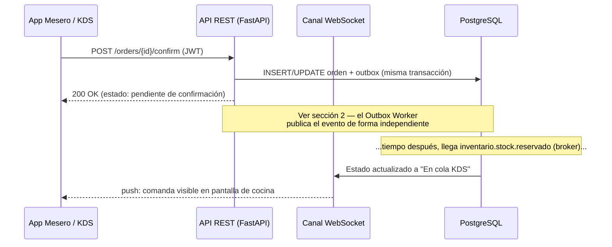
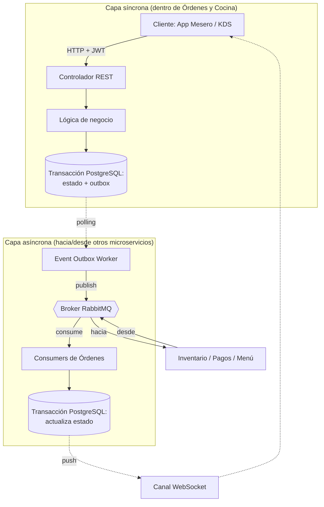

# Arquitectura de Comunicación — Microservicio de Órdenes y Cocina (Orders & KDS)

> Este documento complementa `ordenes-kds-diagramas-secuencia.md`. Ese documento cubre **qué** eventos se intercambian con otros microservicios; este documento cubre **cómo** funciona internamente la API de Órdenes y Cocina para producir y consumir esos mensajes — tanto la capa síncrona (REST, hacia los clientes de este microservicio) como la capa asíncrona (broker, hacia/desde otros microservicios).

---

## 0. Aclaración previa: no hay llamadas síncronas hacia otros microservicios de negocio

Antes de listar cualquier llamada síncrona, vale dejar constancia de una restricción de diseño que ya está fijada en los tres documentos base del proyecto:

- El documento de diagramas de secuencia establece como supuesto de arquitectura que el proyecto es **100% orientado a eventos**, **sin llamadas síncronas entre microservicios de negocio**.
- El documento de requisitos funcionales no describe ningún endpoint que Órdenes deba invocar en Inventario, Pagos o Catálogo; toda interacción con esos dominios se describe como publicar o consumir eventos del broker.
- La especificación de UI lo confirma explícitamente al corregir el Requisito 7: el envío de la comanda a la cola del KDS **no ocurre de forma directa** al confirmar el pedido, sino **tras consumir** el evento `inventario.stock.reservado` — es decir, ni siquiera ese flujo interno usa una llamada síncrona esperando respuesta HTTP; es una reacción a un evento.

**Conclusión para este documento:** en el camino de cada request de usuario (crear orden, ver catálogo, marcar platillo listo, etc.) la lista de "llamadas API síncronas de Órdenes hacia otros microservicios" sigue siendo, por diseño, una lista vacía — eso no cambia. Sí se identificó **una única excepción legítima y acotada**: una llamada síncrona saliente hacia Catálogo y Menú, pero exclusivamente para **arranque inicial y reconciliación periódica** de la vista materializada del diagrama 7, nunca como parte de atender a un mesero o a la pantalla KDS (ver sección 1.4). Cualquier otra necesidad de consulta síncrona que surja más adelante sigue representando una **desviación de la arquitectura acordada** y debería documentarse y aprobarse explícitamente, no añadirse silenciosamente.

Lo que sí existe — y es el tema central de este documento — son tres superficies de comunicación **dentro** de este microservicio:

| Capa | Dirección | Protocolo | Hacia quién |
|---|---|---|---|
| API síncrona | Entrante | HTTP/REST (FastAPI) | Clientes de este microservicio: app del mesero, pantalla KDS |
| Sincronización de arranque (excepción) | Saliente, fuera del camino de request de usuario | HTTP/REST síncrono | Catálogo y Menú — solo bootstrap/reconciliación (ver 1.4) |
| Mensajería asíncrona | Saliente y entrante | AMQP vía RabbitMQ (Broker) | Otros microservicios de negocio: Inventario, Pagos, Catálogo/Menú, Sala |

---

## 1. Capa síncrona: API REST expuesta por Órdenes y Cocina

Esta es la única superficie síncrona real del microservicio. No comunica microservicios entre sí — comunica a los **dispositivos físicos del restaurante** (handhelds Android del mesero, monitores industriales con Bump Bar en cocina) con el backend de Órdenes.

### 1.1 Principios de diseño de esta capa

- **Autenticación por token JWT en el encabezado HTTP.** El identificador del usuario autenticado (mesero, cocinero, administrador) que exige el Requisito 4 de trazabilidad **no** se captura como campo de formulario en ninguna vista — se extrae del token en cada petición. Esto significa que el middleware de autenticación debe inyectar `usuarioId` (y su rol) en el contexto de cada request antes de que llegue al controlador, para que la lógica de negocio pueda registrar quién ejecutó cada transición de estado.
- **Cada endpoint que cambia estado dispara una transacción, no una llamada a otro microservicio.** El controlador nunca necesita esperar una respuesta remota síncrona para responder al cliente; responde en cuanto el cambio de estado y el registro en la tabla `outbox` quedan confirmados en PostgreSQL (ver sección 2).
- **Los efectos de fondo (reserva de stock, cálculo de cuenta, etc.) no son parte de la respuesta HTTP.** El mesero recibe `200 OK` a "confirmar orden" cuando la orden queda en estado `Pendiente de confirmación de stock`, no cuando Inventario ya respondió. La actualización real a "en KDS" o "Rechazada" llega después, empujada por WebSocket (sección 1.3).
- **Autorización por rol** debe validarse en el controlador antes de la lógica de negocio: mesero vs. administrador tienen distintos permisos sobre comandas ya avanzadas a "En preparación" o "Listo" (Requisito 6).

### 1.2 Endpoints propuestos por vista

Los documentos fuente describen las capacidades funcionales y las vistas de UI, pero no fijan nombres exactos de rutas/payloads — estos endpoints son una **propuesta a validar con el equipo**, derivada directamente de los requisitos y de las tres vistas de la especificación de UI:

**Vista 1 — Monitor de Mesas Activas (mesero)**
| Método | Ruta propuesta | Requisito | Nota |
|---|---|---|---|
| `GET` | `/orders?estado=` | 5 | Estado por color de cada mesa/comanda |
| `POST` | `/orders` | 4 | Crea comanda vinculada a mesa, o `tipo: "para_llevar"` sin mesa física |

**Vista 2 — Gestor de Comanda (mesero)**
| Método | Ruta propuesta | Requisito | Nota |
|---|---|---|---|
| `PATCH` | `/orders/{orderId}/items` | 4 | Agrega platillos, modificadores, notas — solo si `estado = Pendiente` |
| `PATCH` | `/orders/{orderId}/transfer` | 4 | Cambia la mesa asociada a la comanda |
| `POST` | `/orders/{orderId}/confirm` | 7 | Dispara la publicación de `ordenes.orden.creada` vía outbox |
| `PATCH` | `/orders/{orderId}/cancel` | 6 | Solo permitido si `estado = Pendiente`; dispara `ordenes.orden.cancelada` |
| `PATCH` | `/orders/{orderId}/items/{itemId}/redo` | 5 | Regresa un ítem de "Entregado" a "Pendiente"; requiere `nota` obligatoria en el body |
| `POST` | `/orders/{orderId}/request-bill` | — | Dispara `ordenes.cuenta.solicitada` |

**Vista 3 — Pantalla KDS (cocina, vía Bump Bar)**
| Método | Ruta propuesta | Requisito | Nota |
|---|---|---|---|
| `GET` | `/kds/queue?estacion=` | 1, 2 | Comandas ordenadas por prioridad y luego cronológicamente; filtradas por estación de Catálogo |
| `PATCH` | `/orders/{orderId}/items/{itemId}/ready` | 3 | Marca un platillo como "Listo"; dispara `ordenes.platillo.preparado` |
| `PATCH` | `/orders/{orderId}/ready` | 3 | Marca la comanda completa como "Listo" |

**Acciones administrativas**
| Método | Ruta propuesta | Requisito | Nota |
|---|---|---|---|
| `PATCH` | `/orders/{orderId}/void` (o `/items/{itemId}/void`) | 6 | Solo rol admin, sobre comandas ya en "En preparación"/"Listo"; dispara `ordenes.comanda.mermada` + `ordenes.cobro.solicitado` |

> Cualquier endpoint de esta tabla que no coincida exactamente con lo que finalmente implemente el equipo de frontend debe corregirse aquí — esta tabla es la propuesta de contrato, no el contrato firmado.

### 1.3 Notificación de vuelta al cliente: WebSocket, no polling

Cuando un cambio de estado ocurre por reacción a un evento del broker (por ejemplo, `inventario.stock.reservado` llega y la comanda pasa a la cola del KDS), no hay ninguna petición HTTP en curso a la cual responder — el mesero ya recibió su `200 OK` hace rato. Por eso la especificación de UI indica que Órdenes informa al frontend **vía WebSockets** para que la pantalla se redibuje sola, sin que el cliente tenga que hacer polling.

En la práctica esto implica un canal adicional dentro de esta misma API:
- Conexión WebSocket persistente por sesión de cliente (mesero o pantalla KDS), autenticada igual que el REST (JWT).
- Cuando la lógica de negocio actualiza el estado de una orden (ya sea por una petición REST entrante o por el consumo de un evento del broker), publica un mensaje al canal WebSocket correspondiente a esa mesa/comanda/estación.
- Esto separa claramente dos rutas de entrada a la misma lógica de negocio: **HTTP entrante** (acción humana) y **evento de broker entrante** (reacción a otro microservicio) — ambas terminan escribiendo en PostgreSQL y ambas pueden terminar empujando una actualización por WebSocket.

### 1.4 Excepción documentada: llamada síncrona saliente hacia Catálogo y Menú (bootstrap y reconciliación)

Los eventos `menu.platillo.precio_actualizado` y `menu.catalogo.actualizado` (sección 2.2) son **deltas**: solo informan qué cambió. Eso funciona bien mientras Órdenes ya tiene una copia local completa y consistente para irle aplicando esos cambios — pero deja dos huecos que los eventos por sí solos no resuelven:

- **Arranque inicial**: la primera vez que el microservicio se despliega, o si su base de datos se restaura desde cero, no existe todavía ninguna copia local sobre la cual aplicar deltas. No hay forma de "reproducir" desde eventos pasados a menos que Menú ofrezca un log de eventos re-consumible desde el origen, lo cual no está documentado como parte de su arquitectura.
- **Reconciliación por drift**: si en algún momento se pierde un evento (una caída del consumer, un mensaje mal encolado, etc.), la vista local queda desalineada del catálogo real de forma silenciosa — nadie se entera hasta que un mesero intenta vender un platillo con precio o disponibilidad incorrectos.

Para ambos casos, la solución es una llamada síncrona **acotada a un proceso de sistema, nunca a una request de usuario**:

- **Disparadores**: (a) rutina de arranque del microservicio (`on startup`), antes de aceptar tráfico si la tabla local está vacía; (b) job programado de reconciliación (por ejemplo, cada N horas) — frecuencia a definir con el equipo según qué tan seguido cambia el menú en producción.
- **Endpoint propuesto en Menú**: `GET /menu/catalogo/completo` (o equivalente) — una llamada síncrona real hacia otro microservicio, y por eso debe quedar explícitamente aprobada por el equipo de Catálogo y Menú, no asumida.
- **Comportamiento al recibir la respuesta**: comparar el snapshot completo contra la vista local; aplicar upserts fila por fila; si un ítem local no aparece en el snapshot (fue eliminado del catálogo) o viceversa, registrar la discrepancia. Un volumen alto de discrepancias en una reconciliación es una señal de que se están perdiendo eventos aguas arriba y merece alerta, no solo corrección silenciosa.
- **No debe pisar cambios más recientes**: si un evento en tiempo real actualizó un ítem después de que arrancó la reconciliación pero antes de que termine, la reconciliación no debe sobrescribirlo con un dato más viejo. Conviene comparar por timestamp (`updated_at` local vs. el que traiga el snapshot) antes de aplicar cada upsert, no reemplazar la tabla completa a ciegas.
- **Tolerancia a fallos**: si Menú no responde durante el arranque o la reconciliación, Órdenes debe seguir funcionando con su última copia local conocida (aunque esté algo desactualizada) en vez de bloquear su propia disponibilidad — la meta es no propagar una caída de Menú hacia el mesero o la cocina. Reintentar la sincronización más tarde y alertar si el atraso se vuelve significativo.
- **Fuera de alcance de esta llamada**: la Vista 2 (pestaña de catálogo del mesero) y el filtrado del KDS por estación siguen leyendo exclusivamente la vista local, tal como está en la sección 2.2 — esta llamada síncrona nunca se ejecuta como parte de atender esas pantallas.

---

## 2. Capa asíncrona: cómo esta API produce y consume eventos

Esta es la parte que efectivamente conecta a Órdenes con Inventario, Pagos, Catálogo/Menú y Sala — y es asíncrona en ambos sentidos.

### 2.1 Publicación: patrón Transactional Outbox

Ningún endpoint de la sección 1 publica directamente al broker. En su lugar:

1. El controlador ejecuta la lógica de negocio dentro de **una sola transacción** de PostgreSQL.
2. Esa transacción hace dos cosas atómicamente: (a) escribe el cambio de estado en las tablas de dominio (`Orden`, `Detalle_Orden`, `Comanda`), y (b) inserta una fila en la tabla `outbox` con el evento a publicar (tipo, payload, `orderId`/`sessionId`, timestamp).
3. Un proceso independiente, el **Event Outbox Worker**, hace polling (o escucha vía CDC) de filas no publicadas en `outbox`, las publica al exchange de RabbitMQ con el routing key correspondiente al nombre del evento (`ordenes.orden.creada`, etc.), y marca la fila como publicada.

Esto garantiza que **nunca** se publique un evento sin que el cambio de estado correspondiente ya esté confirmado en base de datos, y viceversa — no hay escenario de "evento publicado pero orden no guardada" ni al revés.

Según el documento de diagramas de secuencia, los eventos que salen de este microservicio por este mecanismo son:

| Evento | Disparado por (endpoint sección 1) | Estado del contrato |
|---|---|---|
| `ordenes.orden.creada` | `POST /orders/{id}/confirm` | Confirmado |
| `ordenes.orden.cancelada` | `PATCH /orders/{id}/cancel` | Confirmado |
| `ordenes.platillo.preparado` | `PATCH /orders/{id}/items/{itemId}/ready` | Confirmado |
| `ordenes.comanda.mermada` | `PATCH /orders/{id}/void` | Propuesto — pendiente de que Inventario documente su suscripción |
| `ordenes.cobro.solicitado` | `PATCH /orders/{id}/void` | Propuesto — pendiente de que Pagos acople su flujo a eventos |
| `ordenes.cuenta.solicitada` | `POST /orders/{id}/request-bill` | Propuesto — pendiente de que Pagos acople su flujo a eventos |

### 2.2 Consumo: listeners reaccionando a eventos externos

En sentido inverso, Órdenes mantiene *consumers* suscritos a las colas del broker para los eventos de otros dominios. Cada consumer:

- Recibe el mensaje del broker.
- Valida idempotencia (ver 2.3) antes de tocar la base de datos.
- Ejecuta la actualización de estado dentro de una transacción.
- Si esa actualización debe reflejarse en la UI en vivo, dispara el push por WebSocket descrito en 1.3.

Eventos consumidos por este microservicio, según el documento de diagramas:

| Evento consumido | Origen | Efecto en Órdenes |
|---|---|---|
| `sala.dining_session.iniciada` | Sala | Crea el registro base de la orden (semilla), usando `sessionId` como identificador de correlación |
| `inventario.stock.reservado` | Inventario | Envía la comanda a la cola del KDS |
| `inventario.stock.insuficiente` | Inventario | Marca la comanda como "Rechazada" + alerta visual (WebSocket) |
| `menu.platillo.precio_actualizado` | Catálogo y Menú | Actualiza precio en la vista materializada local |
| `menu.catalogo.actualizado` | Catálogo y Menú | Actualiza disponibilidad/categoría/estación en la vista materializada local |
| `pagos.pago.completado` | Pagos y Facturación | Marca la comanda como "Cerrada / Pagada" (estado final) |

La vista materializada de Catálogo (última fila del bloque anterior) es, en sí misma, parte de esta misma capa asíncrona: es lo que permite que los endpoints síncronos de la sección 1 (crear orden, filtrar KDS por estación) respondan sin hacer ninguna llamada saliente a Catálogo en el momento de la petición.

### 2.3 Idempotencia

Como el broker puede reentregar mensajes, tanto los publicados como los consumidos deben validarse contra una clave de deduplicación antes de aplicar efecto:
- `orderId + eventId` para los flujos de creación, reserva, consumo y cancelación.
- `sessionId + eventId` específicamente para el consumo de `sala.dining_session.iniciada`, ya que en ese punto todavía no existe un `orderId`.

### 2.4 Diagrama combinado: de la petición HTTP al evento en el broker

---

## 3. Puntos abiertos a validar con el equipo

1. **Contratos de los endpoints REST de la sección 1.2** son una propuesta derivada de requisitos y vistas de UI, no un contrato firmado — falta que el equipo de frontend los confirme o ajuste.
2. **Timeout de Saga**: si Inventario nunca responde a `ordenes.orden.creada` (ni con `reservado` ni con `insuficiente`), no hay hoy un evento de compensación definido. El documento de diagramas ya lo señala como pendiente (`ordenes.orden.expirada` propuesto).
3. **Alcance exacto del canal WebSocket** (¿un socket por mesero o por mesa? ¿el KDS se suscribe por estación o recibe todo y filtra en cliente?) no está definido en los documentos fuente — es una decisión de implementación que conviene fijar antes de construir el frontend.
4. **Contrato del endpoint `GET /menu/catalogo/completo` (sección 1.4)** debe ser aprobado por el equipo de Catálogo y Menú — hoy es una propuesta de este documento, no un endpoint confirmado por ellos.
5. **Frecuencia del job de reconciliación** (sección 1.4) no está definida — depende de qué tan seguido cambia el catálogo en producción y de qué tan tolerable es un drift temporal; sugiero acordarla con el equipo en vez de fijarla unilateralmente aquí.
6. Si en algún momento surge una necesidad real de llamada síncrona hacia otro microservicio **distinta** a la de bootstrap/reconciliación de la sección 1.4, eso sigue siendo una excepción a la arquitectura acordada (ver sección 0) y debería documentarse y aprobarse explícitamente, no añadirse silenciosamente a este documento.
