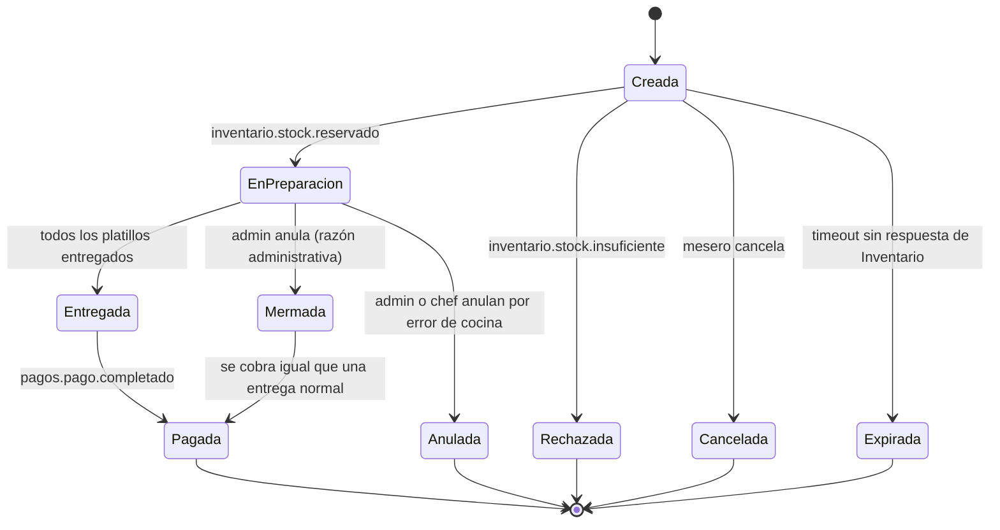
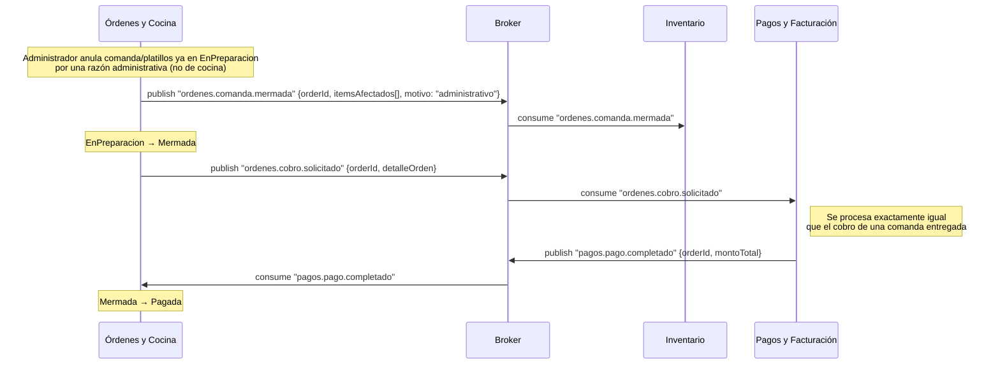
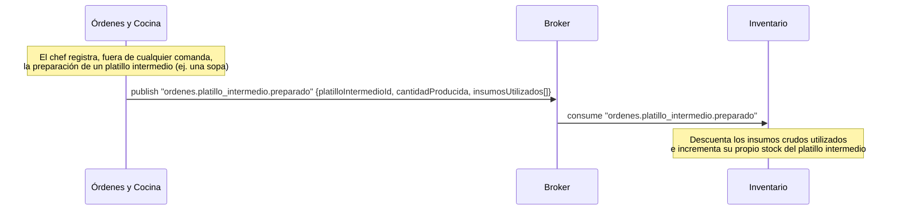
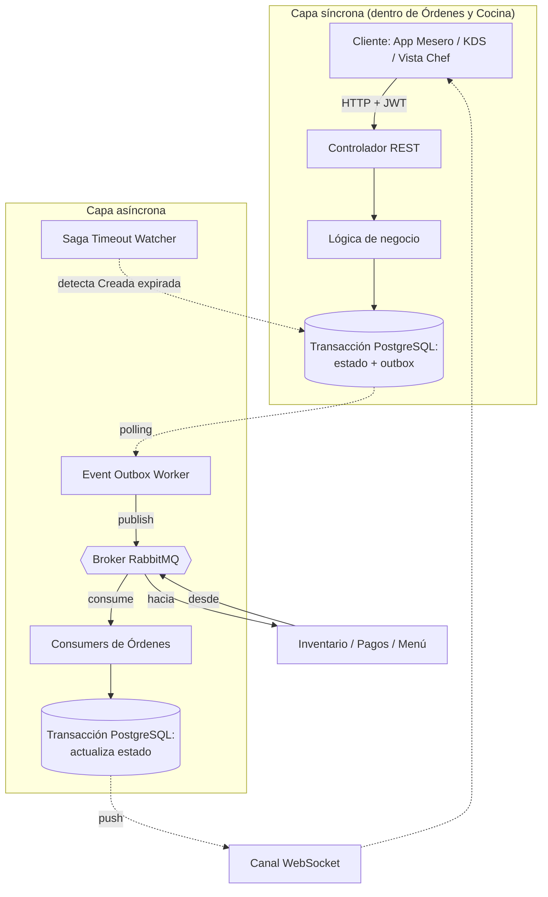

# Arquitectura Completa — Microservicio de Órdenes y Cocina (Orders & KDS)

**Documento base:** consolida y actualiza `Comunicaciones API ordenes y KDS.md` y `ordenes-kds-diagramas-secuencia.md` a la luz de las decisiones tomadas en `ERS_ordeneskds.md` (v4): renombrado de estados, reglas de "Mermada"/"Anulada", rol chef, nuevo estado "Expirada", y propiedad del stock de platillos intermedios.

**Enfoque de este documento:** la comunicación de la API interna (síncrona, hacia los clientes de este microservicio) y, sobre todo, los **eventos asíncronos que este microservicio publica al broker** para que otros microservicios los consuman.

---

## 0. Principios de arquitectura (sin cambios)

- Arquitectura 100% orientada a eventos: ninguna llamada síncrona entre microservicios de negocio, salvo la única excepción documentada en la sección 3.4 (bootstrap/reconciliación con Catálogo y Menú).
- Toda publicación de este microservicio pasa por el patrón **Transactional Outbox**: el cambio de estado y el evento a publicar se escriben en la misma transacción de PostgreSQL; un Event Outbox Worker independiente los publica al broker (RabbitMQ).
- Toda actualización de estado que deba reflejarse en pantalla en tiempo real se empuja por **WebSocket**, sin polling.
- Convención de eventos: `dominio.entidad.accion`. Los eventos que Órdenes consume de otros dominios usan el prefijo de origen (`inventario.*`, `pagos.*`, `menu.*`, `sala.*`).

## 1. Roles y actores

| Rol | Origen | Puede... |
|---|---|---|
| Mesero | Auth | Crear/editar comandas en "Creada", cancelar en "Creada", transferir de mesa, solicitar la cuenta, rehacer un platillo entregado. |
| Personal de cocina | Auth | Marcar platillos/comandas como "Listo". |
| **Chef** | Auth | Además de lo anterior: confirmar la anulación de una comanda por error de cocina (junto con administrador); registrar la preparación de platillos intermedios (vista nueva, sección 3.2). |
| Administrador | Auth | Mermar (anular con cobro) comandas/platillos ya en "EnPreparacion"; confirmar anulaciones por error de cocina (junto con chef). |

> El rol se extrae del token JWT emitido por el microservicio de **Auth** en cada request; no se captura como campo de formulario.

## 2. Ciclo de vida de la orden (referencia rápida)

*(Ver `ERS_ordeneskds.md`, sección 1, para el detalle completo de cada estado.)*



---

## 3. Capa síncrona: API REST interna

Esta API no comunica microservicios entre sí — comunica los dispositivos del restaurante (handheld del mesero, Bump Bar de cocina, vista del chef) con el backend de Órdenes.

### 3.1 Principios
- Autenticación por JWT; `usuarioId` y `rol` se inyectan en el contexto de cada request.
- Cada endpoint que cambia estado escribe en una transacción (estado + outbox); nunca espera una respuesta remota síncrona para responder al cliente.
- Autorización por rol validada en el controlador antes de la lógica de negocio.

### 3.2 Endpoints propuestos

**Endpoints consumidos por el Microfrontend de Sala**
| Método | Ruta | Nota |
|---|---|---|
| `GET` | `/orders?estado=` | Estado por color de cada mesa/comanda |
| `POST` | `/orders` | Crea comanda (mesa o para llevar) → estado "Creada" |

**Endpoints consumidos por el Microfrontend de Menú**
| Método | Ruta | Nota |
|---|---|---|
| `PATCH` | `/orders/{orderId}/items` | Agrega platillos — solo si "Creada"; valida disponibilidad contra la vista local de Catálogo y Menú |
| `PATCH` | `/orders/{orderId}/transfer` | Cambia la mesa asociada |
| `POST` | `/orders/{orderId}/confirm` | Publica `ordenes.orden.creada` |
| `PATCH` | `/orders/{orderId}/cancel` | Solo si "Creada" → publica `ordenes.orden.cancelada` → "Cancelada" |
| `PATCH` | `/orders/{orderId}/items/{itemId}/redo` | Regresa un ítem "Entregado" a "Pendiente"; `nota` obligatoria |
| `POST` | `/orders/{orderId}/request-bill` | Publica `ordenes.cuenta.solicitada` |

**Vista 3 — Pantalla KDS (cocina)**
| Método | Ruta | Nota |
|---|---|---|
| `GET` | `/kds/queue?estacion=` | Comandas por prioridad y estación; deja de listar comandas en "Pagada" |
| `PATCH` | `/orders/{orderId}/items/{itemId}/ready` | Publica `ordenes.platillo.preparado` |
| `PATCH` | `/orders/{orderId}/ready` | Marca la comanda completa como "Listo" |

**Acciones administrativas**
| Método | Ruta | Rol | Nota |
|---|---|---|---|
| `PATCH` | `/orders/{orderId}/void` | Administrador | Anula comanda completa o platillos individuales ya "EnPreparacion" por razón administrativa → **"Mermada"**. Publica `ordenes.comanda.mermada` + `ordenes.cobro.solicitado` (tratado igual que una comanda entregada). |
| `PATCH` | `/orders/{orderId}/void-error-cocina` | Administrador **o Chef** | Anula la comanda **completa** ya "EnPreparacion" por error de cocina → **"Anulada"**. `nota` obligatoria. Publica `ordenes.comanda.mermada`; **no** publica ningún evento de cobro. |

**Vista 4 — Preparación de Platillos Intermedios (chef) — `[Opcional]`**
| Método | Ruta | Rol | Nota |
|---|---|---|---|
| `POST` | `/platillos-intermedios` | **Chef** | Registra un lote preparado por adelantado, fuera de cualquier comanda de cliente. Publica `ordenes.platillo_intermedio.preparado`. Requiere una vista nueva y dedicada (no se integra a una vista existente). |

> Estos endpoints son una propuesta a validar con el equipo de frontend, igual que en la versión anterior de este documento.

### 3.3 Notificación al cliente: WebSocket (sin cambios)
Conexión persistente por sesión (mesero/KDS/chef), autenticada por JWT. Cualquier actualización de estado —venga de un request REST entrante o de un evento del broker— se empuja por este canal, sin que el cliente tenga que hacer polling.

### 3.4 Excepción documentada: sincronización con Catálogo y Menú (sin cambios)
Única llamada síncrona saliente permitida en todo el microservicio, acotada a la rutina de arranque y a un job de reconciliación periódico contra `GET /menu/catalogo/completo` — nunca en el camino de una request de usuario. El detalle de tolerancia a fallos y comparación por `updated_at` se mantiene igual que en la versión anterior de este documento.

---

## 4. Capa asíncrona: eventos

### 4.1 Publicación — Transactional Outbox (sin cambios)
Ningún endpoint publica directamente al broker: escribe en la tabla `outbox` dentro de la misma transacción del cambio de estado; el Event Outbox Worker la publica de forma independiente y la marca como publicada.

### 4.2 Eventos que este microservicio PUBLICA

| Evento | Disparado por | Payload (aprox.) | Consumidor | Estado del contrato |
|---|---|---|---|---|
| `ordenes.orden.creada` | `POST /orders/{id}/confirm` (en "Creada") | `{orderId, items[]}` | Inventario | Confirmado |
| `ordenes.orden.cancelada` | `PATCH /orders/{id}/cancel` ("Creada" → "Cancelada") | `{orderId, itemsCancelados[]}` | Inventario | Confirmado |
| `ordenes.platillo.preparado` | `PATCH /orders/{id}/items/{itemId}/ready` | `{orderId, itemId}` | Inventario | Confirmado |
| `ordenes.comanda.mermada` | `PATCH /orders/{id}/void` **o** `/void-error-cocina` ("EnPreparacion" → "Mermada" **o** "Anulada") | `{orderId, itemsAfectados[], motivo: "administrativo" \| "error_cocina"}` | Inventario | Propuesto — pendiente de que Inventario documente su suscripción |
| `ordenes.cobro.solicitado` | `PATCH /orders/{id}/void` (**solo** para "Mermada") | `{orderId, detalleOrden}` — tratado de forma **idéntica** a la cuenta de una comanda entregada normalmente | Pagos | Propuesto — **no** se publica para "Anulada" |
| `ordenes.cuenta.solicitada` | `POST /orders/{id}/request-bill` (en "Entregada") | `{orderId, sessionId, detalleOrden}` | Pagos | Propuesto |
| `ordenes.orden.expirada` **(nuevo)** | Vencimiento del temporizador de Saga (comanda en "Creada" sin respuesta de Inventario) | `{orderId, tiempoEsperaMs}` | Inventario | Propuesto — nombre ya anticipado en `ordenes-kds-diagramas-secuencia.md`; pendiente validar el umbral de tiempo (sección 5) |
| `ordenes.platillo_intermedio.preparado` **(nuevo, opcional)** | `POST /platillos-intermedios` (chef, fuera del flujo de comandas) | `{platilloIntermedioId, cantidadProducida, insumosUtilizados[]}` | Inventario | Propuesto — pendiente validar nombre/payload con Inventario |

> **Por qué `ordenes.comanda.mermada` es un solo evento con un campo `motivo`, y no dos eventos distintos:** tanto "Mermada" como "Anulada" significan lo mismo para Inventario — insumos que ya se consumieron y no se recuperan —, así que reutilizan el mismo evento. Lo único que cambia según el motivo es si además se dispara un cobro (`ordenes.cobro.solicitado`) o no.
>
> **Por qué "Anulada" siempre implica la comanda completa:** al no admitir anulación parcial, el evento de merma publicado para "Anulada" siempre cubre la totalidad de los `itemsAfectados` de la comanda — nunca un subconjunto. Esto es justamente lo que evita el caso borde de una comanda con una mezcla de platillos "Mermados" (con cobro) y "Anulados" (sin cobro) dentro de la misma comanda.

### 4.3 Eventos que este microservicio CONSUME

| Evento consumido | Origen | Efecto en Órdenes |
|---|---|---|
| `sala.dining_session.iniciada` | Sala | Crea el registro base de la orden ("Creada"), usando `sessionId` como correlación |
| `inventario.stock.reservado` | Inventario | "Creada" → **"EnPreparacion"**; envía la comanda a la cola del KDS |
| `inventario.stock.insuficiente` | Inventario | "Creada" → **"Rechazada"**; alerta visual al mesero |
| `menu.platillo.precio_actualizado` | Catálogo y Menú | Actualiza el precio en la vista local materializada |
| `menu.catalogo.actualizado` | Catálogo y Menú | Actualiza disponibilidad/categoría/estación en la vista local — es lo que impide que el mesero pueda seleccionar un platillo no disponible |
| `pagos.pago.completado` | Pagos y Facturación | "Entregada" **o** "Mermada" → **"Pagada"** (estado final); la comanda deja de listarse en el KDS |

### 4.4 Idempotencia
- `orderId + eventId`: creación, reserva, consumo, cancelación, merma/anulación, expiración.
- `sessionId + eventId`: únicamente para `sala.dining_session.iniciada` (todavía no existe `orderId`).
- `loteId + eventId` **(nuevo)**: para `ordenes.platillo_intermedio.preparado`, ya que este flujo no tiene `orderId`.

---

## 5. Mecanismo del estado "Expirada" (Saga Timeout Watcher)

*(Detalle de implementación — el ERS solo exige el comportamiento resultante, no cómo se logra.)*

- Un proceso programado (análogo al job de reconciliación con Catálogo, sección 3.4) revisa periódicamente las comandas en "Creada" cuya antigüedad supere un umbral configurable.
- Al vencer el umbral sin haber recibido `inventario.stock.reservado` ni `inventario.stock.insuficiente`, transiciona la comanda a **"Expirada"** y publica `ordenes.orden.expirada`.
- Si Inventario responde **después** del timeout (una reserva "huérfana"), debe poder identificar — al consumir `ordenes.orden.expirada` — que tiene que liberar cualquier reserva hecha tardíamente, para no dejar insumo fantasma reservado para una comanda que el mesero ya no puede ver.
- **Pendiente de validar con el equipo:** el valor exacto del umbral (ver `ERS_ordeneskds.md`, sección 10, punto 7).

---

## 6. Diagramas de secuencia actualizados

Los flujos 1, 3, 4, 7 y 8 de `ordenes-kds-diagramas-secuencia.md` no cambian en su mecánica (solo en el nombre de los estados) y no se repiten aquí. A continuación, únicamente los flujos que sí cambian.

### 6.1 Creación y reserva — con "Rechazada" y "Expirada"

```mermaid
sequenceDiagram
    participant OC as Órdenes y Cocina
    participant B as Broker
    participant INV as Inventario

    Note over OC: Mesero confirma la orden (Creada)
    OC->>B: publish "ordenes.orden.creada" {orderId, items[]}
    B->>INV: consume "ordenes.orden.creada"

    alt Stock suficiente
        B->>OC: consume "inventario.stock.reservado"
        Note over OC: Creada → EnPreparacion; comanda a cola del KDS
    else Stock insuficiente
        B->>OC: consume "inventario.stock.insuficiente"
        Note over OC: Creada → Rechazada; alerta al mesero
    else Inventario no responde dentro del tiempo límite
        Note over OC: Vence el Saga Timeout Watcher (sección 5)
        OC->>B: publish "ordenes.orden.expirada" {orderId}
        Note over OC: Creada → Expirada
    end
```

### 6.2 Anulación administrativa ("Mermada") — se cobra igual que una entrega normal



### 6.3 Anulación por error de cocina ("Anulada") — sin cobro, cancela la comanda completa

```mermaid
sequenceDiagram
    participant OC as Órdenes y Cocina
    participant B as Broker
    participant INV as Inventario

    Note over OC: Administrador o Chef confirman la anulación<br/>de un platillo por error de cocina (nota obligatoria)
    Note over OC: La comanda COMPLETA se cancela de inmediato,<br/>no solo el platillo con el error
    OC->>B: publish "ordenes.comanda.mermada" {orderId, itemsAfectados[]: todos, motivo: "error_cocina"}
    B->>INV: consume "ordenes.comanda.mermada"
    Note over INV: Registra la pérdida; NO libera insumos ya consumidos
    Note over OC: EnPreparacion → Anulada (estado final)
    Note over OC: No se publica ningún evento de cobro
```

### 6.4 [Opcional] Preparación de un platillo intermedio



---

## 7. Diagrama combinado (síncrono → asíncrono)



---

## 8. Puntos abiertos relevantes a esta arquitectura

1. Validar con Inventario que su reserva de stock sea atómica (condición de carrera detrás de "Rechazada").
2. Definir el umbral exacto de tiempo para "Expirada" (sección 5).
3. Validar con Inventario el nombre y payload exactos de `ordenes.orden.expirada` y de `ordenes.platillo_intermedio.preparado`.
4. Confirmar con el equipo de frontend los endpoints de la sección 3.2, en especial los dos nuevos (`/void-error-cocina` y `/platillos-intermedios`).
5. Confirmar con Inventario si prefiere el campo `motivo` explícito en `ordenes.comanda.mermada` (propuesto aquí) o inferirlo de otra forma.
