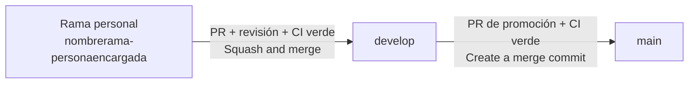

# Contribuir a Orders & KDS — Frontend

> **Repositorio:** `ordenes-kds-frontend`
> **Idioma de este documento:** español · **Idioma del código, commits, ramas y PRs:** inglés
>
> Este documento explica **cómo trabajar** en el repositorio: flujo de ramas, commits, Pull Requests, entorno local y revisión. Los **estándares de código** viven en [`docs/DEVELOPMENT_GUIDELINES.md`](docs/DEVELOPMENT_GUIDELINES.md). Si algo de aquí contradice la sección 12 de esa guía, prevalece la guía y este archivo se corrige.
>
> El flujo de trabajo es **idéntico al del repositorio de backend** (`ordenes-kds-backend`): rama personal → `develop` → `main`.

---

## Tabla de contenido

1. [Antes de empezar](#1-antes-de-empezar)
2. [Flujo de trabajo: rama-persona → develop → main](#2-flujo-de-trabajo-rama-persona--develop--main)
3. [Convención de nombres de rama](#3-convención-de-nombres-de-rama)
4. [Conventional Commits](#4-conventional-commits)
5. [Pull Requests](#5-pull-requests)
6. [Promoción de develop a main](#6-promoción-de-develop-a-main)
7. [Entorno local y variables de entorno](#7-entorno-local-y-variables-de-entorno)
8. [Verificación local antes de abrir un PR](#8-verificación-local-antes-de-abrir-un-pr)
9. [Cambios que afectan al backend o a otros micro frontends (contratos)](#9-cambios-que-afectan-al-backend-o-a-otros-micro-frontends-contratos)
10. [Decisiones de arquitectura (ADR)](#10-decisiones-de-arquitectura-adr)
11. [Puntos abiertos: no se resuelven en silencio](#11-puntos-abiertos-no-se-resuelven-en-silencio)
12. [Seguridad](#12-seguridad)
13. [Si trabajas con un agente de IA](#13-si-trabajas-con-un-agente-de-ia)
14. [Errores frecuentes y cómo repararlos](#14-errores-frecuentes-y-cómo-repararlos)
15. [Protección de ramas (para mantenedores)](#15-protección-de-ramas-para-mantenedores)

---

## 1. Antes de empezar

1. Levanta el proyecto siguiendo el [`README.md`](README.md) (sección *Quick Start*). Si `pnpm` te da problemas en Windows o con `ERR_PNPM_IGNORED_BUILDS`, consulta las secciones 14.1 y 14.2 de la guía de desarrollo.
2. Lee, como mínimo:
   - [`docs/DEVELOPMENT_GUIDELINES.md`](docs/DEVELOPMENT_GUIDELINES.md): estándares, regla de idioma, estilos aislados y directivas para agentes IA.
   - [`docs/ERS_ordeneskds.md`](docs/ERS_ordeneskds.md) y [`docs/Arquitectura_ordeneskds.md`](docs/Arquitectura_ordeneskds.md): qué se construye y con qué endpoints/eventos.
   - [`docs/Comunicaciones_API_ordenes_y_KDS.md`](docs/Comunicaciones_API_ordenes_y_KDS.md): REST y WebSocket desde el punto de vista del cliente.
   - [`docs/FMAT_RESTAURANT_Guia_Visual_Componentes.md`](docs/FMAT_RESTAURANT_Guia_Visual_Componentes.md): tokens y componentes visuales.
3. Todo cambio debe poder ligarse a un requisito (`RF-XX` / `RNF-XX`) del catálogo de [`docs/VyV_OrdenesKDS.md`](docs/VyV_OrdenesKDS.md). Si no encaja en ninguno, coméntalo en el issue antes de programar.

### Reglas que nunca se rompen

| Regla | Detalle |
|---|---|
| **Código 100 % en inglés** | Identificadores, comentarios, tests, claves de i18n, commits, ramas y PRs (guía §2). El texto visible para el personal vive en `es.json`, nunca como literal dentro de un componente (guía §7.7). |
| **Sin estilos globales** | Nada de Preflight, reglas sobre `body`/`html`/`:root`, ni `!important`. Los tokens viven en `.orders-kds-root` (guía §8.1): este frontend se carga dentro del Shell de Auth y del micro frontend de Menú. |
| **La UI no decide reglas de negocio** | Ocultar o deshabilitar un botón es solo usabilidad; el backend es la fuente de la regla (guía §3.4.1). |
| **Sin login en este remoto** | El JWT lo gestiona el Shell; este módulo no implementa login ni guarda el token en `localStorage` (guía §10.1). |
| **Nada de trabajo directo en `develop` ni `main`** | Ver sección 2. |

---

## 2. Flujo de trabajo: rama-persona → develop → main

Todo cambio recorre **siempre** las mismas tres etapas. No hay atajos, tampoco para urgencias.



### 2.1 Las tres capas

| Rama | Propósito | ¿Se escribe directamente? | Recibe cambios de |
|---|---|---|---|
| `nombrerama-personaencargada` | Trabajo de una persona en una tarea concreta | Sí, solo su dueña/o | — |
| `develop` | Integración: todo lo aprobado y listo para probarse en conjunto | **No** | PRs de ramas personales |
| `main` | Producción: solo lo que ya vivió y se validó en `develop` | **No** | PR de promoción desde `develop` |

Este esquema da control sobre los cambios: cada cambio tiene un dueño identificable (el nombre está en la rama), pasa por revisión antes de mezclarse con el trabajo de los demás y solo llega a producción tras haberse integrado y verificado en `develop`.

### 2.2 Paso a paso

```bash
# 1. Parte siempre de develop actualizado
git checkout develop
git pull origin develop

# 2. Crea tu rama personal: nombrerama-personaencargada
git checkout -b bumpbarkeymap-ana

# 3. Trabaja en commits pequeños (formato Conventional Commits, sección 4)
git add src/features/kds-board/bumpBarKeyMap.ts src/features/kds-board/bumpBarKeyMap.test.ts
git commit -m "feat(bump-bar): map Enter to mark focused order ready [RF-11, RNF-07]"

# 4. Publica tu rama (la primera vez)
git push -u origin bumpbarkeymap-ana

# 5. Antes de pedir revisión, ponte al día con develop
git fetch origin
git rebase origin/develop
git push --force-with-lease          # necesario tras un rebase; nunca uses --force a secas

# 6. Abre el Pull Request en GitHub:  base = develop  ←  compare = tu rama
```

Después del merge:

```bash
git checkout develop
git pull origin develop
git branch -d bumpbarkeymap-ana     # la rama remota se borra desde GitHub al hacer merge
```

### 2.3 Reglas del flujo

- **Toda rama nace de `develop`**, nunca de otra rama personal ni de `main`.
- **Una rama = una persona = una tarea.** No se comparten ramas ni se hacen commits en la rama de otra persona. Si dos personas colaboran, cada una trabaja en su propia rama y se integran vía `develop`.
- **Ramas cortas.** Idealmente viven días, no semanas. Si crece más de ~400 líneas cambiadas, divide el trabajo en varias ramas.
- **Un solo camino:** rama personal → `develop` → `main`. Está prohibido:
  - hacer commit o push directo a `develop` o `main`;
  - abrir un PR desde una rama personal hacia `main`;
  - mezclar `main` en tu rama personal (si necesitas actualizarte, haz rebase sobre `develop`);
  - reutilizar una rama ya mezclada: para nuevo trabajo, crea una rama nueva desde `develop`.
- **Correcciones urgentes** siguen el mismo flujo (rama personal → `develop` → `main`), con revisión prioritaria y promoción a `main` en cuanto `develop` esté verde. No existe la rama `hotfix`.

---

## 3. Convención de nombres de rama

```
nombrerama-personaencargada
```

- **`nombrerama`**: qué se hace, en **inglés**, en minúsculas, **sin separadores** (solo letras y dígitos), corto (idealmente ≤ 25 caracteres).
- **`-`**: un único guion que separa las dos partes.
- **`personaencargada`**: nombre de pila de quien trabaja la rama, en minúsculas y sin acentos ni `ñ` (`José` → `jose`, `Muñoz` → `munoz`). Si dos integrantes comparten nombre, agrega la inicial del apellido (`pablor`, `pablom`).

Expresión regular que debe cumplir toda rama personal:

```
^[a-z0-9]+-[a-z]+$
```

| ✅ Correcto | Por qué |
|---|---|
| `testingproduct-pablo` | Nombre en inglés + persona |
| `kdsboard-ana` | Pantalla KDS |
| `bumpbarkeymap-ana` | Mapeo de teclas del Bump Bar [RNF-07] |
| `orderticketwidget-luis` | Widget de ticket/comanda exportado al MFE de Menú |
| `intermediatedishesview-maria` | Vista del chef para platillos intermedios *(opcional)* |
| `wsreconnect-pablo` | Reconexión del WebSocket con *backoff* [RNF-04] |

| ❌ Incorrecto | Problema |
|---|---|
| `feature/RF-11-kds-ready` | Estilo anterior: usa `/`, prefijo de tipo y varios guiones |
| `kds-board-ana` | Guiones dentro de `nombrerama`; debe ser `kdsboard-ana` |
| `tablero-cocina-ana` | Nombre en español |
| `kdsboard` | Falta la persona encargada |
| `ana` | Falta el nombre de la rama |
| `kdsboard-Ana` | Mayúsculas |
| `kdsboard-ana2` | Dígitos en la parte de la persona; usa un nombre de rama distinto (`kdsboardtests-ana`) |

> **¿Dónde va el requisito (`RF-XX`)?** No en el nombre de la rama, sino en los commits y en la descripción del PR.
>
> **Tip:** si el cambio requiere PR en este repositorio y en el backend, usa el **mismo nombre de rama** en ambos: facilita enlazarlos (sección 9).

---

## 4. Conventional Commits

**Todos los commits** de tu rama —no solo el título del PR— deben seguir [Conventional Commits](https://www.conventionalcommits.org/). Sirven para leer el historial de un vistazo, generar changelogs y saber qué tipo de cambio entra a `develop` y a `main`.

### 4.1 Formato

```
<type>(<scope>)[!]: <description> [RF/RNF refs]

[body opcional]

[footer(s) opcional(es)]
```

Reglas de redacción:

1. **En inglés**, en modo imperativo presente: `add`, `fix`, `extract` (no `added`, `adds`, `agrega`).
2. `type` en minúsculas y de la lista de la sección 4.2.
3. `scope` opcional, entre paréntesis, de la lista de la sección 4.3.
4. `description` empieza en minúscula, **sin punto final**. El título completo (incluyendo referencias) mide **≤ 100 caracteres**.
5. Las referencias a requisitos van entre corchetes al final del título: `[RF-11]`, `[RF-23, RF-24]`, `[RNF-07]`.
6. El **body** explica el *por qué* (no el *qué*, que ya dice el diff). Separado del título por una línea en blanco.
7. Los **footers** enlazan issues (`Closes #42`, `Refs #57`) y declaran cambios que rompen compatibilidad (`BREAKING CHANGE: ...`).
8. **Un commit = un cambio lógico.** Si necesitas escribir "y" entre dos tipos distintos (`fix` y `refactor`, por ejemplo), sepáralos en dos commits.

### 4.2 Tipos (todos)

| Tipo | Úsalo cuando... | Ejemplo en este repositorio |
|---|---|---|
| `feat` | Agregas una funcionalidad nueva: pantalla, componente, hook, atajo de teclado, integración con un endpoint o un mensaje WebSocket. | `feat(kds-board): show elapsed time counter on every order card [RF-07]` |
| `fix` | Corriges un comportamiento incorrecto respecto al requisito (un bug). Debe ir con su prueba de regresión. | `fix(realtime): refetch queue after reconnect to recover missed messages [RNF-04]` |
| `docs` | Cambias **solo documentación**: `docs/`, README, TSDoc, comentarios `@satisfies` sin alterar comportamiento. | `docs(order-ticket): document the props contract of the ticket widget` |
| `style` | Cambios de **formato** que no alteran el significado del código: espacios, comas, orden de clases Tailwind aplicado por `prettier-plugin-tailwindcss`. **No** es para cambios visuales: un cambio de apariencia es `feat` o `fix`. | `style: apply prettier to the kds-board feature` |
| `refactor` | Reestructuras código sin cambiar su comportamiento externo y sin corregir un bug ni agregar funcionalidad. | `refactor(order-ticket): move confirm logic out of the component into a hook` |
| `perf` | Mejoras el rendimiento (renders, tamaño del bundle, memoización) sin cambiar el comportamiento funcional. | `perf(kds-board): memoize sorted queue to avoid re-render on every tick` |
| `test` | Agregas, corriges o reorganizas **solo tests** (unitarios, Playwright, axe) sin tocar código de producción. | `test(bump-bar): cover every key in BUMP_BAR_KEY_MAP [RNF-07]` |
| `build` | Tocas el sistema de build o las dependencias: `package.json`, `pnpm-lock.yaml`, `vite.config.ts` (incluida la configuración de Module Federation), `tsconfig.json`, `tailwind.config`. | `build(deps): bump @tanstack/react-query to the latest 5.x patch` |
| `ci` | Cambias la configuración de integración continua: `.github/workflows/`, `sonar-project.properties`, umbrales de calidad. | `ci: run Playwright keyboard-only suite on every pull request` |
| `chore` | Mantenimiento que no encaja en los demás y no toca `src/` ni tests: `.gitignore`, `scripts/`, `.env.example`. | `chore(scripts): add helper to print the preview URL for the Shell` |
| `revert` | Deshaces un commit anterior. El body indica el hash revertido. | `revert: feat(intermediate-dishes): add chef view route` |

`revert` se escribe así:

```
revert: feat(intermediate-dishes): add chef view route

This reverts commit 3f2a9c1.
Reason: the exposed module name is still pending agreement with the Shell team.
```

#### ¿Qué tipo elijo?

1. ¿Cambia lo que el personal (mesero, cocina, chef) puede hacer o ver? Es nuevo → `feat`; estaba mal → `fix`.
2. ¿Solo reorganizas el código y todo se comporta y se ve igual? → `refactor`.
3. ¿Solo cambia el formato del código (sin lógica ni apariencia)? → `style`.
4. ¿Solo hace lo mismo pero más rápido? → `perf`.
5. ¿Solo tests? → `test`. ¿Solo documentación? → `docs`.
6. ¿Dependencias, Vite/Federation o configuración de build? → `build`. ¿Workflows de CI o Sonar? → `ci`.
7. ¿Ninguna de las anteriores y no toca código de la aplicación? → `chore`. ¿Deshaces un commit? → `revert`.

> Las actualizaciones de dependencias se registran como `build(deps)`, no como `chore`. Recuerda que **agregar** una dependencia nueva exige justificarla en el PR.

### 4.3 Scopes del frontend

El scope es opcional pero recomendado. Usa uno de esta lista (si necesitas otro, propónlo en el PR y actualiza la guía §12.5):

| Scope | Área |
|---|---|
| `kds-board` | Pantalla KDS: cola, tarjetas de comanda, contador de tiempo, filtro por estación |
| `bump-bar` | Mapeo de teclas y navegación por teclado del KDS (`BUMP_BAR_KEY_MAP`) |
| `order-ticket` | Widget de Ticket/Comanda (confirmar, cancelar, modificar) exportado al MFE de Menú |
| `intermediate-dishes` | Vista del chef para platillos intermedios *(opcional)* |
| `realtime` | Cliente WebSocket, reconexión y actualización de la caché |
| `api` | Cliente REST, esquemas Zod, `errorCodes.ts` |
| `styles` | Tokens FMAT-RESTAURANT, aislamiento de estilos, configuración de Tailwind |
| `federation` | Configuración de Module Federation y módulos expuestos |
| `a11y` | Accesibilidad (`aria-*`, foco, contraste) |
| `i18n` | Diccionario `es.json` y claves de traducción |
| `deps` | Dependencias (con `build`) |

### 4.4 Cambios que rompen compatibilidad

Renombrar o quitar una prop de un módulo expuesto, un campo de un esquema Zod compartido, o cambiar el nombre de un módulo federado **rompe el contrato** (guía §9.3 y sección 9 de este documento). Márcalo con `!` después del scope y agrega el footer `BREAKING CHANGE:`:

```
feat(order-ticket)!: rename onConfirm prop to onConfirmOrder [OP-04]

The Menu team imports this widget, so both names are exposed during one release cycle.

BREAKING CHANGE: `onConfirm` is replaced by `onConfirmOrder` in OrderTicketWidget.
```

### 4.5 Ejemplos completos

```
feat(kds-board): sort orders by priority and then by arrival time [RF-02, RF-03]
fix(order-ticket): disable confirm button while the request is in flight [RF-32]
test(order-ticket): add boundary cases for empty and maximum-length note [RF-22]
refactor(realtime): isolate the subscription in a single module [OP-02]
style: apply prettier to the api package
build(federation): pin shared react version to match the Shell
ci: fail the pipeline when coverage of new code drops below 85%
```

Ejemplo con body y footer:

```
fix(realtime): refetch queue after reconnect to recover missed messages [RNF-04]

Previously the queue kept the last cached state after a dropped connection,
so orders confirmed during the outage never appeared on the kitchen screen.
A full refetch now runs on every successful reconnect.

Closes #42
```

---

## 5. Pull Requests

### 5.1 Reglas

- **Base:** siempre `develop` (la única excepción es la promoción `develop` → `main`, sección 6).
- **Un PR = un propósito.** Preferible < 400 líneas cambiadas. Puedes abrirlo como **Draft** temprano para recibir feedback.
- **Título:** en inglés y en formato Conventional Commits. Con *Squash and merge*, el título del PR se convierte en el único commit que entra a `develop`.
- **Descripción:** en inglés, usando la plantilla de [`.github/PULL_REQUEST_TEMPLATE.md`](.github/PULL_REQUEST_TEMPLATE.md). Debe incluir: qué y por qué, `RF/RNF` cubiertos, cómo se probó, si cambia un contrato (API, WebSocket, módulo federado), capturas de pantalla o un GIF si cambia la interfaz, y cualquier supuesto sobre un punto abierto (`OP-XX`). Enlaza el issue con `Closes #NN`.

### 5.2 Checklist del autor (Definition of Done)

Marca cada punto en el PR (guía §11.6):

- [ ] Rama con formato `nombrerama-personaencargada`, creada desde `develop`.
- [ ] Todos los commits y el título del PR siguen Conventional Commits.
- [ ] Referencia al menos un `RF-XX`/`RNF-XX`; TSDoc con `@satisfies` en cada módulo, hook o componente exportado.
- [ ] Pruebas unitarias del comportamiento nuevo (éxito **y** al menos un error), etiquetadas con `// @requirement RF-XX`.
- [ ] Si cambia el comportamiento visible: prueba E2E de Playwright y verificación `axe-core` sin violaciones; si toca el KDS, prueba operada **solo con `page.keyboard`**.
- [ ] Si cambia un contrato: tipos TypeScript, esquemas Zod y `errorCodes.ts` actualizados en coordinación con el backend.
- [ ] `eslint` y `tsc` sin errores; sin `any`; `prettier` aplicado (incluido el orden de clases Tailwind).
- [ ] Sin estilos globales, sin `!important`, sin `dangerouslySetInnerHTML`; tokens solo en `.orders-kds-root`.
- [ ] Texto visible mediante claves de i18n en inglés (`t('ticket.confirm')`); ningún literal en español en componentes ni tests.
- [ ] Elementos interactivos con `data-testid` (`<feature>-<element>`), foco visible, y estados comunicados con color **+** texto o icono.
- [ ] CI en verde, incluido el *Quality Gate* de SonarCloud (≥ 85 % de cobertura en código nuevo).
- [ ] Cero secretos y cero vulnerabilidades críticas (`pnpm audit`, gitleaks); ningún token ni URL interna hardcodeada en el bundle.
- [ ] Sin resolver en silencio ningún punto abierto (sección 11).

### 5.3 Revisión

- Se requiere **al menos 1 aprobación** de alguien distinto al autor. Nadie aprueba su propio PR.
- Todas las conversaciones deben quedar resueltas.
- La rama debe estar actualizada con `develop` y el CI completo en verde. Nunca se desactiva un *check* para "salir del paso".

**Qué mira quien revisa:**

1. ¿La UI se limita a mostrar u ocultar por usabilidad, sin duplicar reglas de negocio que pertenecen al backend?
2. ¿Todo dato de red se valida con Zod en el borde, y el estado del servidor vive solo en TanStack Query?
3. ¿El WebSocket no hace *polling*, valida cada mensaje y refresca todo al reconectar?
4. ¿Se respeta el aislamiento de estilos (nada global) y los tokens FMAT-RESTAURANT (sin inventar colores, radios ni espaciado)?
5. ¿El KDS es operable solo con teclado y el mapeo de teclas vive únicamente en `BUMP_BAR_KEY_MAP`?
6. ¿El código, los comentarios, las claves de i18n y los tests están en inglés?
7. ¿Se respetan los contratos con el backend y con los demás micro frontends, y los puntos abiertos?

### 5.4 Merge

- **Estrategia hacia `develop`: *Squash and merge*.** El commit resultante usa el título del PR (Conventional Commits) y como cuerpo el resumen del PR.
- Borra la rama al mezclar (activa *Automatically delete head branches* en GitHub).
- Quien mezcla es normalmente el autor, una vez con aprobación y CI verde.

---

## 6. Promoción de develop a main

`main` solo se actualiza mediante un PR de `develop` → `main`.

**Precondiciones:**

- `develop` con CI y *Quality Gate* en verde.
- Sin PRs bloqueantes pendientes de mezclar.
- Verificación funcional de lo acumulado en `develop`: E2E de Playwright (incluida la suite de teclado del KDS) y `axe-core` en verde, y el remoto probado dentro del Shell (`pnpm build && pnpm preview`, guía §14.5).
- Contratos coordinados con el backend y con los equipos de Shell (Auth), Menú y Sala (sección 9).

**Cómo:**

1. Abre el PR con **base `main`** y **compare `develop`**.
2. Título: `chore(release): promote develop to main`.
3. Descripción: lista de los PRs incluidos (GitHub puede generarla) y cualquier nota de despliegue (nuevas variables `VITE_*`, cambios en los módulos expuestos).
4. Requiere 1 aprobación distinta de quien lo abre y CI verde.
5. **Estrategia: *Create a merge commit*** (no squash). Squash en esta etapa haría que `develop` y `main` divergieran en historial y generaría conflictos falsos en la siguiente promoción; además, cada commit que llega de `develop` ya es un Conventional Commit limpio.

---

## 7. Entorno local y variables de entorno

```bash
cp .env.example .env.local     # .env y .env.local NUNCA se versionan; solo .env.example (sin valores reales)
pnpm install
```

Reglas:

- Todo lo que empieza con `VITE_` **termina dentro del bundle y es público**. Nunca pongas secretos, tokens ni credenciales en una variable `VITE_*` (guía §10.1 y §10.2).
- Las URLs (API Gateway, WebSocket) vienen de variables de entorno; no se hardcodean en el código.
- Las claves están en `UPPER_SNAKE_CASE` y en inglés. En CI, los secretos viven en *GitHub Secrets*.

### 7.1 Variables

Los nombres de esta tabla son una **propuesta**: ajústalos al `.env.example` real del repositorio y mantén ambos sincronizados.

| Variable | Obligatoria | Descripción | Ejemplo local |
|---|:---:|---|---|
| `VITE_API_BASE_URL` | Sí | URL base del API Gateway, por donde pasan las peticiones REST hacia el backend de Órdenes. *(Propuesta)* | `http://localhost:8080` |
| `VITE_WS_URL` | Sí | URL del canal WebSocket de Órdenes; el alcance de los canales sigue abierto (OP-02). *(Propuesta)* | *(vacío hasta acordar OP-02)* |

> **JWT:** lo emite Auth y lo gestiona el Shell. Este remoto lo recibe del anfitrión y lo envía en cada petición; no implementa login ni lo persiste en `localStorage`. Por eso **no** existe (ni debe crearse) una variable de secreto de firma.

Si agregas una variable: actualiza `.env.example`, esta tabla y menciónalo en el PR (y en las notas de despliegue si es obligatoria).

### 7.2 Problemas de entorno local

Consulta la sección 14 de la guía de desarrollo: `pnpm` en Windows (14.1), `ERR_PNPM_IGNORED_BUILDS` (14.2), Playwright (14.4) y Module Federation / `remoteEntry.js` (14.5).

---

## 8. Verificación local antes de abrir un PR

Los nombres de los scripts son los habituales del stack; confirma los definitivos en `package.json`.

```bash
# Estilo, formato y tipos
pnpm lint && pnpm typecheck

# Pruebas unitarias con cobertura
pnpm test --coverage

# E2E, accesibilidad (axe-core) y suite de teclado del KDS
pnpm test:e2e

# El remoto federado se genera en el build; pruébalo desde el Shell o desde Menú
pnpm build && pnpm preview
```

Primera vez con Playwright: `pnpm exec playwright install --with-deps chromium webkit`.

**Objetivos de cobertura** (guía §11.4): global ≥ 85 % (código nuevo en el PR también); mapeador del Bump Bar, cliente WebSocket y funciones de ordenamiento ≥ 90 % de ramas; hooks (`useKdsQueue`, `useOrderEvents`, …) ≥ 75 %; componentes de presentación ≥ 50 %. La cobertura es una señal, no una meta: una prueba sin aserciones significativas se rechaza en revisión.

**Cada bug nace con su prueba de regresión** *antes* del arreglo (rojo → verde). En Playwright usa *auto-waiting* y selectores por `data-testid`; nunca `waitForTimeout` fijo (guía §11.5).

---

## 9. Cambios que afectan al backend o a otros micro frontends (contratos)

Este repositorio tiene dos tipos de contrato:

### 9.1 Contrato con el backend (REST, WebSocket, `ErrorCode`)

Un cambio de esquema (endpoint, parámetro, campo, `ErrorCode`, mensaje WebSocket) rompe compatibilidad y exige actualizar **ambos lados en un cambio coordinado**:

1. Abre el PR en este repositorio y el PR correspondiente en `ordenes-kds-backend`, con el **mismo nombre de rama** si es posible, y enlázalos entre sí en las descripciones.
2. En el frontend actualiza: tipos TypeScript, esquemas Zod y `src/shared/api/errorCodes.ts` (espejo de `app/core/error_codes.py`).
3. Se mezcla primero el cambio **compatible hacia atrás** del backend; después el del frontend. Al renombrar un endpoint, se soportan ambos nombres durante un ciclo de release y solo entonces se retira el antiguo (guía §9.3).
4. Los contratos *propuestos* (guía §9.1 y OP-07) se tratan como propuestos hasta que el equipo los confirme.

### 9.2 Contrato con el Shell y los demás micro frontends (Module Federation)

Este repositorio es un **remoto federado** y otros equipos dependen de lo que expone. Los módulos expuestos son un contrato público:

| Exposición | Quién la consume | Qué pasa si cambia |
|---|---|---|
| App KDS (vista completa) | Shell (Auth): se carga cuando el cocinero entra a "Órdenes y Cocina" | El Shell debe conocer el nuevo nombre/ruta |
| App de Platillos Intermedios *(opcional)* | Shell (Auth): vista del chef | Ídem |
| `OrderTicketWidget` (confirmar, cancelar, modificar) | Micro frontend de Menú, que lo incrusta junto a su catálogo | Cambiar sus props rompe la pantalla del mesero |

> Los nombres exactos de los módulos expuestos (por ejemplo `./KdsApp`, `./IntermediateDishesApp`, `./OrderTicketWidget`) son una **propuesta** hasta acordarlos con el Shell y con Menú.

Reglas:

- Las props nuevas del widget son **opcionales**; renombrar o quitar una prop, o cambiar el nombre de un módulo expuesto, requiere un ciclo de deprecación acordado con el equipo consumidor y se marca con `!` + `BREAKING CHANGE:` (sección 4.4).
- El widget **no** maneja rutas ni *layout* de página: su anfitrión decide dónde vive y qué props recibe (guía §7.4).
- Las versiones compartidas (`react`, `react-dom`) se coordinan con el Shell; un cambio en la configuración de `vite.config.ts` que las afecte se anuncia en el PR con tipo `build(federation)`.
- Ningún estilo de este remoto puede afectar fuera de `.orders-kds-root`. Los puertos distintos entre micro frontends se resuelven conforme se construyan; anota en el PR cualquier puerto o URL que estrenes.
- Los endpoints que consumen los MFE de Sala (mesas activas) y Menú (catálogo con ticket) no cambian por estar en otro repositorio: siguen siendo los de Órdenes.

---

## 10. Decisiones de arquitectura (ADR)

Toda decisión de arquitectura no trivial (nueva dependencia relevante, patrón nuevo, cambio en la forma de exponer módulos federados, desviación de un principio) se registra como **ADR**:

- Archivo: `docs/adr/NNNN-short-title.md` (nombre en inglés y `kebab-case`; contenido en español).
- Se propone en el mismo PR que la introduce, o en un PR `docs` previo.
- Plantilla mínima:

```markdown
# ADR-NNNN: Título corto

- **Estado:** Propuesto | Aceptado | Reemplazado por ADR-XXXX
- **Fecha:** AAAA-MM-DD
- **Requisitos relacionados:** RF-XX, RNF-XX

## Contexto
Qué problema o fuerza motiva la decisión.

## Decisión
Qué se decide, en una o dos frases claras.

## Consecuencias
Qué se gana, qué se pierde y qué queda pendiente.
```

---

## 11. Puntos abiertos: no se resuelven en silencio

La guía §1.2 lista decisiones pendientes (`OP-01` … `OP-07`). Ningún PR "elige una" sin dejarlo explícito. En este repositorio afectan sobre todo a:

| Punto | Qué hacer mientras tanto |
|---|---|
| OP-02 Alcance de canales WebSocket | Encapsular la suscripción en un único módulo (`realtime`). |
| OP-03 Hex de Éxito/Advertencia/Error/Información | Usar tokens semánticos (`--color-success`, …) sin inventar el hex; siempre color **+** texto. |
| OP-04 Contrato de `ordenes.orden.expirada`, `ordenes.platillo_intermedio.preparado` y `motivo` | Reflejarlos en tipos/Zod como *propuestos*. |
| OP-05 `confirm` sobre una orden ya confirmada | Tratar la acción como idempotente en la UI y documentar el supuesto en el PR. |
| OP-06 Mapeo exacto de teclas del Bump Bar | Definirlo en una sola constante configurable (`BUMP_BAR_KEY_MAP`). |
| OP-07 Rutas en español de la Arquitectura §3.2 | Usar las rutas en inglés de la guía §9.1 hasta confirmarse. |

Si tu cambio depende de uno, escribe el supuesto en la descripción del PR. Cuando el equipo resuelva un punto, actualiza la guía en el mismo cambio.

---

## 12. Seguridad

- Nunca hagas commit de secretos. Un escáner (gitleaks) corre en CI; si sospechas que expusiste uno, **rótalo de inmediato** y avisa al equipo (borrar el commit no basta).
- Checklist de seguridad del frontend: guía §10.1. En resumen: sin tokens ni URLs internas hardcodeadas, notas y modificadores siempre escapados (sin `dangerouslySetInnerHTML`), sin JWT en `localStorage`, y acciones ocultas por rol también protegidas en el backend.
- Los mensajes WebSocket entrantes se validan con Zod; los inválidos se descartan y se registran, nunca rompen la UI (guía §10.3).
- Para reportar una vulnerabilidad, **no abras un issue público**: contacta directamente a las personas mantenedoras listadas en la tabla *Team Members* del README.

---

## 13. Si trabajas con un agente de IA

El flujo es el mismo para humanos y agentes (Claude, Copilot, Cursor, etc.):

- El agente trabaja en **tu rama personal** (`nombrerama-personaencargada`), nunca en `develop` ni `main`.
- Sus commits y el título del PR siguen Conventional Commits, en inglés, con el tipo correcto de la sección 4.2.
- Debe cumplir la sección 13 de la guía (trazabilidad de requisitos, pruebas, idioma, sin estilos globales, accesibilidad, KDS por teclado, etc.).
- **Una persona revisa y es responsable del PR.** El agente no aprueba ni mezcla.

---

## 14. Errores frecuentes y cómo repararlos

| Situación | Solución |
|---|---|
| **Hice commits en `develop` local** (aún sin push) | `git switch -c nombrerama-persona` (conserva tus commits en la rama nueva) → `git switch develop` → `git reset --hard origin/develop` → `git switch nombrerama-persona`. |
| **`git push` a `develop` o `main` fue rechazado** | Es lo esperado (ramas protegidas). Aplica la solución anterior y abre un PR. |
| **Mi último mensaje de commit está mal** | `git commit --amend -m "fix(scope): corrected message"` y luego `git push --force-with-lease`. |
| **Varios commits con mensajes mal escritos** | `git rebase -i origin/develop`, marca `reword` en cada uno y luego `git push --force-with-lease`. |
| **El nombre de mi rama no cumple la convención** | `git branch -m nombrerama-persona` → `git push -u origin nombrerama-persona` → `git push origin --delete nombre-viejo`. Si había un PR abierto, ábrelo de nuevo desde la rama renombrada. |
| **Conflictos al hacer rebase sobre `develop`** | Resuélvelos archivo por archivo, `git add <archivo>` y `git rebase --continue`. Para abortar: `git rebase --abort`. |
| **Conflicto en `pnpm-lock.yaml`** | No lo edites a mano: resuelve `package.json`, ejecuta `pnpm install` para regenerar el lockfile y haz `git add pnpm-lock.yaml` antes de continuar el rebase. |
| **Abrí el PR hacia `main` por error** | En GitHub, edita el PR y cambia la *base* a `develop`. |
| **El CI falla por formato o tipos** | Corre localmente `pnpm lint` y `pnpm typecheck`, aplica `prettier`, revisa el diff y haz un commit `style:` o `fix:` según corresponda. |
| **El remoto no carga desde el Shell** | `remoteEntry.js` se genera en el build: ejecuta `pnpm build && pnpm preview` y apunta el host a la URL/puerto que imprima `preview` (guía §14.5). |

---

## 15. Protección de ramas (para mantenedores)

Configura en *Settings → Branches* (o *Rulesets*) para **`develop`** y **`main`**:

| Ajuste | `develop` | `main` |
|---|:---:|:---:|
| Exigir Pull Request antes de mezclar | ✅ | ✅ |
| Aprobaciones requeridas (distintas del autor) | ≥ 1 | ≥ 1 |
| Descartar aprobaciones al llegar commits nuevos | ✅ | ✅ |
| Exigir conversaciones resueltas | ✅ | ✅ |
| Exigir *checks* en verde (CI + SonarCloud Quality Gate) | ✅ | ✅ |
| Exigir rama actualizada con la base | ✅ | ✅ |
| Prohibir push directo y *force push* | ✅ | ✅ |
| Prohibir borrar la rama | ✅ | ✅ |
| Métodos de merge permitidos | Solo *Squash and merge* | Solo *Create a merge commit* |
| Solo `develop` puede ser origen de PRs hacia `main` | — | ✅ (vía *check* de CI) |

Además, en el repositorio: activa *Automatically delete head branches*.

**Automatizaciones recomendadas** (propuestas; cada una se justifica y revisa en su PR de `ci`):

- Un *job* de CI que valide el nombre de la rama personal con `^[a-z0-9]+-[a-z]+$` y bloquee PRs hacia `main` cuyo origen no sea `develop`.
- Un *job* que valide con *commitlint* (o equivalente) el título del PR y cada commit contra la lista de tipos de la sección 4.2.
