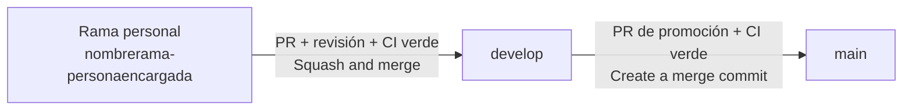

# Orders & KDS — Guía de Buenas Prácticas de Desarrollo

> **Versión:** 1.1 (flujo Git rama-persona → develop → main, convención de ramas y Conventional Commits completos)
> **Aplica a:** `ordenes-kds-backend` y `ordenes-kds-frontend` (este documento es **idéntico en ambos repositorios**, en `docs/DEVELOPMENT_GUIDELINES.md`)
> **Stack backend:** Python 3.12 · FastAPI · Pydantic 2 · SQLAlchemy 2 + Alembic · aio-pika · PostgreSQL 16 · Redis 7 · RabbitMQ
> **Stack frontend:** React 18 · TypeScript 5 (`strict`) · Tailwind CSS 3 · Vite 5 + Module Federation · TanStack Query 5 · Zod 3
> **Estándares:** `ERS_ordeneskds.md` (v4) · ISO/IEC 25010 · Conventional Commits (todos los tipos, §12.4) · PEP 8 / PEP 257 · TSDoc · OpenAPI 3 (generado por FastAPI) · WCAG 2.1 AA · FMAT-RESTAURANT Guía visual v2.0
> **Audiencia:** desarrolladores humanos y agentes de codificación IA que contribuyan a este microservicio.

---

## Tabla de Contenido

1. [Introducción](#1-introducción)
2. [Regla de Idioma: el Código es 100 % en Inglés](#2-regla-de-idioma-el-código-es-100--en-inglés)
3. [Principios Generales](#3-principios-generales)
4. [Estándares de Comentarios y Documentación](#4-estándares-de-comentarios-y-documentación)
5. [Buenas Prácticas — Python / FastAPI (Backend)](#5-buenas-prácticas--python--fastapi-backend)
6. [Buenas Prácticas — Mensajería y Eventos](#6-buenas-prácticas--mensajería-y-eventos)
7. [Buenas Prácticas — TypeScript / React (Frontend)](#7-buenas-prácticas--typescript--react-frontend)
8. [Buenas Prácticas — Tailwind CSS y Estilos](#8-buenas-prácticas--tailwind-css-y-estilos)
9. [Contrato de API y de Eventos](#9-contrato-de-api-y-de-eventos)
10. [Seguridad](#10-seguridad)
11. [Buenas Prácticas de V&V para Desarrolladores](#11-buenas-prácticas-de-vv-para-desarrolladores)
12. [Git y Convenciones de Commits](#12-git-y-convenciones-de-commits)
13. [Directivas para Agentes IA](#13-directivas-para-agentes-ia)
14. [Entorno Local y Troubleshooting](#14-entorno-local-y-troubleshooting)

---

## 1. Introducción

Este documento es la **fuente única de verdad** para estándares de codificación, convenciones de documentación y disciplina de pruebas en el microservicio **Órdenes y Cocina (Orders & KDS)**. Tiene tres propósitos:

1. **Consistencia** — todo contribuyente (humano o IA) produce código con la misma estructura y estilo, en los dos repositorios.
2. **Trazabilidad** — toda decisión no trivial se puede rastrear a un requisito (`RF-XX` / `RNF-XX`) del catálogo definido en [`VyV_OrdenesKDS.md`](VyV_OrdenesKDS.md) §3, que a su vez proviene del ERS v4 y de los documentos de arquitectura.
3. **Calidad verificable** — el código debe nacer con pruebas, pasar el análisis estático y cumplir las reglas de seguridad **antes** de integrarse a `develop` (ver [§11](#11-buenas-prácticas-de-vv-para-desarrolladores)).

Toda regla aquí documentada está justificada. Si una regla entra en conflicto con una necesidad técnica real, abre una discusión y actualiza este documento. **No te desvíes en silencio.**

### 1.1 Jerarquía de fuentes de verdad

Si dos documentos se contradicen, se resuelve en este orden (el primero gana):

| Prioridad | Documento | Qué decide |
|---|---|---|
| 1 | `ERS_ordeneskds.md` (v4) | Requisitos, estados, reglas de cobro/anulación |
| 2 | `Arquitectura_ordeneskds.md` | Endpoints, eventos publicados/consumidos, roles |
| 3 | `Comunicaciones_API_ordenes_y_KDS.md` | Capa síncrona/asíncrona, outbox, idempotencia, WebSocket |
| 4 | `ordenes-kds-diagramas-secuencia.md` | Flujos de eventos entre microservicios |
| 5 | `FMAT_RESTAURANT_Guia_Visual_Componentes.md` | Tokens y componentes visuales (solo frontend) |
| 6 | Este documento | *Cómo* se escribe el código que implementa lo anterior |

> El flujo de trabajo Git (§12: rama-persona → `develop` → `main`, nombres de rama y Conventional Commits) es **normativo** en ambos repositorios. Cada `CONTRIBUTING.md` lo desarrolla paso a paso; si hay contradicción, prevalece este documento.

### 1.2 Puntos abiertos que **nunca** se resuelven en silencio

Los documentos fuente marcan decisiones pendientes. Ningún contribuyente (ni agente IA) debe "elegir una" dentro de un PR sin dejarlo explícito:

| # | Punto abierto | Dónde vive | Qué hacer mientras tanto |
|---|---|---|---|
| OP-01 | Umbral exacto del timeout de "Expirada" | ERS §10.7 | Leerlo de configuración (`SAGA_TIMEOUT_SECONDS`), sin valor por defecto "mágico" en código |
| OP-02 | Alcance de los canales WebSocket (por mesero / mesa / estación) | Comunicaciones §3.3 | Encapsular la suscripción en un único módulo (`realtime`) para poder cambiarla |
| OP-03 | Colores hexadecimales de Éxito/Advertencia/Error/Información | FMAT §1 | Usar tokens semánticos (`--color-success`, …) sin inventar el hex; siempre color **+ texto** |
| OP-04 | Nombre/payload final de `ordenes.orden.expirada`, `ordenes.platillo_intermedio.preparado`, campo `motivo` | Arquitectura §8 | Mantenerlos en `contracts/events/` como *propuestos* |
| OP-05 | Comportamiento de `confirm` sobre una orden ya confirmada y si congela la edición de ítems | ERS §1.1 ("Creada" incluye la espera de reserva) | Hacer `confirm` idempotente y documentar el supuesto en el PR |
| OP-06 | Mapeo exacto de teclas del Bump Bar | UI Spec §4 | Definirlo en una sola constante configurable (ver [§7.5](#75-kds-solo-teclado-bump-bar)) |
| OP-07 | Rutas en español de la Arquitectura §3.2 (`/void-error-cocina`, `/platillos-intermedios`, `?estado=`, `?estacion=`) frente a la regla de inglés | Este documento §2.3 | Usar las rutas en inglés propuestas en §9.1 hasta que el equipo confirme |

---

## 2. Regla de Idioma: el Código es 100 % en Inglés

> ### ⚠️ Regla no negociable
> **Todo el código se escribe en inglés**, aunque la documentación del proyecto (`docs/`, secciones en español de los README, este documento) esté en español para facilitar su lectura. Esto aplica por igual a humanos y a agentes IA, **incluso si la instrucción que recibes está en español**.

### 2.1 Qué debe estar en inglés

| Elemento | Ejemplo correcto | Ejemplo incorrecto |
|---|---|---|
| Identificadores (variables, funciones, clases, tipos, constantes) | `pending_orders`, `OrderService`, `MAX_NOTE_LENGTH` | `ordenes_pendientes`, `ServicioOrden` |
| Nombres de archivos y carpetas | `saga_timeout_watcher.py`, `KdsBoard.tsx` | `vigilante_saga.py` |
| Comentarios y docstrings/TSDoc | `# Reject late reservations: the order already expired.` | `# Rechaza reservas tardías` |
| Mensajes de log y de excepción | `logger.warning("stock_reserved ignored: order expired")` | `logger.warning("reserva ignorada")` |
| Nombres de tests y de escenarios BDD | `test_void_kitchen_error_does_not_request_charge` | `test_anular_no_cobra` |
| Archivos `.feature` (Gherkin) | `Given an order in status IN_PREPARATION` | `Dado una orden en preparación` |
| Tablas, columnas, índices y valores de enum en base de datos | `orders`, `confirmed_at`, `IN_PREPARATION` | `ordenes`, `confirmada_en` |
| Rutas REST, parámetros y campos JSON propios | `/orders/{orderId}/cancel`, `?station=` | `/ordenes/{id}/cancelar` |
| Códigos de error | `INVALID_STATE_TRANSITION` | `TRANSICION_INVALIDA` |
| Claves de configuración y variables de entorno | `SAGA_TIMEOUT_SECONDS` | `TIEMPO_ESPERA_SAGA` |
| Mensajes de commit (formato Conventional Commits, §12.3), títulos de PR | `feat(orders): add void-kitchen-error endpoint [RF-28]` | `feat: agregar anulación` |
| Nombres de rama (`nombrerama-personaencargada`, §12.2) | `voidkitchenerror-pablo` | `anulacion-pablo` |

### 2.2 Qué **sí** puede estar en español

| Elemento | Regla |
|---|---|
| Documentación en `docs/*.md`, README (sección "Español"), este documento | En español (es la audiencia del equipo). |
| **Texto visible para el personal del restaurante** (etiquetas, avisos, toasts) | No es código: vive en un diccionario de i18n (`es.json`); las **claves** están en inglés (`order.status.in_preparation`). |
| **Nombres de eventos del broker** y campos definidos por *otros* equipos (`ordenes.orden.creada`, `itemsAfectados`, `motivo: "error_cocina"`) | Son contratos externos que no controlamos. Se aíslan en la **capa anticorrupción** (§2.4). |

### 2.3 Rutas y parámetros: propuesta de renombrado

La Arquitectura §3.2 propone algunas rutas con palabras en español. Para cumplir esta regla, el código usa el equivalente en inglés (**propuesta pendiente de confirmar con el equipo de frontend y el Gateway** — punto OP-07):

| Arquitectura §3.2 (español) | Código (inglés) |
|---|---|
| `GET /orders?estado=` | `GET /orders?status=` |
| `GET /kds/queue?estacion=` | `GET /kds/queue?station=` |
| `PATCH /orders/{orderId}/void-error-cocina` | `PATCH /orders/{orderId}/void-kitchen-error` |
| `POST /platillos-intermedios` | `POST /intermediate-dishes` |
| Body `{ "nota": "..." }` | Body `{ "note": "..." }` |

### 2.4 Diccionario de equivalencias (español de negocio → identificador en código)

Este diccionario es **normativo**: los README lo referencian. Ningún equivalente se inventa fuera de aquí.

**Estados de la orden** (`OrderStatus`)

| Negocio (ERS) | Código |
|---|---|
| Creada | `CREATED` |
| EnPreparacion | `IN_PREPARATION` |
| Entregada | `DELIVERED` |
| Pagada | `PAID` |
| Cancelada | `CANCELLED` |
| Rechazada | `REJECTED` |
| Mermada | `WASTED` |
| Anulada | `VOIDED` |
| Expirada | `EXPIRED` |

**Estados de ítem** (`ItemStatus`, sub-estados internos; **no** se mezclan con `OrderStatus`)

| Negocio | Código |
|---|---|
| Pendiente | `PENDING` |
| Listo | `READY` |
| Entregado | `DELIVERED` |

**Roles** (claim del JWT emitido por Auth)

| Negocio | Código |
|---|---|
| Mesero | `waiter` |
| Personal de cocina | `kitchen` |
| Chef | `chef` |
| Administrador | `admin` |

**Eventos** (nombre en el broker → constante en código). Las cadenas en español **solo** aparecen en `app/messaging/events.py` y en `contracts/events/`.

| Evento del broker | Constante | Dirección |
|---|---|---|
| `ordenes.orden.creada` | `ORDER_CREATED` | Publica |
| `ordenes.orden.cancelada` | `ORDER_CANCELLED` | Publica |
| `ordenes.platillo.preparado` | `DISH_PREPARED` | Publica |
| `ordenes.comanda.mermada` | `ORDER_WASTED` | Publica (`reason`: `ADMINISTRATIVE` \| `KITCHEN_ERROR`) |
| `ordenes.cobro.solicitado` | `CHARGE_REQUESTED` | Publica |
| `ordenes.cuenta.solicitada` | `BILL_REQUESTED` | Publica |
| `ordenes.orden.expirada` | `ORDER_EXPIRED` | Publica |
| `ordenes.platillo_intermedio.preparado` | `INTERMEDIATE_DISH_PREPARED` | Publica *(opcional)* |
| `sala.dining_session.iniciada` | `DINING_SESSION_STARTED` | Consume |
| `inventario.stock.reservado` | `STOCK_RESERVED` | Consume |
| `inventario.stock.insuficiente` | `STOCK_INSUFFICIENT` | Consume |
| `menu.platillo.precio_actualizado` | `DISH_PRICE_UPDATED` | Consume |
| `menu.catalogo.actualizado` | `CATALOG_UPDATED` | Consume |
| `pagos.pago.completado` | `PAYMENT_COMPLETED` | Consume |

### 2.5 Capa anticorrupción (Anti-Corruption Layer)

Los payloads de eventos de otros equipos pueden traer campos en español (`itemsAfectados`, `faltantes`). Ese español **no debe filtrarse** al dominio. Se traduce en el borde, con alias de Pydantic:

```python
# app/messaging/events.py — the ONLY module where Spanish contract strings may appear.
from enum import StrEnum
from pydantic import BaseModel, ConfigDict, Field


class EventName(StrEnum):
    """Broker routing keys. Values are owned by the publishing team's contract."""

    ORDER_CREATED = "ordenes.orden.creada"
    STOCK_RESERVED = "inventario.stock.reservado"
    STOCK_INSUFFICIENT = "inventario.stock.insuficiente"


class StockInsufficientMessage(BaseModel):
    """Inbound contract from Inventory, translated to English domain names."""

    model_config = ConfigDict(populate_by_name=True)

    event_id: str = Field(alias="eventId")
    order_id: str = Field(alias="orderId")
    missing_ingredients: list[str] = Field(alias="faltantes")  # Spanish is confined to the alias
```

El resto del código (services, domain, repositories) solo ve `missing_ingredients`.

---

## 3. Principios Generales

Aplican a todas las capas.

### 3.1 El código es la documentación principal

> Comenta el *por qué*, no el *qué*. Si necesitas un comentario para explicar qué hace una línea, reescríbela hasta que sea autoexplicativa.

- Los nombres **revelan intención**: `expire_stale_orders` es mejor que `process2`.
- Funciones cortas: lógica pura ≤ 20 líneas; orquestación ≤ 40; complejidad cognitiva ≤ 15 (umbral por defecto de SonarCloud).
- Una función = una responsabilidad. Un módulo = un concepto.
- Sin valores mágicos: `SAGA_TIMEOUT_SECONDS`, `MAX_NOTE_LENGTH`, `KDS_RECONNECT_MAX_DELAY_MS` en lugar de `300`, `500`, `30000`.
- Preferir tipos y enums a *strings* sueltos (`OrderStatus.CREATED`, nunca `"CREATED"` regado por el código).

### 3.2 Explícito sobre implícito

- Contratos tipados de extremo a extremo: **esquemas Pydantic ↔ tipos TypeScript + Zod**.
- Toda condición de error produce un **código de error con nombre** (`ErrorCode`); jamás un mensaje de excepción crudo hacia el cliente.
- Toda transición de estado pasa por la **máquina de estados del dominio** (§5.4). Nadie asigna `order.status = ...` directamente.

### 3.3 Trazabilidad de requisitos

Todo módulo, función o componente que implemente directamente un requisito **debe** declararlo:

```python
"""Cancellation rules for waiter-initiated cancellations.

Satisfies: RF-24, RF-25 (ERS §7)
"""
```

```typescript
/**
 * @file OrderTicketWidget.tsx
 * @satisfies RF-23, RF-24, RF-32, RNF-07
 */
```

El catálogo de IDs (`RF-01`…`RF-41`, `RNF-01`…`RNF-13`) vive en [`VyV_OrdenesKDS.md`](VyV_OrdenesKDS.md) §3. Un cambio que no se puede ligar a un requisito necesita aprobación humana explícita.

### 3.4 Falla rápido, falla claro

- Valida en el borde (router / mensaje entrante / respuesta de API) y **antes** de la lógica de negocio.
- Usa *guard clauses*; el camino feliz queda plano.
- Nunca tragues excepciones. Registra con contexto y relanza o traduce a un error de dominio.

### 3.4.1 La UI nunca decide reglas de negocio

Qué transiciones son válidas, quién puede anular y si un platillo está disponible lo decide **el backend**. El frontend oculta o deshabilita acciones *solo por usabilidad*; nunca es la barrera de seguridad ni la fuente de la regla.

### 3.5 Eventos, no llamadas

El proyecto es **100 % orientado a eventos**. No se añaden llamadas síncronas hacia otros microservicios de negocio. La **única excepción documentada** es el bootstrap/reconciliación con Catálogo y Menú (`GET /menu/catalogo/completo`), que **jamás** corre dentro de una petición de usuario (Arquitectura §3.4). Cualquier otra llamada síncrona es una desviación de arquitectura y requiere aprobación explícita.

### 3.6 Cada mensaje puede llegar dos veces

RabbitMQ entrega *at-least-once*. Todo consumidor **debe** ser idempotente (§6.3). Diseña asumiendo reentrega, reordenamiento leve y reinicios en mitad de un proceso.

### 3.7 Sin estado global mutable

Ni el backend ni los módulos federados guardan datos de una petición/mensaje en variables globales. Cada request o mensaje se trata como si fuera el primero y el último. El estado compartido vive en PostgreSQL (verdad), Redis (vista materializada) o en el estado de React/TanStack Query (solo UI).

### 3.8 Autonomía de despliegue del frontend

El frontend es un **remoto federado** que convive con otros micro frontends. **Ninguna** regla de estilo o script puede afectar fuera de su propio contenedor raíz (ver [§8](#8-buenas-prácticas--tailwind-css-y-estilos)).

---

## 4. Estándares de Comentarios y Documentación

### 4.1 La regla de oro

> **Los comentarios explican el *por qué* y los algoritmos no obvios. Nunca el *qué*.** Un comentario que describe qué hace el código es señal de que el código debe refactorizarse.

| Escenario | Acción requerida |
|---|---|
| Módulo `.py` | Docstring de módulo (una línea + `Satisfies:` si aplica) |
| Archivo `.ts` / `.tsx` | Bloque `@file` TSDoc con `@satisfies` si implementa un requisito |
| Clase/función pública Python | Docstring estilo **Google** (`Args`, `Returns`, `Raises`) |
| Función privada simple | **Sin comentario** — el nombre es suficiente |
| Función privada con lógica no obvia | Comentario inline con la *razón* |
| Regla de negocio del ERS | Referencia el ID `RF-XX` en el docstring/comentario |
| Router (endpoint) | `summary`, `description`, `responses` de FastAPI **y** `Satisfies:` |
| Hook / componente exportado (React) | TSDoc con `@param`/`@returns`/`@satisfies` |
| Esquema Pydantic público | `Field(description=...)` en campos no obvios (alimenta OpenAPI) |
| Decisión de arquitectura | Registrar en un ADR (ver `CONTRIBUTING.md`) |

### 4.2 Python — docstrings estilo Google

```python
"""Order lifecycle service.

Owns every state transition of an order and guarantees that each transition
and the event it produces are persisted in the same transaction.

Satisfies: RF-24, RF-25, RF-32, RNF-01
"""


async def cancel_order(self, order_id: UUID, actor: AuthContext) -> Order:
    """Cancel an order that has not been sent to the kitchen yet.

    Args:
        order_id: Public identifier of the order.
        actor: Authenticated user resolved from the JWT.

    Returns:
        The order in ``CANCELLED`` status.

    Raises:
        OrderNotFoundError: If no order matches ``order_id``.
        InvalidStateTransitionError: If the order is not in ``CREATED``.
    """
```

### 4.3 TypeScript — TSDoc

```typescript
/**
 * Subscribes to order state changes pushed by the backend over WebSocket.
 * Never polls: a missed message is recovered by a full refetch on reconnect.
 *
 * @param onChange - Called once per validated message.
 * @returns Connection status for UI feedback.
 * @satisfies RF-18, RNF-04
 */
export function useOrderEvents(onChange: (event: OrderEvent) => void): ConnectionStatus {
```

### 4.4 Qué **no** debe comentarse

```python
# ❌ Redundant — the name already says it
# Increment the retry counter
retries += 1

# ❌ Redundant — obvious from the signature
def get_status(self) -> OrderStatus:
    """Return the status."""

# ✅ Necessary — explains a non-obvious business constraint
# A VOIDED order must never emit a charge event: the kitchen error is the
# restaurant's responsibility (ERS §7.1, RF-31).
if order.status is OrderStatus.VOIDED:
    return
```

### 4.5 Convención TODO / FIXME / NOTE

```python
# TODO(RF-35): Make the timeout watcher batch-size configurable. Issue #42.
# FIXME(RNF-02): Idempotency table grows unbounded — add retention job. Issue #57.
# NOTE: Inventory may reply after EXPIRED; the consumer must ignore it (RF-35).
```

- Incluye siempre el ID del requisito cuando aplique y el número de *issue*.
- Nunca hagas commit de un `TODO` que bloquee la funcionalidad actual: regístralo como GitHub Issue.

### 4.6 Documentación de la API

- **REST:** FastAPI genera OpenAPI en `/openapi.json` y `/docs`. Es **la** especificación ejecutable: la consumen Postman/Newman (contratos) y OWASP ZAP (API scan). Mantén `summary`, `description`, `responses` y los modelos Pydantic completos.
- **Eventos:** cada evento tiene un JSON Schema versionado en `contracts/events/` (§6.5).
- **WebSocket:** los mensajes se documentan como tipos Zod en el frontend y como modelos Pydantic en el backend (mismo nombre en ambos).

---

## 5. Buenas Prácticas — Python / FastAPI (Backend)

### 5.1 Convenciones de nomenclatura

| Elemento | Convención | Ejemplo |
|---|---|---|
| Paquete / módulo | `snake_case` | `saga_timeout_watcher.py` |
| Clase | `PascalCase` | `OrderService`, `OrderRepository` |
| Función / método / variable | `snake_case` | `expire_stale_orders`, `order_id` |
| Constante | `UPPER_SNAKE_CASE` | `MAX_NOTE_LENGTH` |
| Miembro de `Enum` | `UPPER_SNAKE_CASE` | `OrderStatus.IN_PREPARATION` |
| Privado | prefijo `_` | `_ALLOWED_TRANSITIONS` |
| Excepción | sufijo `Error` | `InvalidStateTransitionError` |
| Esquema de request/response | sufijo `Request` / `Response` | `ConfirmOrderRequest`, `OrderResponse` |
| Evento de dominio saliente | sufijo `Event` | `OrderCreatedEvent` |
| Mensaje entrante del broker | sufijo `Message` | `StockReservedMessage` |
| Router | sustantivo plural del recurso | `orders.py`, `kds.py` |
| Test | `test_<unit>_<scenario>_<expected>` | `test_cancel_order_when_in_preparation_raises_error` |

### 5.2 Arquitectura en capas (regla de dependencias)

```
Router (api/) ──► Service (services/) ──► Repository (repositories/) ──► PostgreSQL
                       │
                       ├──► Domain (domain/)   # entities, state machine, domain errors — no I/O
                       └──► Outbox (same transaction)
Consumers (messaging/consumers/) ──► Service ──► Repository
Workers (workers/) ──► Service / Repository
```

| Regla | Justificación |
|---|---|
| Los **routers** solo validan/serializan, extraen el contexto de auth y delegan. **Cero lógica de negocio.** | Testeabilidad y trazabilidad |
| Los **services** contienen las reglas y orquestan la transacción. | Un solo lugar para cada regla |
| El **dominio** (`domain/`) es Python puro: sin FastAPI, SQLAlchemy ni aio-pika. | Pruebas unitarias sin mocks |
| Los **repositories** son el único código que escribe SQL/ORM. Mapean UUID público ↔ ID interno. | Aislamiento de persistencia |
| Los **consumers** y los **routers** son "puertas de entrada" equivalentes: ambas terminan llamando al mismo service. | Una regla, dos orígenes (Comunicaciones §1.3) |
| Un service **nunca** importa de `api/` ni de `messaging/consumers/`. | Evita dependencias circulares |

### 5.3 Tipado, estilo y complejidad

- `mypy --strict` sin errores. Prohibido `Any` implícito; usa `object` + *narrowing* o `TypedDict`/Pydantic.
- `ruff` (reglas `E, F, I, B, UP, N, S, ASYNC, C90, SIM`) y `ruff format` sin diferencias.
- Longitud de función ≤ 40 líneas; archivo ≤ 400 líneas; ≤ 5 parámetros (agrupa en un objeto si hay más).
- **Dinero:** `Decimal` y `NUMERIC(12,2)`. Nunca `float`.
- **Fechas:** `datetime` *timezone-aware* en **UTC**. Nunca `datetime.now()` sin zona ni `utcnow()`. Inyecta un `Clock` para poder congelar el tiempo en tests.
- **Identificadores públicos:** `UUID`. El ID entero interno solo existe dentro de los repositories.
- **Formato del cable (JSON):** `camelCase` (coincide con los contratos de eventos existentes, p. ej. `orderId`). En Python se usa `snake_case` y `alias_generator=to_camel` en los modelos.

### 5.4 Máquina de estados del dominio

La **única** forma de cambiar el estado de una orden es a través de la tabla de transiciones permitidas. Es la pieza de mayor riesgo del sistema (ver matriz de riesgos en el plan V&V).

```python
"""Order lifecycle state machine.

Satisfies: RF-18, RF-24, RF-26, RF-28, RF-33, RF-34, RF-35 (ERS §1.3)
"""
from enum import StrEnum


class OrderStatus(StrEnum):
    CREATED = "CREATED"
    IN_PREPARATION = "IN_PREPARATION"
    DELIVERED = "DELIVERED"
    PAID = "PAID"
    CANCELLED = "CANCELLED"
    REJECTED = "REJECTED"
    WASTED = "WASTED"
    VOIDED = "VOIDED"
    EXPIRED = "EXPIRED"


_ALLOWED_TRANSITIONS: dict[OrderStatus, frozenset[OrderStatus]] = {
    OrderStatus.CREATED: frozenset({
        OrderStatus.IN_PREPARATION, OrderStatus.REJECTED,
        OrderStatus.CANCELLED, OrderStatus.EXPIRED,
    }),
    OrderStatus.IN_PREPARATION: frozenset({
        OrderStatus.DELIVERED, OrderStatus.WASTED, OrderStatus.VOIDED,
    }),
    OrderStatus.DELIVERED: frozenset({OrderStatus.PAID}),
    OrderStatus.WASTED: frozenset({OrderStatus.PAID}),
    # Final states: no outgoing transitions.
    OrderStatus.PAID: frozenset(),
    OrderStatus.CANCELLED: frozenset(),
    OrderStatus.REJECTED: frozenset(),
    OrderStatus.VOIDED: frozenset(),
    OrderStatus.EXPIRED: frozenset(),
}


def ensure_transition_allowed(current: OrderStatus, target: OrderStatus) -> None:
    """Raise if ``current -> target`` is not part of the lifecycle."""
    if target not in _ALLOWED_TRANSITIONS[current]:
        raise InvalidStateTransitionError(current=current, target=target)
```

Reglas derivadas que **deben** estar cubiertas por pruebas: *cancelar solo en `CREATED`* (RF-24), *modificar ítems solo en `CREATED`* (RF-23), *`VOIDED` nunca emite cobro* (RF-31), *una reserva tardía sobre `EXPIRED` se ignora* (RF-35).

### 5.5 Transacción de servicio con Outbox

Ningún endpoint ni consumer publica **directamente** a RabbitMQ. El cambio de estado y la fila de `outbox` se escriben en **la misma transacción**.

```python
async def confirm_order(self, order_id: UUID, actor: AuthContext) -> Order:
    """Confirm an order and request stock reservation.

    Satisfies: RF-32, RNF-01
    """
    async with self._unit_of_work() as uow:
        order = await uow.orders.get_for_update(order_id)
        order.confirm(confirmed_by=actor.user_id)  # domain rule; idempotent (see OP-05)
        uow.outbox.add(OrderCreatedEvent.from_order(order))  # same transaction as the state change
        await uow.commit()
    return order
```

Reglas:

- El controlador responde en cuanto la transacción confirma (`200 OK`); **no** espera a Inventario (Comunicaciones §1.1).
- `git grep "aio_pika"` fuera de `app/messaging/` y `app/workers/` debe dar cero resultados.
- Concurrencia optimista: cada agregado lleva una columna `version`. Un `UPDATE` con versión obsoleta produce `409 VERSION_CONFLICT` (RNF-09).

### 5.6 Manejo de errores

```python
# ✅ Domain errors carry a stable ErrorCode; the API layer maps them to HTTP.
class InvalidStateTransitionError(DomainError):
    code = ErrorCode.INVALID_STATE_TRANSITION
    http_status = 409

# ✅ Detailed error to logs, generic error to the client
logger.error("cancel_order failed", extra={"order_id": str(order_id)}, exc_info=True)
raise HTTPException(status_code=500, detail={"code": ErrorCode.INTERNAL_ERROR, "message": "Internal error"})

# ❌ Never leak internals to the client
raise HTTPException(status_code=500, detail=str(exc))  # violates RNF-03
```

**Registro central de códigos de error** (`app/core/error_codes.py`), espejado en el frontend (`src/shared/api/errorCodes.ts`). Añadir un código exige actualizar **ambos** lados en el mismo cambio coordinado:

```python
class ErrorCode(StrEnum):
    VALIDATION_ERROR = "VALIDATION_ERROR"
    UNAUTHENTICATED = "UNAUTHENTICATED"
    FORBIDDEN_ROLE = "FORBIDDEN_ROLE"
    ORDER_NOT_FOUND = "ORDER_NOT_FOUND"
    INVALID_STATE_TRANSITION = "INVALID_STATE_TRANSITION"
    VERSION_CONFLICT = "VERSION_CONFLICT"
    NOTE_REQUIRED = "NOTE_REQUIRED"
    DISH_UNAVAILABLE = "DISH_UNAVAILABLE"
    INTERNAL_ERROR = "INTERNAL_ERROR"
```

### 5.7 Autenticación y autorización

- El **API Gateway** valida la firma del JWT; el backend extrae `user_id` y `role` de las *claims* mediante una dependencia de FastAPI (`api/dependencies/auth.py`) y las inyecta como `AuthContext`.
- El identificador del usuario **nunca** llega en el body ni en un campo de formulario (RF-15). Un body que intente enviar `userId`/`status` se ignora o se rechaza (*mass assignment*).
- La **autorización por rol** se valida en el router (dependencia `require_roles(...)`) **antes** de llamar al service, y el service vuelve a comprobar las reglas de dominio que dependen del rol (defensa en profundidad).

| Acción | Roles permitidos |
|---|---|
| Crear/editar/cancelar/confirmar/transferir/pedir cuenta/rehacer | `waiter` (y `admin`) |
| Marcar platillo/comanda como listo, leer cola KDS | `kitchen`, `chef`, `admin` |
| Anulación administrativa (→ `WASTED`, con cobro) | `admin` |
| Anulación por error de cocina (→ `VOIDED`, sin cobro) | `admin`, `chef` |
| Registrar platillo intermedio *(opcional)* | `chef` |

### 5.8 Persistencia (SQLAlchemy / Alembic)

- Solo **consultas parametrizadas** (ORM/`text()` con *bind params*). Prohibido construir SQL con f-strings o concatenación.
- Toda modificación de esquema se hace con una migración de **Alembic** revisada; nunca `Base.metadata.create_all` en producción.
- Los filtros recibidos por query string (`status`, `station`) se validan contra `Enum`/lista blanca antes de llegar a la consulta.
- Columnas JSONB (modificadores) se validan con un modelo Pydantic antes de persistir.

### 5.9 Logging y observabilidad (RNF-12)

- Log estructurado (JSON) con `correlation_id`, `order_id`, `event_id` cuando existan. El `correlation_id` viaja en el evento y se reutiliza en los logs del consumer.
- Nunca registres tokens, JWT completos ni datos personales.
- Niveles: `INFO` transiciones de estado; `WARNING` eventos ignorados (duplicados, tardíos); `ERROR` fallos con `exc_info`.

### 5.10 Async

- No bloquees el *event loop*: nada de `time.sleep`, `requests` ni E/S síncrona dentro de `async def`.
- Toda tarea en segundo plano (`workers/`) debe poder detenerse limpiamente (`asyncio.CancelledError`) y reintentar con *backoff*.

---

## 6. Buenas Prácticas — Mensajería y Eventos

### 6.1 Publicación (Transactional Outbox)

1. El service escribe estado + fila `outbox` (tipo, payload, `order_id`/`session_id`, `event_id`, `correlation_id`, `created_at`) en **una** transacción.
2. El **Event Outbox Worker** lee filas no publicadas, publica en el *exchange* `topic` con la *routing key* del evento y marca la fila como publicada.
3. Si la publicación falla, la fila **permanece** pendiente y se reintenta. Nunca se borra antes de confirmar el *publisher confirm* del broker.

### 6.2 Consumo — plantilla obligatoria

```python
async def handle_stock_reserved(message: StockReservedMessage, uow: UnitOfWork) -> None:
    """React to Inventory confirming a reservation.

    Satisfies: RF-33, RNF-02
    """
    async with uow:
        if await uow.processed_events.exists(message.event_id, message.order_id):
            logger.info("duplicate stock_reserved ignored", extra={"event_id": message.event_id})
            return  # redelivery: already applied

        order = await uow.orders.get_for_update(message.order_id)
        if order.status is OrderStatus.EXPIRED:
            logger.warning("late stock_reserved ignored: order expired")  # RF-35
            return

        order.mark_in_preparation()  # ensure_transition_allowed inside
        await uow.processed_events.add(message.event_id, message.order_id)
        await uow.commit()

    await realtime.notify_order_changed(order)  # WebSocket push after commit
```

### 6.3 Idempotencia — claves de deduplicación

| Flujo | Clave |
|---|---|
| Creación, reserva, consumo, cancelación, merma/anulación, expiración | `orderId + eventId` |
| `sala.dining_session.iniciada` (aún no existe `orderId`) | `sessionId + eventId` |
| `ordenes.platillo_intermedio.preparado` *(opcional)* | `batchId + eventId` |

### 6.4 Colas de mensajes fallidos (DLQ)

Cada cola de consumo tiene su *Dead Letter Queue*. Un mensaje malformado o que agota reintentos va a la DLQ; **nunca** se reintenta indefinidamente ni tumba el consumer. Un mensaje inválido no debe alterar el estado de ninguna orden.

### 6.5 Contratos de eventos

- Cada evento publicado/consumido tiene un **JSON Schema** en `contracts/events/<event-name>.v<N>.json`.
- Los modelos Pydantic de `messaging/events.py` deben ser **compatibles** con esos esquemas (lo verifica una prueba de contrato en CI).
- Cambios que **rompen** compatibilidad (renombrar/quitar campo, cambiar tipo) requieren nueva versión del esquema y acuerdo con el equipo consumidor. Los campos nuevos son **opcionales**.
- El estado *Confirmado/Propuesto* de cada contrato está en `Arquitectura_ordeneskds.md` §4.2/§4.3; un contrato *propuesto* nunca se trata como estable.

---

## 7. Buenas Prácticas — TypeScript / React (Frontend)

### 7.1 Convenciones de nomenclatura

| Elemento | Convención | Ejemplo |
|---|---|---|
| Componente | `PascalCase` | `KdsBoard`, `OrderCard`, `OrderTicketWidget` |
| Hook | prefijo `use` | `useKdsQueue`, `useOrderEvents`, `useBumpBar` |
| Función / variable | `camelCase` | `sortByPriority`, `elapsedSeconds` |
| Tipo / Interface | `PascalCase` | `Order`, `KdsCommand` |
| Constante | `UPPER_SNAKE_CASE` | `KDS_RECONNECT_MAX_DELAY_MS` |
| Archivo de componente | igual al componente | `OrderCard.tsx` |
| Archivo de hook/util | `camelCase` | `useKdsQueue.ts`, `sortOrders.ts` |
| Carpeta de feature | `kebab-case` | `kds-board/`, `order-ticket/` |
| Test unitario | junto al código | `OrderCard.test.tsx` |
| `data-testid` | `kebab-case`, `<feature>-<element>` | `kds-order-card`, `ticket-confirm-button` |
| Clave de i18n | `dot.separated.english` | `order.status.in_preparation` |

### 7.2 Tipado estricto

```typescript
// tsconfig.json → "strict": true, "noUncheckedIndexedAccess": true

// ✅ Discriminated union for API responses
export type ApiResult<T> =
  | { ok: true; data: T }
  | { ok: false; error: { code: ErrorCode; message: string } };

// ✅ Enum-like const objects that mirror the backend (single source: docs §2.4)
export const OrderStatus = {
  CREATED: 'CREATED',
  IN_PREPARATION: 'IN_PREPARATION',
  DELIVERED: 'DELIVERED',
  PAID: 'PAID',
  CANCELLED: 'CANCELLED',
  REJECTED: 'REJECTED',
  WASTED: 'WASTED',
  VOIDED: 'VOIDED',
  EXPIRED: 'EXPIRED',
} as const;
export type OrderStatus = (typeof OrderStatus)[keyof typeof OrderStatus];

// ✅ Validate at the boundary with Zod, never trust the network
const raw: unknown = await response.json();
const order = OrderSchema.parse(raw);

// ❌ Never
const data: any = await response.json();
```

### 7.3 Estado del servidor y tiempo real

- **TanStack Query** es la única fuente del estado del servidor. No dupliques datos del servidor en `useState`/contexto.
- El WebSocket **no hace polling**: cada mensaje se valida con Zod y actualiza la caché (`queryClient.setQueryData` / `invalidateQueries`). Al **reconectar**, se hace un *refetch* completo para recuperar mensajes perdidos (RNF-04).
- Reconexión automática con *backoff* exponencial acotado (`KDS_RECONNECT_MAX_DELAY_MS`) y un indicador visible de estado de conexión.
- Confirmar una orden es **asíncrono por naturaleza**: la respuesta inmediata significa "pendiente de confirmación de stock"; el paso a "en cocina" o "rechazada" llega por WebSocket. El botón entra en estado *loading* para evitar el doble clic.

```typescript
export function useKdsQueue(station: StationId | undefined) {
  const queryClient = useQueryClient();

  const query = useQuery({
    queryKey: ['kds-queue', station],
    queryFn: () => kdsApi.getQueue({ station }),
  });

  useOrderEvents((event) => {
    // Push, never poll. Invalidate only the affected queue.
    queryClient.invalidateQueries({ queryKey: ['kds-queue'] });
  });

  return query;
}
```

### 7.4 Componentes: presentación vs. lógica

```tsx
/**
 * @file OrderCard.tsx
 * @description Kitchen ticket for a single order.
 * @satisfies RF-05, RF-06, RF-07, RNF-07
 */
interface OrderCardProps {
  order: Order;
  /** True when the Bump Bar cursor is on this card. */
  isFocused: boolean;
}

export function OrderCard({ order, isFocused }: OrderCardProps) {
  const elapsed = useElapsedTime(order.createdAt); // logic lives in a hook, the component only renders
  // ...
}
```

- Los componentes solo renderizan; la lógica va en *hooks*/funciones puras testeables.
- Los widgets exportados (`OrderTicketWidget`) **no** manejan rutas ni *layout* de página: su anfitrión decide dónde vive y qué props recibe.
- Nada de `dangerouslySetInnerHTML`. Las notas y modificadores son texto libre del mesero: se renderizan **escapados** (prevención de XSS).

### 7.5 KDS: solo teclado (Bump Bar)

La pantalla de cocina se opera **exclusivamente** con teclado físico sellado (atajos numéricos, flechas y `Enter`). No puede depender de ratón ni de táctil (RNF-07).

- El mapeo de teclas vive en **una** constante configurable (`BUMP_BAR_KEY_MAP`), no disperso en componentes (punto OP-06).
- Toda acción del KDS debe ser alcanzable por teclado; el foco siempre es visible y se mueve de forma predecible.
- Hay pruebas de teclado (unitarias del mapeador y E2E con Playwright usando solo `page.keyboard`).

```typescript
export const BUMP_BAR_KEY_MAP: Readonly<Record<string, KdsCommand>> = {
  ArrowLeft: 'FOCUS_PREVIOUS_ORDER',
  ArrowRight: 'FOCUS_NEXT_ORDER',
  Enter: 'MARK_FOCUSED_READY',
  // Numeric shortcuts are defined once the hardware mapping is confirmed (OP-06).
};
```

### 7.6 Accesibilidad y usabilidad (RNF-11)

- HTML semántico; `aria-label`/`role` en controles sin texto; `aria-live` para alertas de "Rechazada".
- Foco visible en **todo** control interactivo; navegación por teclado completa.
- Contraste ≥ 4.5:1 (WCAG AA); **nunca** comunicar un estado solo con color: color **+ texto/icono** (regla FMAT §12).
- Objetivos táctiles ≥ 44 px (48 px en el handheld del mesero); botones a 40 px de alto mínimo en escritorio.
- Se verifica automáticamente con `axe-core` dentro de Playwright.

### 7.7 Internacionalización

El personal usa la UI en español, pero el **código no**. Todo texto visible sale de un diccionario (`es.json`) por clave inglesa (`t('ticket.confirm')`). Nunca literales en español dentro de componentes ni tests (los tests validan claves o `data-testid`).

---

## 8. Buenas Prácticas — Tailwind CSS y Estilos

### 8.1 Regla de aislamiento: **sin estilos globales**

El frontend se carga dentro del Shell de Auth y del micro frontend de Menú. Un estilo global rompe a otros equipos.

| Prohibido | Permitido |
|---|---|
| CSS *reset* / Tailwind Preflight (`corePlugins: { preflight: false }`) | Utilidades Tailwind sobre elementos propios |
| Reglas sobre `body`, `html`, `:root` o selectores sin acotar | Tokens definidos **en el contenedor raíz** del módulo (`.orders-kds-root`) |
| `!important` | Ajustar la especificidad o el componente |
| Selectores de ID para estilos | `class` + `data-*` |
| Selectores descendientes de más de 2 niveles | Componentes pequeños con sus propias clases |

### 8.2 Tokens FMAT-RESTAURANT

Se usan los tokens de la guía visual; **nadie inventa otro naranja, radio o espaciado**.

```css
.orders-kds-root {
  --color-primary: #C2410C;
  --color-primary-hover: #9A3412;
  --color-primary-soft: #FFF7ED;
  --color-text: #111827;
  --color-border: #E5E7EB;
  --radius-control: 8px;
  --radius-card: 12px;
  --space-unit: 4px;
}
```

- Espaciado: múltiplos de 4 px (`4·8·12·16·24·32·48`).
- Radios: 8 px controles, 12 px *cards*. Tipografía: Inter con *fallback* `system-ui, Segoe UI, Roboto, Arial, sans-serif`.
- El naranja **guía la atención** (acciones, selección); no se usa de fondo de cada card.
- **Sin franjas de color laterales en cards.** Una acción primaria por bloque. Rojo solo para destructivas.
- Los colores de Éxito/Advertencia/Error/Información **aún no tienen hex acordado** (OP-03): usa tokens semánticos y no fijes valores.

### 8.3 Orden de clases

`Layout → Tamaño → Espaciado → Tipografía → Visual → Interacción → Responsivo → Estado`. Se aplica con `prettier-plugin-tailwindcss`.

Cuando una combinación de clases se repite en **3 o más lugares**, extrae un componente. Sin `style={{}}` para valores del sistema de diseño (excepción: valores dinámicos en *runtime*, p. ej. el ancho de una barra).

### 8.4 Dos dispositivos, dos diseños

| Vista | Dispositivo | Reglas |
|---|---|---|
| KDS | Monitor industrial, **landscape**, lectura a distancia | Alto contraste, tipografía expansiva, sin dependencia de puntero |
| Ticket del mesero | Handheld/tablet 8", **portrait**, una mano | Botones amplios (48 px), scroll vertical |

Respeta `prefers-reduced-motion` en cualquier animación.

---

## 9. Contrato de API y de Eventos

Los cambios de esquema **rompen compatibilidad** y exigen actualizar ambos lados (Pydantic ↔ TypeScript/Zod) **y** la colección Postman/contratos en el mismo cambio coordinado.

### 9.1 Endpoints (propuesta, a confirmar con frontend — OP-07)

| Método | Ruta | Rol | Requisito | Efecto |
|---|---|---|---|---|
| `GET` | `/orders?status=` | waiter, admin | RF-18 | Lista comandas con su estado |
| `POST` | `/orders` | waiter, admin | RF-12, RF-13 | Crea comanda (mesa o `takeaway`) → `CREATED` |
| `PATCH` | `/orders/{orderId}/items` | waiter, admin | RF-14, RF-17, RF-23 | Agrega/edita ítems (solo `CREATED`) |
| `PATCH` | `/orders/{orderId}/transfer` | waiter, admin | RF-16 | Cambia la mesa |
| `POST` | `/orders/{orderId}/confirm` | waiter, admin | RF-32 | Encola `ORDER_CREATED` (outbox) |
| `PATCH` | `/orders/{orderId}/cancel` | waiter, admin | RF-24, RF-25 | `CREATED → CANCELLED` |
| `PATCH` | `/orders/{orderId}/items/{itemId}/redo` | waiter, admin | RF-22 | Ítem `DELIVERED → PENDING`; `note` obligatoria |
| `POST` | `/orders/{orderId}/request-bill` | waiter, admin | RF-20 | Encola `BILL_REQUESTED` |
| `GET` | `/kds/queue?station=` | kitchen, chef, admin | RF-01…RF-04, RF-08 | Cola por prioridad, luego cronológica |
| `PATCH` | `/orders/{orderId}/items/{itemId}/ready` | kitchen, chef, admin | RF-09, RF-10 | Encola `DISH_PREPARED` |
| `PATCH` | `/orders/{orderId}/ready` | kitchen, chef, admin | RF-11 | Marca la comanda completa como lista |
| `PATCH` | `/orders/{orderId}/void` | admin | RF-26, RF-27 | `IN_PREPARATION → WASTED`; `ORDER_WASTED` + `CHARGE_REQUESTED` |
| `PATCH` | `/orders/{orderId}/void-kitchen-error` | admin, chef | RF-28…RF-31 | `IN_PREPARATION → VOIDED` (comanda completa); `ORDER_WASTED`; **sin** cobro |
| `POST` | `/intermediate-dishes` | chef | RF-36, RF-37 | *(Opcional)* Encola `INTERMEDIATE_DISH_PREPARED` |

### 9.2 Envoltorio de errores (propuesta a validar con el equipo de contratos)

```json
{ "error": { "code": "INVALID_STATE_TRANSITION", "message": "Order cannot be cancelled in its current status." } }
```

Códigos HTTP: `200/201` éxito · `401` sin/JWT inválido · `403` rol insuficiente · `404` no existe · `409` transición inválida o conflicto de versión · `422` validación · `500` genérico (sin detalles).

### 9.3 Reglas de versionado

- Campos opcionales siguen opcionales; los campos nuevos de respuesta son opcionales en TypeScript.
- Renombrar un endpoint: soportar ambos nombres durante un ciclo de release, luego retirar el antiguo.
- Nunca eliminar un campo de un esquema sin período de deprecación acordado con los consumidores.
- Todo cambio de contrato actualiza: modelo Pydantic, tipo/Zod, JSON Schema (`contracts/`), colección Postman y `ErrorCode` si aplica.

---

## 10. Seguridad

### 10.1 Checklist de seguridad antes de cada PR

**Backend**

- [ ] Toda entrada se valida con Pydantic en el borde (tipos, longitudes, enums).
- [ ] La autorización por rol está en el router **y** las reglas de dominio dependientes del rol en el service.
- [ ] `user_id` y `role` salen del JWT, nunca del body.
- [ ] Consultas parametrizadas; ningún SQL construido con cadenas.
- [ ] Errores hacia el cliente genéricos; el detalle solo en logs.
- [ ] Ningún secreto en código, tests, logs ni imágenes Docker.
- [ ] Consumers idempotentes y con DLQ; un mensaje malformado no altera estado.
- [ ] No hay estado mutable global con datos de una petición.

**Frontend**

- [ ] Ningún token, secreto ni URL interna hardcodeada en el bundle (las URLs vienen de variables `VITE_*` públicas).
- [ ] Notas/modificadores renderizados escapados (sin `dangerouslySetInnerHTML`).
- [ ] El JWT lo gestiona el Shell; el remoto **no** implementa login ni lo persiste en `localStorage`.
- [ ] Las acciones ocultas por rol también están protegidas en el backend.
- [ ] Sin estilos globales (ver [§8](#8-buenas-prácticas--tailwind-css-y-estilos)).

### 10.2 Secretos

```bash
# ✅ Always in environment variables / CI secrets — never in the repository
DATABASE_URL=...
RABBITMQ_URL=...
SAGA_TIMEOUT_SECONDS=...
SONAR_TOKEN=...            # GitHub secret

# ❌ Never in source code or committed .env files
JWT_SECRET = "abc123"      # ❌
```

`.env.local` y `.env` están en `.gitignore`; solo `.env.example` (sin valores reales) se versiona. Se ejecuta un escáner de secretos (gitleaks) en CI.

### 10.3 WebSocket

- La conexión se autentica con el mismo JWT que REST; una conexión sin token válido se rechaza.
- Un cliente solo recibe mensajes de los canales que su rol autoriza (alcance definido en OP-02).
- Los mensajes entrantes se validan con Zod; los inválidos se descartan y se registran, nunca rompen la UI.

---

## 11. Buenas Prácticas de V&V para Desarrolladores

Esta sección traduce el [Plan de V&V](VyV_OrdenesKDS.md) a hábitos diarios. **Verificación** = ¿lo construimos bien? (estándares, análisis estático, pruebas). **Validación** = ¿construimos lo correcto? (ERS, pruebas de aceptación BDD, UAT).

### 11.1 Principios

1. **Shift-left:** las pruebas nacen con el código, no después. Un PR sin pruebas no está terminado.
2. **Pirámide de pruebas:** muchas unitarias (rápidas, aisladas) → integración con contenedores reales → contratos → E2E/BDD → rendimiento y seguridad.
3. **Independencia y determinismo:** cada prueba es autónoma; mismo resultado siempre. Sin `sleep`, sin depender del reloj real (usa `Clock` inyectable / *fake timers*), sin orden implícito.
4. **Trazabilidad:** cada prueba referencia al menos un `RF-XX`/`RNF-XX`.
5. **Automatización primero:** todo lo automatizable se automatiza; lo manual es excepción y queda registrado.
6. **Cada bug nace con su prueba de regresión** *antes* del arreglo (rojo → verde).
7. **CI verde o no se integra.** Nadie hace *merge* con el pipeline en rojo ni desactiva un *check* para "salir del paso".

### 11.2 Estructura de una prueba (AAA)

```python
def test_void_kitchen_error_does_not_request_charge(order_in_preparation, chef_actor):
    # Arrange — an order already in the kitchen and a chef
    service = build_order_service()

    # Act
    order = await service.void_for_kitchen_error(order_in_preparation.id, chef_actor, note="Burnt dish")

    # Assert — RF-31: the restaurant, not the customer, bears the cost
    assert order.status is OrderStatus.VOIDED
    assert EventName.CHARGE_REQUESTED not in published_event_names()
```

- Un solo comportamiento por prueba; el nombre describe escenario y resultado.
- Los *builders/fixtures* crean datos válidos por defecto; cada prueba solo sobreescribe lo relevante.
- **Mocks solo en las fronteras** (broker, HTTP externo, reloj). Nunca mockees el dominio ni el propio código bajo prueba.
- Valores límite (BVA) explícitos: umbral de timeout −1/=/+1, nota vacía / 1 carácter / máximo, prioridad idéntica con timestamps distintos.

### 11.3 Etiquetado de trazabilidad

```python
@pytest.mark.requirement("RF-24", "RF-25")
def test_cancel_order_when_created_publishes_cancelled_event(): ...
```

```typescript
// @requirement RF-22
it('requires a note before sending a delivered dish back to the kitchen', () => { ... });
```

```gherkin
@RF-31 @critical
Scenario: A kitchen-error void never charges the customer
```

### 11.4 Umbrales de cobertura (por riesgo)

> **Umbral mínimo global:** ≥ **85 %** de cobertura de sentencias, verificado por SonarCloud y aplicado como *Quality Gate* en CI. El código **nuevo** en un PR debe cumplir ≥ 85 %.

| Módulo | Riesgo | Objetivo | Tipo |
|---|---|---|---|
| `domain/` (máquina de estados, reglas) | Crítico | ≥ 95 % | Ramas |
| `services/` (transiciones, outbox, autorización) | Crítico | ≥ 90 % | Ramas |
| `messaging/consumers/`, `workers/` (idempotencia, timeout, outbox) | Crítico | ≥ 90 % | Ramas |
| `api/routers/` | Alto | ≥ 85 % | Ramas |
| `repositories/` | Alto | Cubierto por integración (Testcontainers) | — |
| Frontend: mapeador Bump Bar, cliente WebSocket, reducers/ordenamiento | Alto | ≥ 90 % | Ramas |
| Frontend: hooks (`useKdsQueue`, `useOrderEvents`, …) | Medio | ≥ 75 % | Sentencias |
| Frontend: componentes de presentación | Bajo | ≥ 50 % | Sentencias |

La cobertura es una **señal, no una meta**: una prueba sin aserciones significativas que solo "toca líneas" se rechaza en revisión.

### 11.5 Pruebas "flaky"

Una prueba inestable es un defecto. Se abre un *issue* el mismo día, se etiqueta `flaky` y se corrige o elimina en ≤ 48 h. En Playwright: usa *auto-waiting*, selectores por `data-testid` y nunca `waitForTimeout` fijo.

### 11.6 Definición de Hecho (Definition of Done)

Un cambio está **terminado** cuando:

- [ ] Se trabajó en una rama personal `nombrerama-personaencargada` creada desde `develop` (§12.2) y el PR apunta a `develop`.
- [ ] Todos los commits y el título del PR siguen Conventional Commits (§12.3).
- [ ] Referencia al menos un `RF-XX`/`RNF-XX` y su documentación (docstring/TSDoc, OpenAPI).
- [ ] Tiene pruebas unitarias del comportamiento nuevo (éxito **y** al menos un error) y, si toca mensajería/BD, pruebas de integración.
- [ ] Si cambia un contrato: esquema, tipos, colección Postman y `ErrorCode` actualizados.
- [ ] `ruff`/`mypy` (backend) o `eslint`/`tsc` (frontend) sin errores.
- [ ] El pipeline de CI está en verde, incluido el *Quality Gate* de SonarCloud.
- [ ] Cero secretos, cero vulnerabilidades críticas (`pip-audit` / `pnpm audit`, gitleaks).
- [ ] Al menos 1 aprobación de revisión (el autor no se aprueba a sí mismo).

### 11.7 Rendimiento y seguridad como criterios de aceptación

Se aplican los presupuestos del Plan V&V (p. ej. `p95 < 500 ms`, tasa de errores `< 1 %`). Un cambio que degrade estos umbrales en `k6` bloquea el *pipeline*. Un hallazgo de riesgo **Alto** en OWASP ZAP bloquea el despliegue.

---

## 12. Git y Convenciones de Commits

Esta sección es **normativa** y aplica por igual a `ordenes-kds-backend` y `ordenes-kds-frontend`. Cada repositorio desarrolla el paso a paso en su `CONTRIBUTING.md` (flujo, entorno local, revisión y protección de ramas); si algo de allí contradice esta sección, prevalece esta sección y el `CONTRIBUTING.md` se corrige.

### 12.1 Flujo de trabajo: rama-persona → develop → main

Todo cambio recorre **siempre** las mismas tres etapas, sin atajos (tampoco para urgencias):



| Rama | Propósito | ¿Se escribe directamente? | Recibe cambios de |
|---|---|---|---|
| `nombrerama-personaencargada` | Trabajo de una persona en una tarea concreta | Sí, solo su dueña/o | — |
| `develop` | Integración: todo lo aprobado y listo para probarse en conjunto | **No** | PRs de ramas personales |
| `main` | Producción: solo lo que ya vivió y se validó en `develop` | **No** | PR de promoción desde `develop` |

Este esquema da control sobre los cambios: cada cambio tiene un dueño identificable (su nombre está en la rama), pasa por revisión antes de mezclarse con el trabajo de los demás y solo llega a producción tras haberse integrado y verificado en `develop`.

**Reglas del flujo**

- **Toda rama nace de `develop`** actualizado; nunca de otra rama personal ni de `main`.
- **Una rama = una persona = una tarea.** No se comparten ramas ni se hacen commits en la rama de otra persona. Si dos personas colaboran, cada una usa su propia rama y se integran vía `develop`.
- **Ramas cortas:** idealmente viven días, no semanas. Si el cambio supera ~400 líneas, se divide en varias ramas.
- **Prohibido:** commit o push directo a `develop` o `main`; abrir un PR desde una rama personal hacia `main`; mezclar `main` en una rama personal (para actualizarte, haz *rebase* sobre `develop`); reutilizar una rama ya mezclada (el trabajo nuevo va en una rama nueva desde `develop`).
- **Correcciones urgentes** siguen el mismo camino (rama personal → `develop` → `main`) con revisión prioritaria. No existen ramas `hotfix`, `release` ni `feature/*`.
- Tras un *rebase* de tu rama usa `git push --force-with-lease`; nunca `--force` a secas.
- Si un cambio requiere PR en backend **y** en frontend, usa el **mismo nombre de rama** en ambos repositorios para enlazarlos fácilmente (ver [§9](#9-contrato-de-api-y-de-eventos)).

### 12.2 Convención de nombres de rama

```
nombrerama-personaencargada
```

- **`nombrerama`**: qué se hace, en **inglés**, en minúsculas, **sin separadores** (solo letras y dígitos) y corto (idealmente ≤ 25 caracteres).
- **`-`**: un único guion que separa las dos partes.
- **`personaencargada`**: nombre de pila de quien trabaja la rama, en minúsculas y sin acentos ni `ñ` (`José` → `jose`). Si dos integrantes comparten nombre, se agrega la inicial del apellido (`pablor`, `pablom`).

Expresión regular que debe cumplir toda rama personal: `^[a-z0-9]+-[a-z]+$`

| ✅ Correcto | ❌ Incorrecto | Problema |
|---|---|---|
| `testingproduct-pablo` | `feature/RF-32-publish-order-created` | Estilo anterior: usa `/`, prefijo de tipo y varios guiones |
| `voidkitchenerror-pablo` | `void-kitchen-error-pablo` | Guiones dentro de `nombrerama` |
| `kdsboard-ana` | `anulacion-pablo` | Nombre en español |
| `bumpbarkeymap-luis` | `voidkitchenerror` / `pablo` | Falta la persona o el nombre de la rama |
| `outboxretry-maria` | `voidkitchenerror-Pablo` | Mayúsculas |

> El requisito (`RF-XX`) **no** va en el nombre de la rama: va en los commits y en la descripción del PR.

### 12.3 Commits — Conventional Commits (en inglés)

**Todos los commits** de una rama —no solo el título del PR— siguen [Conventional Commits](https://www.conventionalcommits.org/). Esto permite leer el historial de un vistazo, generar changelogs y saber qué tipo de cambio entra a `develop` y a `main`.

```
<type>(<scope>)[!]: <description> [RF/RNF refs]

[body opcional]

[footer(s) opcional(es)]
```

Reglas de redacción:

1. En **inglés** y en modo imperativo presente: `add`, `fix`, `extract` (no `added`, `adds`, `agrega`).
2. `type` en minúsculas y de la lista de §12.4.
3. `scope` opcional, entre paréntesis, de la lista de §12.5.
4. `description` empieza en minúscula y **sin punto final**. El título completo (con referencias) mide **≤ 100 caracteres**.
5. Las referencias a requisitos van entre corchetes al final del título: `[RF-31]`, `[RF-28, RF-29]`, `[RNF-01]`.
6. El *body* explica el **por qué** (el *qué* ya lo dice el diff), separado del título por una línea en blanco.
7. Los *footers* enlazan issues (`Closes #42`, `Refs #57`) y declaran rupturas de compatibilidad (`BREAKING CHANGE: ...`).
8. **Un commit = un cambio lógico.** Si necesitas escribir "y" entre dos tipos distintos (`fix` y `refactor`, por ejemplo), sepáralos en dos commits.

### 12.4 Tipos de commit (todos)

| Tipo | Úsalo cuando... | Ejemplo |
|---|---|---|
| `feat` | Agregas una funcionalidad nueva: endpoint, evento, consumer, pantalla, componente, regla de negocio, campo de API. | `feat(orders): add void-kitchen-error endpoint for admin and chef [RF-28, RF-29, RF-31]` |
| `fix` | Corriges un comportamiento incorrecto respecto al requisito (un bug). Va con su prueba de regresión. | `fix(outbox): keep row pending when publisher confirm fails [RNF-01]` |
| `docs` | Cambias **solo documentación**: `docs/`, README, docstrings/TSDoc, descripciones OpenAPI sin alterar comportamiento. | `docs(contracts): clarify why confirm is idempotent [OP-05]` |
| `style` | Cambios de **formato** que no alteran el significado del código: espacios, comas, orden de imports o de clases aplicado por la herramienta (`ruff format`, `prettier`). | `style: apply prettier to the kds-board feature` |
| `refactor` | Reestructuras código sin cambiar su comportamiento externo, sin corregir un bug ni agregar funcionalidad. | `refactor(orders): extract outbox repository from order service` |
| `perf` | Mejoras el rendimiento (consultas, índices, renders, memoria) sin cambiar el comportamiento funcional. | `perf(kds-board): memoize sorted queue to avoid re-render on every tick` |
| `test` | Agregas, corriges o reorganizas **solo tests** (sin tocar código de producción). | `test(domain): cover every invalid state transition [RF-18]` |
| `build` | Tocas el sistema de build o las dependencias: `Dockerfile`, `requirements/`, `pyproject.toml`, `alembic.ini`, `package.json`, `pnpm-lock.yaml`, `vite.config.ts`. | `build(deps): bump @tanstack/react-query to the latest 5.x patch` |
| `ci` | Cambias la integración continua: `.github/workflows/`, `sonar-project.properties`, umbrales de calidad. | `ci: add OWASP ZAP baseline scan job [SEC-01]` |
| `chore` | Mantenimiento que no encaja en los demás y no toca código de la aplicación ni tests: `.gitignore`, `scripts/`, datos semilla, promoción a `main`. | `chore(release): promote develop to main` |
| `revert` | Deshaces un commit anterior. El *body* indica el hash revertido y la razón. | `revert: feat(orders): add void-kitchen-error endpoint` |

`revert` se escribe así:

```
revert: feat(orders): add void-kitchen-error endpoint

This reverts commit 3f2a9c1.
Reason: the endpoint path is still pending agreement with the frontend team (OP-07).
```

**¿Qué tipo elijo?**

1. ¿Cambia lo que un usuario, un cliente de la API o un consumidor de eventos puede hacer? Es nuevo → `feat`; estaba mal → `fix`.
2. ¿Solo reorganizas el código y todo se comporta igual? → `refactor`. ¿Solo cambia el formato? → `style`. ¿Solo más rápido? → `perf`.
3. ¿Solo tests? → `test`. ¿Solo documentación? → `docs`.
4. ¿Dependencias, Docker, Vite o configuración de build? → `build`. ¿Workflows de CI o Sonar? → `ci`.
5. ¿Ninguna de las anteriores y no toca código de la aplicación? → `chore`. ¿Deshaces un commit? → `revert`.

> Las actualizaciones de dependencias se registran como `build(deps)`, no como `chore`. **Agregar** una dependencia nueva exige justificarla en el PR.

### 12.5 Scopes

El scope es opcional pero recomendado. Si necesitas uno que no está en la lista, propónlo en el PR y actualiza esta sección.

- **Backend:** `orders`, `kds`, `domain`, `outbox`, `consumers`, `workers`, `cache`, `db`, `websocket`, `security`, `contracts`, `docker`, `deps`
- **Frontend:** `kds-board`, `order-ticket`, `intermediate-dishes`, `realtime`, `api`, `styles`, `federation`, `a11y`, `i18n`, `bump-bar`, `deps`

### 12.6 Cambios que rompen compatibilidad

Renombrar o quitar un campo, cambiar un tipo o retirar un endpoint **rompe el contrato** ([§9](#9-contrato-de-api-y-de-eventos)). Se marca con `!` después del scope y un footer `BREAKING CHANGE:`:

```
feat(contracts)!: rename reason field of order-wasted event [OP-04]

BREAKING CHANGE: `motivo` is replaced by `reason` in ordenes.comanda.mermada v2.
```

### 12.7 Ejemplos

```
feat(orders): add void-kitchen-error endpoint for admin and chef [RF-28, RF-29, RF-31]
fix(outbox): keep row pending when publisher confirm fails [RNF-01]
feat(consumers): ignore late stock_reserved on expired orders [RF-35]
test(domain): cover every invalid state transition [RF-18]
feat(kds-board): map Enter to mark focused order ready [RF-11, RNF-07]
fix(styles): scope design tokens to the module root [RNF-08]
build(deps): bump zod to the latest 3.x patch
ci: add OWASP ZAP baseline scan job [SEC-01]
```

### 12.8 Pull Requests y estrategia de merge

- **Base:** siempre `develop`. La única excepción es la promoción `develop` → `main`.
- **Un PR = un propósito.** Preferible < 400 líneas cambiadas. Puede abrirse como *Draft* para recibir feedback temprano.
- **Título y descripción en inglés.** El título sigue Conventional Commits; enlaza los `RF/RNF` y las pruebas que lo cubren.
- **Rama personal → `develop`: *Squash and merge*.** El título del PR se convierte en el commit que entra a `develop`, por eso debe ser un Conventional Commit válido.
- **`develop` → `main`: *Create a merge commit*** (nunca *squash*, para que ambas ramas no diverjan en historial). El PR se titula `chore(release): promote develop to main`.
- Ambos merges requieren al menos **1 aprobación** distinta del autor y CI verde (incluido el *Quality Gate* de SonarCloud). `develop` y `main` son ramas protegidas: sin push directo ni *force push*.
- La rama personal se borra al mezclar (*Automatically delete head branches*).

---

## 13. Directivas para Agentes IA

Reglas explícitas para agentes de codificación (Claude, Copilot, Cursor, etc.). Se aplican en revisión de código y **no deben eludirse**.

### 13.1 Antes de generar cualquier código

1. **Lee el contexto.** Como mínimo: `ERS_ordeneskds.md`, `Arquitectura_ordeneskds.md`, `Comunicaciones_API_ordenes_y_KDS.md`, `ordenes-kds-diagramas-secuencia.md`, este documento y `VyV_OrdenesKDS.md`. En frontend, además, la Guía visual FMAT-RESTAURANT.
2. **Traza el requisito.** Toda función debe ligarse a `RF-01…RF-41` o `RNF-01…RNF-13`. No implementes funcionalidad no solicitada.
3. **Confirma la capa.** Reglas de negocio y de seguridad → backend (`domain/`, `services/`). Renderizado, teclado y *layout* → frontend. **Nunca mezcles responsabilidades.**
4. **Si algo es ambiguo, pregunta o declara el supuesto.** No resuelvas en silencio los puntos abiertos de §1.2. Anota el supuesto en la descripción del PR.
5. **Escribe la prueba primero** (o junto con el código). No entregues código sin pruebas.
6. **Trabaja en la rama personal de la persona a cargo** (`nombrerama-personaencargada`, §12.2), creada desde `develop`. Nunca en `develop` ni en `main`.

### 13.2 Reglas obligatorias para el código generado

| Regla | Justificación |
|---|---|
| **Todo el código en inglés** (identificadores, comentarios, logs, tests, commits, `.feature`), aunque el *prompt* esté en español | §2 |
| Toda transición de estado pasa por `ensure_transition_allowed`; nunca `order.status = ...` | RF-18, §5.4 |
| Toda publicación a RabbitMQ pasa por la tabla `outbox` en la misma transacción | RNF-01 |
| Todo *consumer* verifica idempotencia antes de tocar la BD | RNF-02 |
| `user_id`/`role` salen del JWT, nunca del body | RF-15, RNF-03 |
| Errores al cliente genéricos con `ErrorCode`; detalle solo en logs | RNF-03 |
| `VOIDED` **nunca** publica evento de cobro; `WASTED` sí | RF-27, RF-31 |
| Nada de `Any` (Python) ni `any` (TypeScript) | Seguridad de tipos |
| Validar en el borde (Pydantic / Zod) | Falla rápido |
| Sin estilos globales en el frontend; tokens en `.orders-kds-root` | RNF-08 |
| Componentes accesibles (`aria-*`, foco visible, color + texto) | RNF-11 |
| KDS operable solo con teclado | RNF-07 |
| Cada función/componente exportado con docstring/TSDoc y `Satisfies`/`@satisfies` | Trazabilidad |
| Nuevo endpoint/evento ⇒ actualizar Pydantic, TS/Zod, JSON Schema, colección Postman y tests de contrato | §9 |
| No añadir dependencias sin justificarlo en el PR | Superficie de ataque / mantenibilidad |
| Todo commit y el título del PR siguen Conventional Commits en inglés, con el tipo correcto de §12.4 (un commit = un cambio lógico) | §12.3 |
| El PR apunta a `develop`; el único PR hacia `main` es la promoción `develop` → `main` | §12.1 |

### 13.3 Lo que nunca debes hacer

- **Nunca** llamar síncronamente a otro microservicio de negocio (única excepción: reconciliación con Catálogo, §3.5).
- **Nunca** publicar directamente al broker desde un router o consumer.
- **Nunca** inventar nombres de eventos, campos o endpoints: usa los del [§2.4](#24-diccionario-de-equivalencias-español-de-negocio--identificador-en-código) y [§9](#9-contrato-de-api-y-de-eventos). Si falta uno, propónlo explícitamente como *propuesto*.
- **Nunca** hacer SQL con concatenación de cadenas.
- **Nunca** devolver trazas, rutas internas ni versiones de librerías al cliente.
- **Nunca** hardcodear secretos, ni siquiera en tests o ejemplos.
- **Nunca** añadir CSS global, `!important` ni Preflight en el frontend.
- **Nunca** deshabilitar reglas de linter, tipos o *checks* de CI sin un comentario con la razón y un *issue* enlazado.
- **Nunca** borrar o debilitar una prueba para que "pase el pipeline".
- **Nunca** cambiar un contrato de evento/API en silencio.
- **Nunca** hacer commit o push directo a `develop` o `main`, ni abrir un PR desde una rama personal hacia `main`.
- **Nunca** crear ramas fuera de la convención `nombrerama-personaencargada` (`feature/…`, `fix/…`, `hotfix/…`) ni escribir commits que no sigan Conventional Commits.
- **Nunca** hacer `git push --force` (solo `--force-with-lease` sobre la propia rama personal) ni reescribir el historial de `develop` o `main`.

### 13.4 Checklist de modificación de archivos

Antes de entregar cualquier cambio, verifica:

- [ ] Todo el código, comentarios, logs y tests están en inglés.
- [ ] Toda función pública tiene docstring/TSDoc y referencia a un `RF/RNF`.
- [ ] No se introdujo `Any`/`any`.
- [ ] Las transiciones usan la máquina de estados; las publicaciones usan outbox.
- [ ] Los consumers son idempotentes y tienen prueba de duplicado.
- [ ] Hay pruebas: éxito, error y valores límite relevantes.
- [ ] Contratos sincronizados (Pydantic ↔ TS/Zod ↔ JSON Schema ↔ Postman).
- [ ] Sin secretos; sin datos sensibles en logs.
- [ ] Frontend: sin estilos globales, con `data-testid`, accesible y operable por teclado.
- [ ] La rama es `nombrerama-personaencargada`, nació de `develop` y el PR apunta a `develop`.
- [ ] Todos los commits siguen Conventional Commits (tipo correcto, scope válido, ≤ 100 caracteres, sin punto final).
- [ ] Los puntos abiertos (§1.2) no se resolvieron en silencio.

---

## 14. Entorno Local y Troubleshooting

### 14.1 `pnpm` en Windows (frontend)

Si tras `npm install -g pnpm` aparece *"pnpm no se reconoce como un comando interno o externo"*, usa el instalador oficial:

1. Desinstala la versión corrupta: `npm uninstall -g pnpm`
2. Elimina residuos: `Remove-Item -Recurse -Force "$env:LOCALAPPDATA\pnpm"`
3. Instala con el script oficial: `iwr https://get.pnpm.io/install.ps1 -useb | iex`

En una emergencia: `npx pnpm <comando>`.

### 14.2 Error `ERR_PNPM_IGNORED_BUILDS`

`pnpm` moderno bloquea *postinstall* de dependencias (p. ej. `esbuild`). Ejecuta `pnpm approve-builds`, marca con `<espacio>` las dependencias bloqueadas y confirma con `<enter>`; luego repite `pnpm install`.

### 14.3 Docker / infraestructura local (backend)

| Síntoma | Causa probable | Solución |
|---|---|---|
| `connection refused` a PostgreSQL/RabbitMQ/Redis | Contenedores no levantados | `docker compose up -d postgres redis rabbitmq` y `docker compose ps` |
| `alembic` no encuentra la BD | `DATABASE_URL` incorrecta o BD sin iniciar | Revisa `.env`; espera al *healthcheck* de Postgres |
| Testcontainers falla al arrancar | Docker no está corriendo / sin permisos | Inicia Docker Desktop; en Linux añade tu usuario al grupo `docker` |
| Los consumers no reciben mensajes | *Exchange*/colas no declaradas | Levanta los workers (`python -m app.workers.run_all`) y revisa `http://localhost:15672` |
| Eventos "atascados" sin publicarse | Outbox Worker detenido | Revisa el proceso de workers y las filas `outbox` con `published_at IS NULL` |

### 14.4 Playwright (frontend)

- Primera vez: `pnpm exec playwright install --with-deps chromium webkit`.
- En Linux/CI, WebKit necesita dependencias del sistema (`--with-deps`).
- Para depurar: `pnpm test:e2e --ui` o abrir la traza con `pnpm exec playwright show-trace <trace.zip>`.

### 14.5 Federation (frontend)

`remoteEntry.js` se genera **en el build**. Para probar el remoto desde el Shell o Menú: `pnpm build && pnpm preview` y apunta el host a la URL/puerto que imprima `preview`.

---

*Última actualización: 29 de septiembre de 2026 · Aplica a Orders & KDS — ERS v4*
*Este documento debe revisarse con cada revisión del ERS, de la arquitectura o del plan de V&V.*
