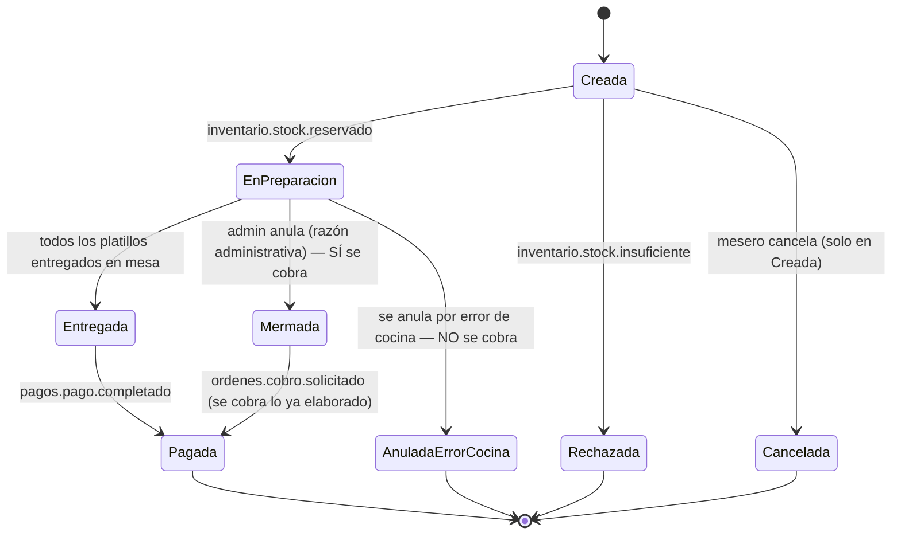

# Especificación de Requisitos de Software (ERS)
## Microservicio 4: Órdenes y Cocina (Orders & KDS Service)

**Versión:** v4 — actualización sobre `Requisitos_MS4_Ordenes_Final_v3`
**Alcance de esta versión:** (1) redefinición del ciclo de vida de estados de la orden, (2) nuevo requisito de cancelación por error de cocina sin cobro al cliente, (3) requisito opcional de preparación de platillos intermedios, (4) correcciones puntuales sobre disponibilidad de platillos y visibilidad de la comanda en el KDS.

---

## 0. Historial de cambios respecto a v3

| # | Cambio | Tipo |
|---|---|---|
| 1 | Se redefine el ciclo de vida principal de la orden a 4 estados: **Creada → En preparación → Entregada → Pagada** (antes: Pendiente, En preparación, Listo, Entregado, Cerrada/Pagada, usados de forma inconsistente) | Modificado |
| 2 | Se aclara la regla de cancelación: solo se cancela libremente en estado "Creada"; la anulación en "En preparación" es exclusiva de administrador y **no exime del cobro** | Modificado (aclaración, la regla de fondo ya existía) |
| 3 | Se agrega el estado y requisito de **"Anulada por Error de Cocina"**: cuando la anulación en "En preparación" se debe a una falla imputable a cocina, el cliente **no** paga esa comanda/platillo | **Nuevo** |
| 4 | Se agrega, como requisito opcional sujeto a disponibilidad de tiempo, la preparación de **platillos intermedios/pre-elaborados** con impacto en Inventario | **Nuevo (opcional)** |
| 5 | Se aclara que la disponibilidad de un platillo (si el mesero puede o no pedirlo) la determina Catálogo y Menú a través de la vista local ya existente; el mesero nunca puede seleccionar un platillo no disponible. Se acota "Rechazada" a la condición de carrera por stock exacto entre pedidos casi simultáneos | Modificado (aclaración) |
| 6 | Se agrega que la comanda debe desaparecer de la pantalla del KDS en cuanto pasa a estado "Pagada" | **Nuevo** |

---

## 1. Ciclo de vida y estados de la orden (sección de referencia)

Antes de listar los requisitos funcionales, se fija aquí el vocabulario de estados que el resto del documento usa, ya que en la v3 los mismos conceptos aparecían nombrados de forma distinta en distintas secciones (`Pendiente`/`Creada`, `Listo`/`Entregado`, `Cerrada`/`Pagada`).

### 1.1 Estados principales (ciclo de vida feliz)

| Estado | Se alcanza cuando... | Evento asociado |
|---|---|---|
| **Creada** | El mesero crea la comanda (vinculada a mesa o para llevar) y agrega/edita platillos. Incluye el tiempo en que la comanda ya fue confirmada y está esperando la reserva de stock de Inventario. | — (confirmación dispara `ordenes.orden.creada`) |
| **En preparación** | Inventario confirmó la reserva de insumos; la comanda entra a la cola del KDS y cocina la está elaborando. | consume `inventario.stock.reservado` |
| **Entregada** | Todos los platillos de la comanda fueron marcados "Listo" en cocina y el mesero los entregó en mesa. | — |
| **Pagada** *(fin del ciclo de vida)* | Se confirma el pago de la cuenta. | consume `pagos.pago.completado` |

### 1.2 Estados alternativos

| Estado | Se alcanza cuando... | Evento asociado | ¿Se cobra al cliente? |
|---|---|---|---|
| **Cancelada** | El mesero cancela la comanda mientras está en **"Creada"**. | publica `ordenes.orden.cancelada` | No — nunca hubo consumo real de insumos, solo se libera la reserva |
| **Rechazada** | Inventario responde con stock insuficiente tras la confirmación — en la práctica, esto ocurre por una condición de carrera entre pedidos casi simultáneos del mismo platillo, ya que el platillo en sí ya pasó el filtro de disponibilidad de Catálogo y Menú (ver nota abajo). | consume `inventario.stock.insuficiente` | No |
| **Mermada** | Un **administrador** anula una comanda o platillos ya en **"En preparación"** por una razón administrativa/de negocio (no imputable a cocina). | publica `ordenes.comanda.mermada` + `ordenes.cobro.solicitado` | **Sí** — el cliente igual paga lo ya elaborado |
| **Anulada por Error de Cocina** *(nuevo)* | Se anula una comanda o platillo ya en **"En preparación"** por una falla atribuible al personal de cocina (platillo mal preparado, error de elaboración, etc.). | publica `ordenes.comanda.mermada` (el insumo se pierde igual) — **no** publica `ordenes.cobro.solicitado` | **No** — el error es responsabilidad del restaurante |

> **[NUEVO] Nota — dos capas de validación de disponibilidad, y por qué "Rechazada" sigue siendo necesaria:** el mesero **nunca** puede llegar a intentar pedir un platillo marcado como no disponible, porque la vista local de disponibilidad (alimentada por los eventos `menu.catalogo.actualizado`/`menu.platillo.precio_actualizado` de Catálogo y Menú — ver `Comunicaciones API ordenes y KDS.md`, sección 2.2) es la que filtra qué platillos puede siquiera seleccionar en la interfaz. Sin embargo, esa disponibilidad indica "el platillo existe y está activo en el menú", no una garantía de cantidad exacta en tiempo real. Si 3 meseros piden casi al mismo tiempo el mismo platillo y el insumo solo alcanza para uno, las otras dos comandas deben terminar en "Rechazada" aunque el platillo se veía disponible al momento de pedir. Este caso ya queda resuelto por el flujo existente de la sección 8, sin necesidad de un mecanismo adicional en Órdenes: Inventario es la única fuente de verdad sobre la cantidad exacta, y debe procesar cada `ordenes.orden.creada` de forma atómica al reservar stock, de modo que solo una de las solicitudes concurrentes reciba `inventario.stock.reservado` y las demás reciban `inventario.stock.insuficiente`. **Punto a validar con Inventario:** confirmar que su mecanismo de reserva sea atómico (p. ej. un decremento condicionado a nivel de base de datos) y no una simple verificación de disponibilidad seguida de un descuento separado, ya que solo así se sostiene esta garantía bajo concurrencia.

> **Nota / punto a validar:** los estados por ítem ("Pendiente" → "Listo" → "Entregado" a nivel de platillo, usados en el Req. de la sección 4 para el flujo de "rehacer" un platillo) son sub-estados internos dentro del estado de orden "En preparación"/"Entregada", y no deben confundirse con los 4 estados principales de la orden definidos arriba. Se deja así por ahora; conviene que el equipo confirme si esta distinción entre estado-de-orden y estado-de-ítem debe formalizarse en el modelo de datos.

### 1.3 Diagrama de estados (orden)

---

## 2. Visualización de comandas en tiempo real

- El sistema deberá agrupar las comandas entrantes en la pantalla de cocina según su estado actual de elaboración.
- El sistema deberá ordenar las comandas en la pantalla de cocina basándose en su prioridad, calculada a partir del tiempo de preparación de los platillos.
- El sistema deberá ordenar cronológicamente por la hora de ingreso aquellas comandas que compartan el mismo nivel de prioridad.
- **[NUEVO]** El sistema deberá remover la comanda de la pantalla de cocina (KDS) en cuanto su estado transite a **"Pagada"** — información que llega de forma asíncrona desde el microservicio de Pagos y Facturación (ver sección 6).

## 3. Validación y cola KDS

- El sistema debe mostrar los detalles de los platillos, los modificadores aplicados y las notas especiales en cada tarjeta de comanda activa en la cocina.
- El sistema deberá mostrar el identificador de la mesa asignada de forma visible en cada tarjeta de comanda.
- El sistema deberá mostrar un contador de tiempo que indique el tiempo exacto transcurrido desde la creación del pedido.
- El sistema deberá filtrar los platillos visibles en la pantalla de cocina basándose en las categorías definidas en el catálogo para direccionar los pedidos a sus estaciones de preparación correspondientes (Categorías del módulo externo de Catálogo y Menú).

## 4. Control del estado de una comanda en su flujo de vida

- El sistema deberá permitir al personal de cocina marcar el estado de la preparación por ítem (platillo) como "Listo".
- El sistema deberá publicar un evento `ordenes.platillo.preparado` al broker de mensajería cada vez que un platillo transite al estado "Listo", para que el microservicio de Inventario aplique el consumo definitivo de los insumos.
- El sistema deberá permitir al personal de cocina marcar el estado de la preparación por comanda como "Listo".

## 5. Gestión de comandas y apertura/cierre de pedidos

- El sistema deberá permitir al mesero crear una nueva comanda vinculándola a una mesa específica.
- El sistema deberá permitir al mesero crear una nueva comanda designándola explícitamente como un pedido para llevar.
- El sistema deberá permitir al mesero agregar platillos, seleccionar modificadores e ingresar notas especiales a una comanda activa.
- El sistema deberá registrar el identificador del usuario autenticado que crea o modifica una comanda para asegurar la trazabilidad de las acciones según los roles y permisos del personal.
- El sistema deberá permitir al mesero transferir una comanda activa de una mesa a otra.
- **[NUEVO]** El sistema deberá impedir que el mesero seleccione o agregue a la comanda un platillo marcado como no disponible, validando contra la vista local de disponibilidad que el microservicio mantiene sincronizada mediante eventos del microservicio de Catálogo y Menú — un mesero nunca debe poder intentar pedir un platillo inexistente o deshabilitado en el menú (ver nota en sección 1.2 sobre la condición de carrera que esto no elimina).

## 6. Sincronización y transición del ciclo de vida del estado de la comanda

- **[MODIFICADO]** El sistema deberá actualizar visualmente la interfaz cada vez que la comanda transite por los estados de su ciclo de vida principal (**Creada, En preparación, Entregada, Pagada**), así como por los estados alternativos aplicables (**Cancelada, Rechazada, Mermada, Anulada por Error de Cocina**).
- El sistema deberá emitir notificaciones de cambio de estado para actualizar a los módulos externos interesados.
- El sistema deberá publicar un evento asíncrono en el broker de mensajería que contenga la información íntegra del pedido (Detalle_Orden, incluyendo precios congelados y modificadores) para que el microservicio de Pagos lo consuma y calcule el total de la cuenta.
- **[MODIFICADO]** El sistema deberá actualizar el estado final de la comanda a **"Pagada"** únicamente al consumir el evento asíncrono `pagos.pago.completado` proveniente del módulo externo de Pagos. *(Antes se mencionaban dos nombres — "Cerrada" o "Pagada" — para el mismo estado final; se consolida en uno solo: "Pagada".)*
- El sistema deberá permitir al mesero retornar un platillo de estado "Entregado" (a nivel de ítem) al estado "Pendiente", ingresando obligatoriamente una nota de texto que justifique la necesidad de rehacer la preparación en cocina.

## 7. Cancelación y modificación de comandas activas

- El sistema deberá permitir al mesero modificar los platillos de una comanda únicamente si esta se encuentra en estado **"Creada"**.
- El sistema deberá permitir al mesero cancelar una comanda completa únicamente si esta se encuentra en estado **"Creada"**.
- El sistema deberá publicar el evento `ordenes.orden.cancelada` y transicionar la comanda al estado **"Cancelada"** al anular un pedido en estado "Creada", permitiendo al microservicio de Inventario consumir el evento para liberar las reservas de stock asociadas. En este caso no se genera ningún cobro al cliente, ya que no hubo consumo real de insumos.
- El sistema deberá permitir **únicamente a un usuario de rol administrador** cancelar una comanda completa o platillos individuales que ya hayan transitado al estado **"En preparación"**.
- El sistema deberá emitir el evento `ordenes.comanda.mermada` y publicar el evento `ordenes.cobro.solicitado` (incluyendo el Detalle_Orden) cuando un administrador anule, por una razón administrativa o de negocio, una comanda o platillos ya en estado "En preparación", transicionando la comanda/platillo al estado **"Mermada"**. Esto permite al microservicio de Inventario registrar la pérdida de los insumos y al microservicio de Pagos procesar el cobro correspondiente al cliente. **Esta anulación no exime al cliente del pago de lo ya elaborado.**

### 7.1 [NUEVO] Anulación por error de cocina (sin cobro al cliente)

- El sistema deberá permitir anular una comanda completa o platillos individuales que ya se encuentren en estado "En preparación" cuando la causa de la anulación sea **un error atribuible al personal de cocina** (por ejemplo, un platillo mal preparado, un error de elaboración, o un incidente durante la preparación), transicionando la comanda o el/los platillo(s) afectado(s) al nuevo estado **"Anulada por Error de Cocina"**.
- El sistema deberá exigir el registro de una nota de texto obligatoria que justifique la causa del error de cocina, de forma análoga a la justificación ya exigida en la sección 6 para rehacer un platillo, a fin de mantener la trazabilidad de las acciones exigida por el Requisito de la sección 5.
- El sistema deberá publicar el evento `ordenes.comanda.mermada` al anular una comanda o platillo en estado "Anulada por Error de Cocina", permitiendo al microservicio de Inventario registrar la pérdida de los insumos ya consumidos en su elaboración — igual que en una anulación administrativa (sección 7).
- El sistema **no deberá** publicar el evento `ordenes.cobro.solicitado` para las comandas o platillos anulados por error de cocina. A diferencia de la anulación administrativa, este flujo **no debe generar ningún cobro al cliente**, dado que la responsabilidad del error corresponde al restaurante y no al consumidor.

## 8. Interacción inicial y validación por eventos (Saga)

- El sistema deberá publicar el evento `ordenes.orden.creada` en el broker de mensajería inmediatamente después de que el mesero confirme la orden en la interfaz (comanda en estado "Creada"), para solicitar la reserva de los ingredientes.
- El sistema deberá enviar la comanda a la cola de la pantalla de cocina (KDS) y transicionarla a **"En preparación"** únicamente tras consumir el evento asíncrono `inventario.stock.reservado` proveniente del microservicio de Inventario.
- El sistema deberá actualizar el estado de la comanda a **"Rechazada"** y emitir una alerta visual en la interfaz del mesero si consume el evento asíncrono `inventario.stock.insuficiente` (ver sección 1.2 — este es el mecanismo que resuelve la condición de carrera entre pedidos casi simultáneos del mismo platillo).

---

## 9. [Opcional] Preparación de platillos intermedios (pre-elaborados)

> **Estado: requisito opcional**, sujeto a disponibilidad de tiempo del equipo. No implica que deba construirse en esta iteración; el objetivo es dejar el requisito identificado y compatible con el modelo de eventos ya definido, para que una futura iteración lo pueda incorporar sin rediseñar la arquitectura.

**Contexto:** Inventario cambió la forma en que administra los ítems que almacena, de modo que ahora puede llevar existencia no solo de insumos crudos, sino también de **platillos pre-elaborados/intermedios** (por ejemplo, una olla de sopa preparada antes de que abra el servicio). Esto habilita, a futuro, que cocina registre la elaboración de este tipo de platillos **por adelantado y fuera del flujo de una comanda de cliente**.

- **[Opcional]** El sistema deberá permitir, a futuro, que el personal de cocina registre la creación de un lote de un **platillo intermedio** de forma independiente a cualquier comanda de cliente, indicando el platillo intermedio producido, la cantidad resultante y los insumos crudos utilizados en su elaboración.
- **[Opcional]** El sistema deberá publicar un evento asíncrono al broker de mensajería (nombre propuesto: `ordenes.platillo_intermedio.preparado`, a confirmar con el equipo de Inventario) que contenga los insumos crudos consumidos y el platillo intermedio resultante junto con la cantidad producida.
- **[Opcional]** El sistema deberá diseñarse de forma que, al consumir este evento, Inventario pueda descontar los insumos crudos utilizados y, en la misma operación, incrementar su existencia del platillo intermedio resultante, tratándolo como un nuevo tipo de ítem de inventario ("platillo preparado").
- **[Opcional]** Esta funcionalidad deberá seguir el mismo patrón arquitectónico ya vigente en el microservicio (Transactional Outbox + evento asíncrono, sin llamadas síncronas hacia Inventario), por lo que no representa una excepción a los principios de arquitectura del proyecto (ver `Comunicaciones API ordenes y KDS.md`, sección 0).

---

## 10. Puntos abiertos a validar con el equipo

1. **Autorización de la anulación por error de cocina (sección 7.1):** el documento asume que, al igual que la anulación administrativa, esta acción requiere rol administrador. Falta confirmar si el propio personal de cocina debe poder iniciarla directamente (por ser quien detecta el error) o si siempre requiere una confirmación/autorización de un administrador.
2. **Caso borde — comanda con mezcla de estados:** si algunos platillos de una comanda terminan "Mermados" (con cobro) y otros "Anulados por Error de Cocina" (sin cobro) dentro de la misma comanda, falta definir cómo se refleja esto en el Detalle_Orden que se envía a Pagos (cobro parcial, no del total de la comanda).
3. **Timeout de Saga:** si Inventario nunca responde a `ordenes.orden.creada` (ni con `reservado` ni con `insuficiente`), la comanda queda indefinidamente en "Creada". Sigue pendiente, como ya señalaba el documento de diagramas de secuencia, definir un evento de compensación (`ordenes.orden.expirada` propuesto).
4. **Contrato del evento `ordenes.platillo_intermedio.preparado` (sección 9):** nombre, payload y el equipo (Inventario y/o Catálogo y Menú) dueño de la entidad "platillo intermedio" deben confirmarse antes de implementar este requisito opcional.
5. **Interfaz para platillos intermedios (sección 9):** no está definido si esta funcionalidad requiere una pantalla/vista nueva en la app de cocina o si se integra a una vista existente.
6. **[NUEVO] Atomicidad de la reserva de stock en Inventario (sección 1.2):** confirmar con el equipo de Inventario que su reserva de stock ante `ordenes.orden.creada` sea atómica, para garantizar que ante pedidos casi simultáneos del mismo platillo solo uno reciba `inventario.stock.reservado` y el resto `inventario.stock.insuficiente`. Es responsabilidad de Inventario, no de Órdenes, pero condiciona si "Rechazada" cubre correctamente este caso.
