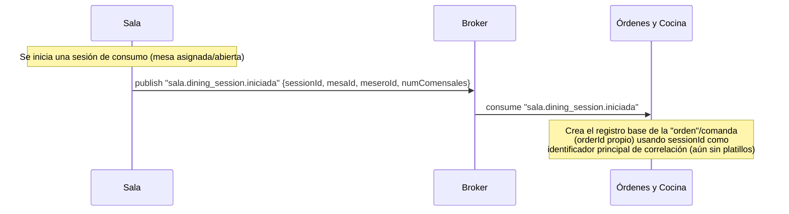
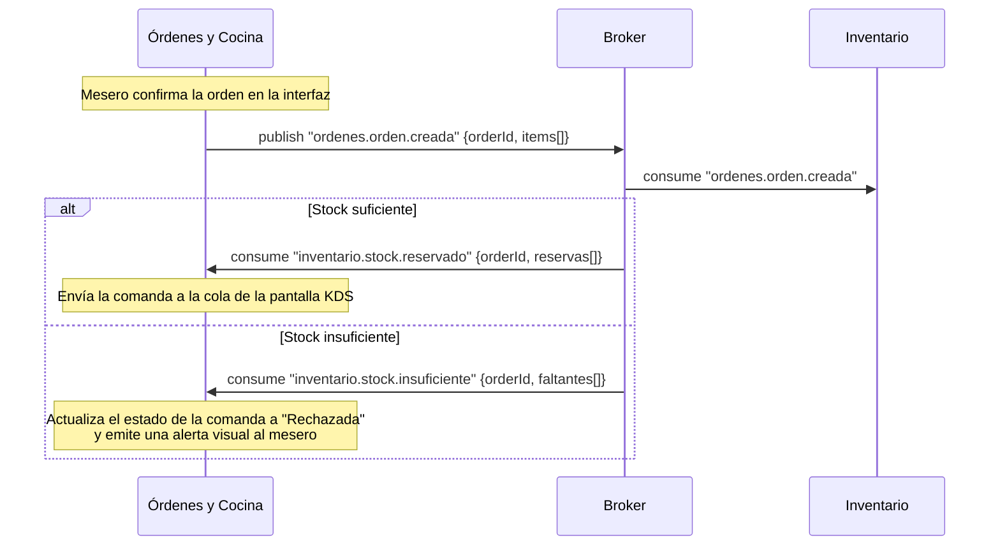
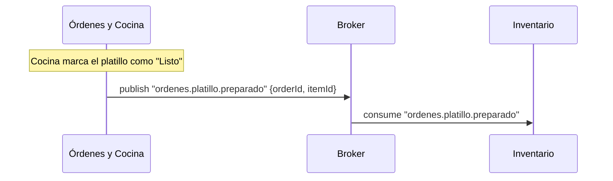
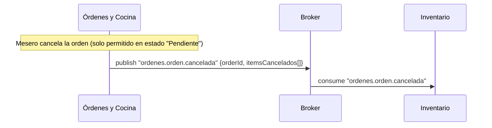
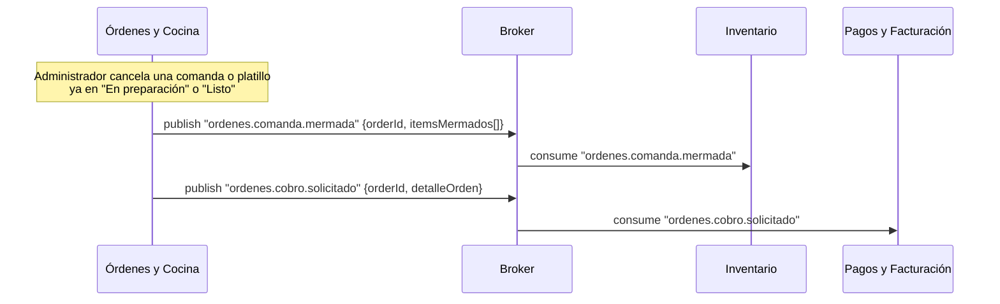
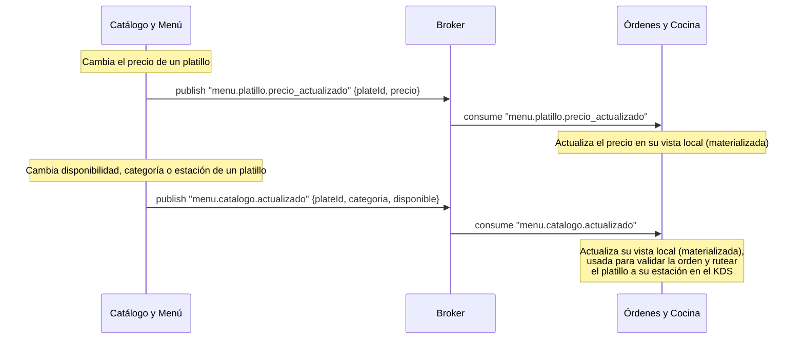

# Diagramas de secuencia — Microservicio de Órdenes y Cocina (Orders & KDS)

> **Supuestos de arquitectura**
> - Arquitectura del proyecto **100% orientada a eventos**: cada microservicio publica los datos relevantes de su dominio en el **broker** para que los interesados se suscriban, sin llamadas síncronas entre microservicios de negocio.
> - Comunicación asíncrona vía broker pub/sub (RabbitMQ), notado como `Broker`.
> - Convención de eventos: `dominio.entidad.accion` (ej. `ordenes.orden.creada`). Los eventos que se consumen de otros dominios usan el prefijo de origen (`inventario.*`, `pagos.*`, `menu.*`, `sala.*`).
> - Toda publicación de eventos de este microservicio ocurre dentro de la misma transacción que el cambio de estado en PostgreSQL, vía el patrón **Transactional Outbox** (Event Outbox Worker) ya definido en el documento de arquitectura.
> - Estos diagramas muestran **únicamente comunicación externa** (Órdenes ↔ Broker ↔ Inventario / Pagos / Catálogo). El flujo interno de Controladores, Lógica de Negocio y Repositorios de este microservicio no se detalla aquí — ver el diagrama de arquitectura de componentes para eso.
> - Entidades relevantes citadas: `Orden`, `Detalle_Orden`, `Comanda`, `Item/Platillo`.
> - La "Orden" es un concepto propio de Órdenes y Cocina: se origina con los datos de la sesión de consumo (`sessionId`) que llegan por evento desde **Sala**, y se enriquece con los platillos seleccionados por el mesero — cuyo catálogo/precio/disponibilidad se obtiene de **Catálogo y Menú** vía eventos `menu.*`, nunca de Inventario. El `sessionId` recibido de Sala se adopta como identificador principal para correlacionar la mesa, la orden y la cuenta a lo largo del ciclo de vida de la comanda. La comunicación con **Inventario** es únicamente para reservar/consumir/liberar insumos, no para conocer qué platillos existen.

---

## 1. Origen de la comanda: sesión de consumo desde Sala

La "orden"/comanda es un concepto propio de este microservicio, pero su información base no se genera aquí: nace del evento que Sala publica al iniciar una sesión de consumo (apertura formal de mesa). Órdenes usa ese evento como semilla del registro, tomando el `sessionId` como identificador principal de correlación — la comanda se va completando después con los platillos que agrega el mesero (ver diagrama 2).



---

## 2. Creación de comanda y reserva de ingredientes (Saga coreografiada)

Una vez que el mesero agrega platillos (validados contra la vista local de Catálogo y Menú, ver diagrama 7) a la comanda ya asociada a una mesa (diagrama 1), Órdenes publica el evento de creación y **espera** la respuesta de Inventario antes de enviar la comanda a la cola de la pantalla de cocina. No hay orquestador central: cada servicio reacciona a los eventos del otro.



---

## 3. Consumo definitivo de ingredientes al marcar un platillo "Listo"

Cuando cocina marca un platillo como preparado, Órdenes notifica al broker para que Inventario convierta la reserva en consumo real.



---

## 4. Liberación de stock por cancelación en estado "Pendiente"

El mesero solo puede cancelar una comanda mientras está en "Pendiente". Al hacerlo, Inventario debe liberar cualquier reserva asociada.



---

## 5. Comanda mermada y solicitud de cobro (cancelación administrativa tardía)

Un administrador puede cancelar una comanda completa o platillos individuales que ya avanzaron a "En preparación" o "Listo". A diferencia del flujo 4, aquí el insumo **no regresa** a existencia disponible y además se debe cobrar al cliente.



---

## 6. Solicitud de cuenta y cierre transaccional del pago

Cuando se solicita la cuenta, Órdenes envía el detalle congelado del pedido a Pagos para que calcule el total. La comanda solo pasa a su estado final al recibir la confirmación de pago — nunca se marca como pagada por iniciativa propia.

```mermaid
sequenceDiagram
    participant OC as Órdenes y Cocina
    participant B as Broker
    participant PAG as Pagos y Facturación

    Note over OC: Se solicita la cuenta de la mesa/comanda
    OC->>B: publish "ordenes.cuenta.solicitada" {orderId, sessionId, detalleOrden}
    Note right of OC: detalleOrden incluye precios congelados<br/>y modificadores aplicados al momento de la venta;<br/>sessionId correlaciona la cuenta con la sesión de Sala
    B->>PAG: consume "ordenes.cuenta.solicitada"

    PAG->>B: publish "pagos.pago.completado" {orderId, montoTotal}
    B->>OC: consume "pagos.pago.completado"
    Note over OC: Actualiza el estado final de la comanda a "Cerrada / Pagada"
```

---

## 7. Sincronización de catálogo (vista materializada) para validación y ruteo en KDS

Para evitar llamadas síncronas a Catálogo (tanto para validar disponibilidad al crear una orden como para rutear platillos a su estación de cocina), Órdenes mantiene una copia local que actualiza reactivamente. El diseño asíncrono ya estaba alineado con Menú; lo que cambió al validar el contrato con ese equipo fue la nomenclatura — Menú publica bajo el prefijo `menu.*`, no `catalogo.*`, y separa el cambio de precio del resto de los cambios de catálogo.



---

## Notas para validar con el equipo

1. **Nombres de eventos confirmados vs. propuestos**: `ordenes.orden.creada`, `ordenes.orden.cancelada` y `ordenes.platillo.preparado` ya están definidos textualmente en el documento de requisitos. Tras validar los contratos con los equipos correspondientes, `sala.dining_session.iniciada` (Sala) y `menu.platillo.precio_actualizado` / `menu.catalogo.actualizado` (Catálogo y Menú) quedan **confirmados** con esa nomenclatura. `ordenes.comanda.mermada`, `ordenes.cobro.solicitado`, `ordenes.cuenta.solicitada` y `pagos.pago.completado` siguen **propuestos**: `ordenes.cobro.solicitado` y `ordenes.cuenta.solicitada` quedan pendientes de que Pagos termine de acoplar su flujo al modelo orientado a eventos (responsabilidad de ese equipo), y `ordenes.comanda.mermada` queda pendiente de que Inventario documente su suscripción (responsabilidad de ese equipo).
2. **Sin orquestador central**: igual que en el documento de Inventario, estos diagramas asumen un diseño coreografiado (cada servicio reacciona a eventos de los demás), no un Saga orchestrator. El flujo 2 depende de que Inventario **siempre** responda con `reservado` o `insuficiente`; conviene definir un timeout y un evento de compensación (ej. `ordenes.orden.expirada`) por si Inventario no responde.
3. **Idempotencia**: en los flujos 1, 2, 3, 4 y 5, Órdenes e Inventario deben validar `orderId + eventId` (o `sessionId + eventId` en el caso del flujo 1) para no crear, reservar, consumir o liberar dos veces si el broker reentrega un mensaje.
4. **Outbox obligatorio**: la publicación de los 6 eventos que emite este microservicio (todos excepto `sala.dining_session.iniciada`, que Órdenes solo consume) debe pasar por la tabla `outbox` dentro de la misma transacción del cambio de estado correspondiente, no directamente al broker.
5. **Cambio respecto a la arquitectura previa**: el diagrama 7 (vista materializada) **reemplaza** la conexión síncrona "valida disponibilidad de platillos (cacheado vía Redis)" que se había dibujado antes en el diagrama de arquitectura general — ahora la validación es contra la copia local alimentada por eventos de Catálogo, alineado con la directriz de que todo el sistema sea orientado a eventos. Recomiendo actualizar el diagrama de arquitectura general para reflejar este cambio.
6. **Confirmado con Sala**: el evento correcto es `sala.dining_session.iniciada`, correspondiente a la sesión de consumo formal (no un genérico "mesa ocupada"). Reemplaza al `sala.mesa.ocupada` que este documento usaba antes.
7. **Alcance de `sessionId`**: por decisión reciente, `sessionId` (recibido de Sala en el diagrama 1) se guarda como atributo de la Orden y se propaga explícitamente en el payload de `ordenes.cuenta.solicitada` (diagrama 6), ya que ahí es donde se cierra el ciclo mesa → orden → cuenta. `orderId` sigue siendo el identificador propio de la orden en el resto de los eventos (diagramas 2 a 5): Inventario no necesita conocer la sesión de Sala para reservar/consumir/liberar insumos. **Pendiente de validar** si Pagos o Sala requieren `sessionId` también en algún otro evento (p. ej. para liberar la mesa al cerrar la cuenta).
